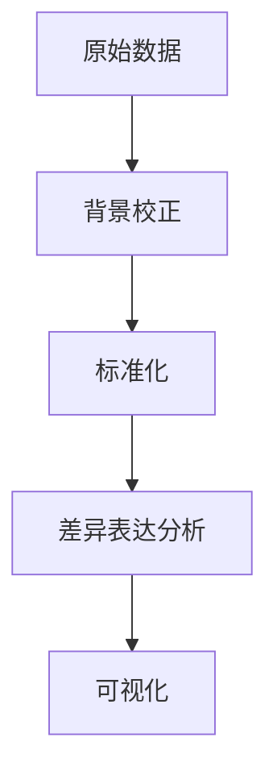

# R微阵列数据分析

微阵列技术是一种用于同时测量成千上万个基因表达水平的高通量技术。通过微阵列数据分析，研究人员可以识别在不同条件下（如疾病与健康）差异表达的基因。R语言是生物信息学中常用的工具，因其强大的统计分析和可视化功能而广受欢迎。本文将逐步介绍如何使用R进行微阵列数据分析。

---

## 1. 微阵列数据简介

微阵列数据通常以矩阵形式存储，其中行代表基因，列代表样本。每个单元格的值表示特定基因在特定样本中的表达水平。分析的目标是从这些数据中提取有意义的生物学信息，例如识别差异表达基因。

---

## 2. 数据预处理

在分析微阵列数据之前，通常需要对原始数据进行预处理，以确保数据的质量和一致性。常见的预处理步骤包括：

- **背景校正**：去除背景噪声。
- **标准化**：消除技术差异，使不同样本之间的数据具有可比性。
- **过滤**：去除低质量或低表达的数据。

以下是一个简单的R代码示例，展示如何使用`limma`包进行背景校正和标准化：

```r
# 加载limma包
library(limma)

# 假设raw_data是一个微阵列数据矩阵
background_corrected <- backgroundCorrect(raw_data, method="normexp")
normalized_data <- normalizeBetweenArrays(background_corrected, method="quantile")
```

:::tip
预处理步骤的选择取决于实验设计和数据类型。确保根据实际情况调整参数。
:::

---

## 3. 差异表达分析

差异表达分析的目标是识别在不同条件下表达水平显著变化的基因。常用的方法包括：

- **t检验**：适用于两组样本的比较。
- **ANOVA**：适用于多组样本的比较。
- **线性模型**：适用于复杂实验设计。

以下是一个使用`limma`包进行差异表达分析的示例：

```r
# 创建设计矩阵
design <- model.matrix(~0 + group)

# 拟合线性模型
fit <- lmFit(normalized_data, design)

# 计算差异表达
fit <- eBayes(fit)
results <- topTable(fit, coef=2, number=100)  # 提取前100个差异表达基因
```

:::note
`topTable`函数返回的结果包括基因名称、logFC（log2倍数变化）、p值等信息。
:::

---

## 4. 数据可视化

可视化是微阵列数据分析的重要部分，可以帮助我们直观地理解数据。常用的可视化方法包括：

- **热图**：展示基因表达模式。
- **火山图**：展示差异表达基因的统计显著性。
- **PCA图**：展示样本之间的相似性。

以下是一个使用`pheatmap`包绘制热图的示例：

```r
# 加载pheatmap包
library(pheatmap)

# 绘制热图
pheatmap(normalized_data, scale="row", clustering_distance_rows="euclidean")
```



---

## 5. 实际案例

假设我们有一组微阵列数据，比较健康组织和癌组织的基因表达差异。通过上述步骤，我们可以识别出在癌组织中显著上调或下调的基因。这些基因可能成为潜在的生物标志物或治疗靶点。

---

## 6. 总结

微阵列数据分析是生物信息学中的重要工具，能够帮助研究人员从高通量数据中提取有价值的生物学信息。通过R语言，我们可以轻松完成数据预处理、差异表达分析和可视化等任务。

---

## 7. 附加资源与练习

- **资源**：
  - [Bioconductor](https://www.bioconductor.org/)：R中生物信息学分析的核心平台。
  - [limma用户指南](https://bioconductor.org/packages/release/bioc/vignettes/limma/inst/doc/usersguide.pdf)：详细介绍了`limma`包的使用方法。

- **练习**：
  1. 下载一个公开的微阵列数据集，尝试完成从预处理到差异表达分析的完整流程。
  2. 使用不同的可视化方法（如火山图、PCA图）展示分析结果。

:::caution
确保在分析过程中记录每一步的操作和参数设置，以便复现和验证结果。
:::