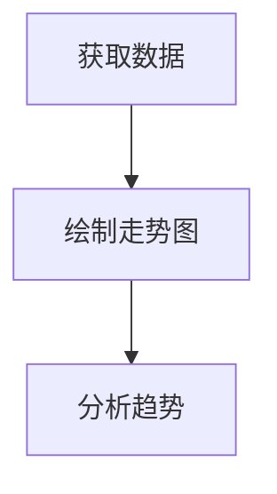

# R金融数据获取

在金融分析中，获取数据是第一步，也是至关重要的一步。R语言提供了多种工具和包，可以帮助我们从不同的来源获取金融数据。本文将介绍如何使用R语言从API、CSV文件和数据库中获取金融数据，并通过实际案例展示这些方法的应用。

## 1. 从API获取金融数据

许多金融数据提供商（如Yahoo Finance、Alpha Vantage等）提供了API接口，允许用户通过编程方式获取数据。R语言中的`quantmod`包是一个强大的工具，可以帮助我们从这些API中获取数据。

### 示例：从Yahoo Finance获取股票数据

```r
# 安装并加载quantmod包
install.packages("quantmod")
library(quantmod)

# 获取Apple公司（AAPL）的股票数据
getSymbols("AAPL", src = "yahoo")

# 查看获取的数据
head(AAPL)
```

**输出：**

```
           AAPL.Open AAPL.High AAPL.Low AAPL.Close AAPL.Volume AAPL.Adjusted
2007-01-03     86.29     86.58    81.90      83.80   309579900         11.44
2007-01-04     84.05     85.95    83.82      85.66   211815100         11.70
2007-01-05     85.77     86.20    84.40      85.05   208685400         11.61
2007-01-08     85.96     86.53    85.28      85.47   199276700         11.67
2007-01-09     86.45     92.98    85.15      92.57   837324600         12.64
2007-01-10     94.75     97.80    93.45      97.00   738220000         13.24
```

:::note
`getSymbols`函数默认会下载最近几年的数据。你可以通过设置`from`和`to`参数来指定时间范围。
:::

## 2. 从CSV文件获取金融数据

CSV文件是存储金融数据的常见格式。R语言提供了多种读取CSV文件的方法，其中最常用的是`read.csv`函数。

### 示例：读取CSV文件中的股票数据

假设我们有一个名为`stock_data.csv`的文件，内容如下：

```
Date,Open,High,Low,Close,Volume
2023-01-01,150,155,148,152,1000000
2023-01-02,152,158,150,156,1200000
2023-01-03,156,160,155,158,1100000
```

我们可以使用以下代码读取并查看数据：

```r
# 读取CSV文件
stock_data <- read.csv("stock_data.csv")

# 查看数据
head(stock_data)
```

**输出：**

```
        Date Open High Low Close  Volume
1 2023-01-01  150  155 148   152 1000000
2 2023-01-02  152  158 150   156 1200000
3 2023-01-03  156  160 155   158 1100000
```

:::tip
如果CSV文件的第一列是日期，可以使用`as.Date`函数将其转换为日期格式，以便后续的时间序列分析。
:::

## 3. 从数据库获取金融数据

对于存储在数据库中的金融数据，R语言提供了多种连接和查询数据库的工具。`DBI`包和`RMySQL`包是常用的工具。

### 示例：从MySQL数据库获取股票数据

假设我们有一个MySQL数据库，其中包含一个名为`stock_prices`的表，存储了股票价格数据。我们可以使用以下代码连接数据库并查询数据：

```r
# 安装并加载DBI和RMySQL包
install.packages("DBI")
install.packages("RMySQL")
library(DBI)
library(RMySQL)

# 连接数据库
con <- dbConnect(MySQL(), user = "root", password = "password", dbname = "finance", host = "localhost")

# 查询数据
query <- "SELECT * FROM stock_prices WHERE symbol = 'AAPL'"
stock_data <- dbGetQuery(con, query)

# 查看数据
head(stock_data)

# 关闭连接
dbDisconnect(con)
```

**输出：**

```
        date  open  high   low close  volume
1 2023-01-01 150.0 155.0 148.0 152.0 1000000
2 2023-01-02 152.0 158.0 150.0 156.0 1200000
3 2023-01-03 156.0 160.0 155.0 158.0 1100000
```

:::caution
在实际应用中，请确保数据库连接信息（如用户名、密码等）的安全性，避免泄露敏感信息。
:::

## 4. 实际案例：获取并分析股票数据

让我们通过一个实际案例来展示如何获取并分析股票数据。假设我们想要分析Apple公司（AAPL）的股票价格走势。

### 步骤1：获取数据

```r
# 获取Apple公司（AAPL）的股票数据
getSymbols("AAPL", src = "yahoo")

# 查看获取的数据
head(AAPL)
```

### 步骤2：绘制股票价格走势图

```r
# 绘制股票价格走势图
chartSeries(AAPL, theme = "white")
```



### 步骤3：计算移动平均线

```r
# 计算20日移动平均线
AAPL$MA20 <- SMA(AAPL$AAPL.Close, n = 20)

# 绘制移动平均线
addTA(AAPL$MA20, on = 1, col = "blue")
```

:::tip
移动平均线是技术分析中常用的工具，可以帮助我们识别股票价格的趋势。
:::

## 5. 总结

本文介绍了如何使用R语言从API、CSV文件和数据库中获取金融数据，并通过实际案例展示了这些方法的应用。掌握这些技能是进行金融分析的基础，希望本文能帮助你在金融数据分析的道路上迈出坚实的一步。

## 6. 附加资源与练习

- **练习1**：尝试从Yahoo Finance获取其他公司的股票数据，并绘制其价格走势图。
- **练习2**：下载一个CSV格式的金融数据集，使用R语言读取并分析数据。
- **附加资源**：
  - [quantmod包文档](https://cran.r-project.org/web/packages/quantmod/quantmod.pdf)
  - [DBI包文档](https://cran.r-project.org/web/packages/DBI/DBI.pdf)
  - [RMySQL包文档](https://cran.r-project.org/web/packages/RMySQL/RMySQL.pdf)

:::warning
在进行金融数据分析时，请确保遵守相关法律法规，避免使用未经授权的数据源。
:::