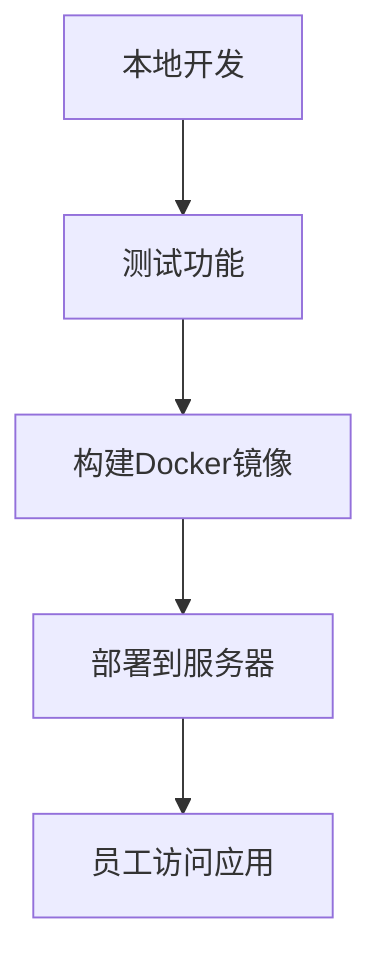

# R部署策略

在数据科学和统计分析中，R语言是一个强大的工具。然而，开发完R代码后，如何将其部署到生产环境中是一个关键步骤。本文将介绍R代码的部署策略，帮助初学者理解如何将R代码从开发环境迁移到生产环境。

## 什么是R部署？

R部署是指将R代码从开发环境迁移到生产环境的过程。生产环境通常是一个稳定的、可扩展的系统，能够处理实际的数据和用户请求。部署的目标是确保代码在生产环境中能够高效、可靠地运行。

## 常见的R部署策略

### 1. 使用R脚本

最简单的部署方式是将R脚本直接运行在生产服务器上。这种方式适用于小型项目或一次性任务。

```r
# 示例R脚本
data <- read.csv("data.csv")
summary(data)
```

:::note
**注意**：这种方式适合小型项目，但对于大型项目或需要频繁更新的项目，可能不够灵活。
:::

### 2. 使用R Markdown

R Markdown允许你将代码、文本和输出结合在一起，生成可重复的报告。你可以将R Markdown文件部署到服务器上，定期生成报告。

```r
# 示例R Markdown
---
title: 数据分析报告
output: html_document
---

```{r}
data <- read.csv("data.csv")
summary(data)
```
```

:::tip
**提示**：R Markdown非常适合生成动态报告，特别是需要定期更新的报告。
:::

### 3. 使用Shiny应用

Shiny是R中的一个Web应用框架，允许你创建交互式的Web应用。你可以将Shiny应用部署到Shiny服务器或RStudio Connect上。

```r
# 示例Shiny应用
library(shiny)

ui <- fluidPage(
  titlePanel("简单Shiny应用"),
  sidebarLayout(
    sidebarPanel(
      sliderInput("bins", "Number of bins:", min = 1, max = 50, value = 30)
    ),
    mainPanel(
      plotOutput("distPlot")
    )
  )
)

server <- function(input, output) {
  output$distPlot <- renderPlot({
    x <- faithful$waiting
    bins <- seq(min(x), max(x), length.out = input$bins + 1)
    hist(x, breaks = bins, col = 'darkgray', border = 'white')
  })
}

shinyApp(ui = ui, server = server)
```

:::caution
**注意**：Shiny应用需要更多的资源，因此在部署时需要考虑服务器的性能。
:::

### 4. 使用Docker容器

Docker是一种容器化技术，允许你将应用及其依赖打包到一个容器中。你可以使用Docker将R应用部署到任何支持Docker的环境中。

```dockerfile
# 示例Dockerfile
FROM rocker/shiny:latest

# 安装必要的R包
RUN install2.r --error \
    dplyr \
    ggplot2

# 复制Shiny应用到容器中
COPY ./shiny-app /srv/shiny-server/

# 暴露端口
EXPOSE 3838

# 启动Shiny服务器
CMD ["/usr/bin/shiny-server.sh"]
```

:::warning
**警告**：Docker需要一定的学习曲线，但对于复杂的部署场景非常有用。
:::

## 实际案例

假设你开发了一个Shiny应用，用于可视化公司的销售数据。你需要将这个应用部署到公司的内部服务器上，以便所有员工都可以访问。

1. **开发环境**：你在本地开发了Shiny应用，并测试了所有功能。
2. **部署环境**：你决定使用Docker将应用部署到公司的内部服务器上。
3. **持续集成**：你设置了CI/CD管道，每当代码更新时，自动构建新的Docker镜像并部署到服务器上。



## 总结

R代码的部署策略多种多样，选择哪种策略取决于项目的规模、复杂性和需求。对于小型项目，简单的R脚本或R Markdown可能就足够了。对于需要交互性和可扩展性的项目，Shiny应用和Docker容器是更好的选择。

## 附加资源

- [R Markdown官方文档](https://rmarkdown.rstudio.com/)
- [Shiny官方文档](https://shiny.rstudio.com/)
- [Docker官方文档](https://docs.docker.com/)

## 练习

1. 尝试将一个简单的R脚本部署到本地服务器上。
2. 使用R Markdown生成一个动态报告，并将其部署到Web服务器上。
3. 创建一个简单的Shiny应用，并使用Docker将其部署到云服务器上。

通过以上步骤，你将掌握R代码的基本部署策略，并能够根据项目需求选择合适的部署方式。