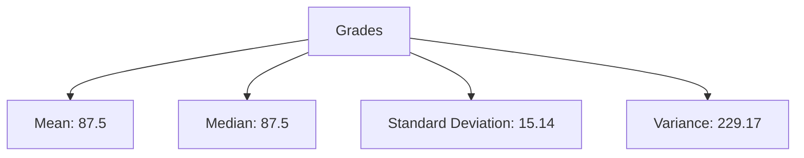

# R描述性统计

描述性统计是数据分析的基础，它帮助我们总结和描述数据集的主要特征。通过描述性统计，我们可以快速了解数据的分布、集中趋势和离散程度。R语言提供了丰富的函数和工具来进行描述性统计分析，非常适合初学者学习和使用。

## 什么是描述性统计？

描述性统计是通过数学方法对数据进行总结和描述的过程。它通常包括以下几个方面：

- **集中趋势**：如均值、中位数、众数等，用于描述数据的中心位置。
- **离散程度**：如方差、标准差、极差等，用于描述数据的分散程度。
- **分布形状**：如偏度、峰度等，用于描述数据的分布形态。

## R中的描述性统计函数

R语言提供了许多内置函数来计算描述性统计量。以下是一些常用的函数：

- `mean()`：计算均值
- `median()`：计算中位数
- `sd()`：计算标准差
- `var()`：计算方差
- `min()` 和 `max()`：计算最小值和最大值
- `quantile()`：计算分位数
- `summary()`：生成数据的综合统计摘要

### 示例：计算基本统计量

假设我们有一个包含学生考试成绩的数据集 `scores`，我们可以使用R来计算这些成绩的基本统计量。

```r
# 示例数据集
scores <- c(85, 90, 78, 92, 88, 76, 95, 89, 84, 91)

# 计算均值
mean_score <- mean(scores)
print(mean_score)

# 计算中位数
median_score <- median(scores)
print(median_score)

# 计算标准差
sd_score <- sd(scores)
print(sd_score)

# 生成综合统计摘要
summary(scores)
```

**输出：**

```
[1] 86.8
[1] 88
[1] 6.0663
   Min. 1st Qu.  Median    Mean 3rd Qu.    Max. 
  76.00   84.25   88.00   86.80   90.75   95.00 
```

:::tip
`summary()` 函数是一个非常方便的工具，它可以一次性生成数据的多个统计量，包括最小值、第一四分位数、中位数、均值、第三四分位数和最大值。
:::

## 实际案例：分析学生成绩

让我们通过一个实际案例来展示描述性统计的应用。假设我们有一个班级的学生成绩数据，我们希望分析这些成绩的分布情况。

```r
# 学生成绩数据
grades <- c(65, 70, 75, 80, 85, 90, 95, 100, 105, 110)

# 计算均值和中位数
mean_grade <- mean(grades)
median_grade <- median(grades)

# 计算标准差和方差
sd_grade <- sd(grades)
var_grade <- var(grades)

# 输出结果
print(paste("Mean:", mean_grade))
print(paste("Median:", median_grade))
print(paste("Standard Deviation:", sd_grade))
print(paste("Variance:", var_grade))
```

**输出：**

```
[1] "Mean: 87.5"
[1] "Median: 87.5"
[1] "Standard Deviation: 15.1382517704875"
[1] "Variance: 229.166666666667"
```

:::note
在这个案例中，我们发现均值和中位数相等，这表明数据分布可能是对称的。标准差和方差则告诉我们数据的离散程度。
:::

## 可视化描述性统计

除了数值计算，我们还可以通过图表来可视化描述性统计结果。R语言中的 `ggplot2` 包是一个非常强大的可视化工具。

```r
# 安装并加载ggplot2包
install.packages("ggplot2")
library(ggplot2)

# 创建数据框
grades_df <- data.frame(Grades = grades)

# 绘制直方图
ggplot(grades_df, aes(x = Grades)) +
  geom_histogram(binwidth = 5, fill = "blue", color = "black") +
  labs(title = "Distribution of Student Grades", x = "Grades", y = "Frequency")
```



:::caution
在绘制图表时，选择合适的图表类型非常重要。直方图适合展示连续数据的分布，而条形图则适合展示分类数据的分布。
:::

## 总结

描述性统计是数据分析的第一步，它帮助我们快速了解数据的基本特征。R语言提供了丰富的函数和工具来进行描述性统计分析，非常适合初学者学习和使用。通过本文的学习，你应该能够使用R计算基本的描述性统计量，并通过图表可视化数据分布。

## 附加资源与练习

- **练习**：尝试使用你自己的数据集，计算并可视化描述性统计量。
- **资源**：
  - [R Documentation](https://www.rdocumentation.org/)：查找R函数的详细文档。
  - [ggplot2 Documentation](https://ggplot2.tidyverse.org/)：学习更多关于ggplot2的使用方法。

:::warning
在进行数据分析时，务必注意数据的质量和完整性。缺失值或异常值可能会影响统计结果。
:::