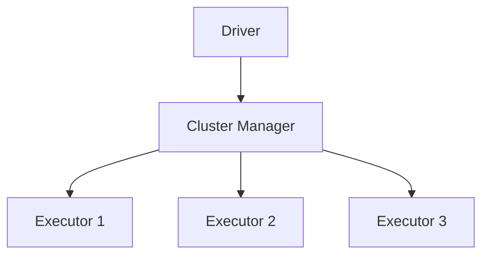

# Spark 简介

Apache Spark 是一个开源的分布式计算系统，旨在处理大规模数据集。它以其高效的内存计算能力和易用性而闻名，广泛应用于大数据处理、机器学习和实时流处理等领域。本文将带你了解 Spark 的基础知识，帮助你快速入门。

## 什么是 Spark？

Spark 是一个用于大规模数据处理的统一分析引擎。它提供了一个简单的编程模型，支持多种编程语言（如 Scala、Java、Python 和 R），并能够在分布式环境中高效地处理数据。Spark 的核心优势在于其内存计算能力，这使得它比传统的 MapReduce 模型快得多。

### Spark 的核心组件

Spark 由以下几个核心组件组成：

1. **Spark Core**：提供基本功能，如任务调度、内存管理和故障恢复。
2. **Spark SQL**：用于处理结构化数据，支持 SQL 查询。
3. **Spark Streaming**：用于实时数据处理。
4. **MLlib**：提供机器学习算法库。
5. **GraphX**：用于图计算。

## Spark 的架构

Spark 采用主从架构，包括一个 **Driver** 和多个 **Executor**。Driver 负责协调任务，而 Executor 负责执行任务。Spark 应用程序通常运行在集群管理器（如 YARN、Mesos 或 Kubernetes）之上。



## Spark 的基本概念

### RDD（弹性分布式数据集）

RDD（Resilient Distributed Dataset）是 Spark 的核心数据结构。它是一个不可变的分布式对象集合，可以在集群中并行处理。RDD 支持两种操作：

- **转换（Transformations）**：从一个 RDD 生成另一个 RDD，如 `map`、`filter`。
- **动作（Actions）**：触发计算并返回结果，如 `count`、`collect`。

#### 示例：创建和操作 RDD

```python
from pyspark import SparkContext

# 初始化 SparkContext
sc = SparkContext("local", "First App")

# 创建一个 RDD
data = [1, 2, 3, 4, 5]
rdd = sc.parallelize(data)

# 对 RDD 进行转换操作
squared_rdd = rdd.map(lambda x: x * x)

# 执行动作操作
result = squared_rdd.collect()

print(result)  # 输出: [1, 4, 9, 16, 25]
```

### DataFrame 和 Dataset

DataFrame 和 Dataset 是 Spark 中用于处理结构化数据的高级 API。DataFrame 是一个分布式的数据集合，类似于关系型数据库中的表。Dataset 是 DataFrame 的类型安全版本，支持强类型语言（如 Scala 和 Java）。

#### 示例：使用 DataFrame

```python
from pyspark.sql import SparkSession

# 初始化 SparkSession
spark = SparkSession.builder.appName("DataFrameExample").getOrCreate()

# 创建一个 DataFrame
data = [("Alice", 34), ("Bob", 45), ("Cathy", 29)]
df = spark.createDataFrame(data, ["Name", "Age"])

# 显示 DataFrame
df.show()
```

输出：

```
+-----+---+
| Name|Age|
+-----+---+
|Alice| 34|
|  Bob| 45|
|Cathy| 29|
+-----+---+
```

## 实际应用场景

### 大数据处理

Spark 广泛应用于大数据处理任务，如日志分析、数据清洗和 ETL（Extract, Transform, Load）流程。由于其高效的分布式计算能力，Spark 能够处理 PB 级别的数据。

### 机器学习

Spark 的 MLlib 库提供了丰富的机器学习算法，支持分类、回归、聚类等任务。Spark 的分布式计算能力使得在大规模数据集上训练模型成为可能。

### 实时流处理

Spark Streaming 允许你处理实时数据流，如社交媒体数据、传感器数据等。它支持高吞吐量和低延迟的流处理。

## 总结

Apache Spark 是一个强大的分布式计算框架，适用于各种大数据处理任务。通过本文，你已经了解了 Spark 的基本概念、架构以及如何在实际场景中使用它。希望这些知识能够帮助你更好地理解和使用 Spark。

## 附加资源

- [Apache Spark 官方文档](https://spark.apache.org/docs/latest/)
- [Spark 编程指南](https://spark.apache.org/docs/latest/rdd-programming-guide.html)
- [Spark SQL 指南](https://spark.apache.org/docs/latest/sql-programming-guide.html)

## 练习

1. 使用 Spark 创建一个 RDD，并对其进行 `map` 和 `filter` 操作。
2. 使用 Spark SQL 查询一个包含用户信息的 DataFrame，并计算平均年龄。
3. 尝试使用 Spark Streaming 处理一个简单的实时数据流。

:::tip
如果你在练习中遇到问题，可以参考 Spark 官方文档或社区论坛获取帮助。
:::