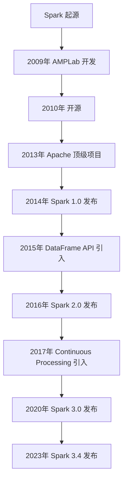

# Spark 历史与发展

Apache Spark 是一个快速、通用的大数据处理引擎，广泛应用于数据分析和机器学习领域。它的设计目标是提供比 Hadoop MapReduce 更高效的数据处理能力，同时支持多种编程语言和数据处理模式。本文将带你了解 Spark 的历史背景、发展历程以及它在大数据生态系统中的重要性。

## 1. Spark的起源

Apache Spark 最初由加州大学伯克利分校的 AMPLab（Algorithms, Machines, and People Lab）于 2009 年开发。其创始人是 Matei Zaharia，他在博士期间提出了 Spark 的核心概念。Spark 的设计初衷是为了解决 Hadoop MapReduce 在处理迭代算法和交互式查询时的性能瓶颈。

:::note
**Hadoop MapReduce 的局限性**  
Hadoop MapReduce 是一种批处理框架，适合处理大规模数据，但在处理迭代算法（如机器学习）和交互式查询时效率较低。每次迭代都需要将数据写入磁盘，导致性能下降。
:::

## 2. Spark的发展历程

### 2.1 早期阶段（2009-2013）

- **2009年**：Spark 项目在 AMPLab 启动，最初是为了优化机器学习算法的性能。
- **2010年**：Spark 开源，并迅速吸引了开发者的关注。
- **2013年**：Spark 成为 Apache 软件基金会的顶级项目，标志着其在大数据领域的地位得到认可。

### 2.2 快速发展阶段（2014-2016）

- **2014年**：Spark 1.0 发布，引入了 RDD（Resilient Distributed Dataset）作为核心抽象。
- **2015年**：Spark 1.3 引入了 DataFrame API，提供了更高级的数据操作接口。
- **2016年**：Spark 2.0 发布，引入了 Structured Streaming 和 Dataset API，进一步提升了数据处理能力。

### 2.3 成熟阶段（2017至今）

- **2017年**：Spark 2.2 引入了 Continuous Processing 模式，支持实时数据处理。
- **2020年**：Spark 3.0 发布，引入了 Adaptive Query Execution 和 Dynamic Partition Pruning 等优化功能。
- **2023年**：Spark 3.4 发布，继续优化性能和扩展功能。

## 3. Spark的核心概念

### 3.1 RDD（Resilient Distributed Dataset）

RDD 是 Spark 的核心抽象，代表一个不可变的分布式数据集。RDD 支持两种操作：
- **转换操作（Transformations）**：如 `map`、`filter`，生成新的 RDD。
- **行动操作（Actions）**：如 `count`、`collect`，触发计算并返回结果。

```python
# 示例：使用 RDD 进行简单的数据处理
from pyspark import SparkContext

sc = SparkContext("local", "RDD Example")
data = [1, 2, 3, 4, 5]
rdd = sc.parallelize(data)
squared_rdd = rdd.map(lambda x: x * x)
print(squared_rdd.collect())  # 输出: [1, 4, 9, 16, 25]
```

### 3.2 DataFrame 和 Dataset

DataFrame 和 Dataset 是 Spark 1.3 和 2.0 引入的高级 API，提供了更丰富的功能和更好的性能优化。

```python
# 示例：使用 DataFrame 进行数据处理
from pyspark.sql import SparkSession

spark = SparkSession.builder.appName("DataFrame Example").getOrCreate()
data = [("Alice", 34), ("Bob", 45), ("Cathy", 29)]
df = spark.createDataFrame(data, ["Name", "Age"])
df.show()
```

:::tip
**DataFrame 的优势**  
DataFrame 提供了类似 SQL 的查询接口，支持多种数据源（如 JSON、Parquet），并且可以通过 Catalyst 优化器进行性能优化。
:::

## 4. Spark的实际应用场景

### 4.1 大数据处理

Spark 广泛应用于大数据处理任务，如日志分析、ETL（Extract, Transform, Load）和数据清洗。

### 4.2 机器学习

Spark MLlib 提供了丰富的机器学习算法，支持分布式模型训练和预测。

```python
# 示例：使用 MLlib 进行线性回归
from pyspark.ml.regression import LinearRegression
from pyspark.ml.linalg import Vectors

data = [(Vectors.dense([1.0]), 2.0), (Vectors.dense([2.0]), 4.0)]
df = spark.createDataFrame(data, ["features", "label"])
lr = LinearRegression(maxIter=10, regParam=0.3)
model = lr.fit(df)
print(model.coefficients)  # 输出: [2.0]
```

### 4.3 实时数据处理

Spark Streaming 和 Structured Streaming 支持实时数据处理，适用于实时监控和流式分析。

## 5. 总结

Apache Spark 自 2009 年诞生以来，已经成为大数据处理领域的重要工具。它的核心设计理念是通过内存计算和高级 API 提升数据处理效率。无论是批处理、流处理还是机器学习，Spark 都提供了强大的支持。

:::caution
**学习建议**  
初学者可以从 RDD 和 DataFrame 入手，逐步掌握 Spark 的核心概念和 API。建议通过实际项目加深理解。
:::

## 6. 附加资源与练习

- **官方文档**：[Apache Spark Documentation](https://spark.apache.org/docs/latest/)
- **练习**：尝试使用 Spark 处理一个真实的数据集，如 [Kaggle](https://www.kaggle.com/) 上的公开数据。



通过本文的学习，你应该对 Spark 的历史与发展有了全面的了解。接下来，可以继续深入学习 Spark 的具体功能和应用场景。