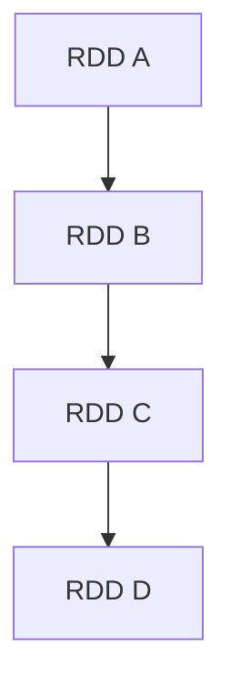

# Spark 常用术语

Apache Spark是一个快速、通用的集群计算系统，广泛用于大数据处理。为了帮助初学者更好地理解Spark的工作原理，本文将介绍一些Spark中的常用术语。

## 1. RDD（Resilient Distributed Dataset）

RDD（弹性分布式数据集）是Spark中最基本的数据抽象。它是一个不可变的、分布式的对象集合，可以在集群中并行处理。RDD可以从Hadoop文件系统（HDFS）或现有的Scala集合中创建，并支持两种类型的操作：**转换（Transformations）**和**动作（Actions）**。

### 示例代码
```scala
val data = Array(1, 2, 3, 4, 5)
val rdd = sc.parallelize(data)
val squaredRDD = rdd.map(x => x * x)
squaredRDD.collect().foreach(println)
```

**输出：**
```
1
4
9
16
25
```

:::note
RDD是Spark的核心数据结构，理解RDD是学习Spark的基础。
:::

## 2. DataFrame

DataFrame是一种以列形式组织的分布式数据集，类似于关系数据库中的表。它提供了丰富的API，支持SQL查询、数据过滤、聚合等操作。DataFrame比RDD更高效，因为它使用了Spark SQL的优化引擎。

### 示例代码
```scala
val df = spark.read.json("examples/src/main/resources/people.json")
df.show()
```

**输出：**
```
+----+-------+
| age|   name|
+----+-------+
|null|Michael|
|  30|   Andy|
|  19| Justin|
+----+-------+
```

:::tip
DataFrame是Spark中处理结构化数据的首选方式，特别适合处理大规模数据集。
:::

## 3. Dataset

Dataset是Spark 1.6引入的一个新API，它结合了RDD和DataFrame的优点。Dataset提供了类型安全的API，并且可以在编译时捕获错误。

### 示例代码
```scala
case class Person(name: String, age: Long)
val caseClassDS = Seq(Person("Andy", 32)).toDS()
caseClassDS.show()
```

**输出：**
```
+----+---+
|name|age|
+----+---+
|Andy| 32|
+----+---+
```

:::caution
Dataset API仅在Scala和Java中可用，Python和R中不支持。
:::

## 4. Spark Session

Spark Session是Spark 2.0引入的新入口点，用于替代旧的SparkContext。它提供了与Spark交互的统一接口，并支持DataFrame和Dataset API。

### 示例代码
```scala
val spark = SparkSession.builder()
  .appName("Spark Example")
  .config("spark.some.config.option", "some-value")
  .getOrCreate()
```

:::note
Spark Session是Spark 2.0及以后版本的推荐入口点。
:::

## 5. DAG（Directed Acyclic Graph）

DAG（有向无环图）是Spark调度程序用来表示RDD依赖关系的数据结构。每个Spark作业都会被分解成一系列的阶段（Stages），每个阶段由一组任务（Tasks）组成。



:::tip
理解DAG有助于优化Spark作业的性能。
:::

## 6. Executor

Executor是运行在集群节点上的进程，负责执行Spark作业中的任务。每个Executor都有自己的内存和CPU资源。

## 7. Driver

Driver是运行Spark应用程序的主进程，负责将用户代码转换为任务，并将任务分发给Executor执行。

## 8. Task

Task是Spark作业的最小执行单元，每个Task对应一个RDD分区上的计算。

## 9. Stage

Stage是Spark作业中的一组任务，每个Stage对应一个DAG中的阶段。Stage分为两种类型：**Shuffle Map Stage**和**Result Stage**。

## 10. Shuffle

Shuffle是Spark中用于在不同节点之间重新分配数据的过程。它通常发生在宽依赖（Wide Dependency）操作中，如`groupByKey`和`reduceByKey`。

### 示例代码
```scala
val rdd = sc.parallelize(Seq(("a", 1), ("b", 2), ("a", 3)))
val groupedRDD = rdd.groupByKey()
groupedRDD.collect().foreach(println)
```

**输出：**
```
(a, CompactBuffer(1, 3))
(b, CompactBuffer(2))
```

:::warning
Shuffle操作通常非常耗时，应尽量避免不必要的Shuffle。
:::

## 实际应用场景

假设你有一个大型日志文件，需要统计每个用户的访问次数。你可以使用Spark的RDD或DataFrame API来实现这一需求。

### 示例代码
```scala
val logs = sc.textFile("hdfs://path/to/logs")
val userCounts = logs.map(line => (line.split(" ")(0), 1))
  .reduceByKey(_ + _)
userCounts.collect().foreach(println)
```

**输出：**
```
(user1, 100)
(user2, 200)
(user3, 150)
```

## 总结

本文介绍了Spark中的一些常用术语，包括RDD、DataFrame、Dataset、Spark Session、DAG、Executor、Driver、Task、Stage和Shuffle。理解这些术语是掌握Spark的基础。

## 附加资源

- [Spark官方文档](https://spark.apache.org/docs/latest/)
- 《Learning Spark》 by Holden Karau, Andy Konwinski, Patrick Wendell, and Matei Zaharia

## 练习

1. 创建一个RDD并对其进行转换和动作操作。
2. 使用DataFrame API读取一个CSV文件并进行简单的数据操作。
3. 尝试理解一个Spark作业的DAG结构，并优化其性能。

通过以上内容的学习和练习，你将能够更好地理解和使用Spark进行大数据处理。