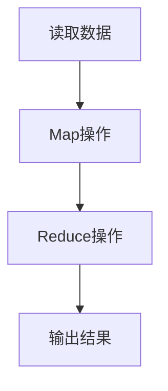

## 介绍

Apache Spark是一个快速、通用的集群计算系统，广泛用于大数据处理。它的核心设计目标是提供高效的数据处理能力，同时保持易用性。Spark的核心概念包括**RDD（弹性分布式数据集）**、**DataFrame**、**Dataset**以及**Spark的执行模型**。这些概念是理解和使用Spark的基础。

在本篇文章中，我们将逐步讲解这些核心概念，并通过代码示例和实际案例帮助你更好地理解它们。

---

## RDD（弹性分布式数据集）

RDD（Resilient Distributed Dataset）是Spark中最基本的数据抽象。它是一个不可变的分布式对象集合，可以在集群中并行处理。RDD的主要特点包括：

- **弹性**：RDD可以从故障中恢复，因为它记录了数据的血统（lineage），即数据的生成过程。
- **分布式**：RDD的数据分布在集群的多个节点上。
- **不可变**：RDD一旦创建，就不能被修改，但可以通过转换操作生成新的RDD。

### 创建RDD

RDD可以通过两种方式创建：
1. 从外部数据集（如HDFS、本地文件系统）加载。
2. 通过并行化驱动程序中的集合。

以下是一个从集合创建RDD的示例：

```python
from pyspark import SparkContext

# 初始化SparkContext
sc = SparkContext("local", "RDD Example")

# 从集合创建RDD
data = [1, 2, 3, 4, 5]
rdd = sc.parallelize(data)

# 输出RDD内容
print(rdd.collect())  # 输出: [1, 2, 3, 4, 5]
```

### RDD的转换操作

RDD支持多种转换操作，如`map`、`filter`、`reduceByKey`等。以下是一个使用`map`操作的示例：

```python
# 对RDD中的每个元素进行平方操作
squared_rdd = rdd.map(lambda x: x * x)

# 输出结果
print(squared_rdd.collect())  # 输出: [1, 4, 9, 16, 25]
```

:::tip
RDD的转换操作是惰性的，只有在执行动作操作（如`collect`）时才会真正计算。
:::

---

## DataFrame

DataFrame是Spark中用于处理结构化数据的高级API。它类似于关系型数据库中的表，具有明确的列和行。DataFrame的优势在于它提供了更高效的执行计划和更丰富的API。

### 创建DataFrame

DataFrame可以从多种数据源创建，如CSV文件、JSON文件、数据库等。以下是一个从CSV文件创建DataFrame的示例：

```python
from pyspark.sql import SparkSession

# 初始化SparkSession
spark = SparkSession.builder.appName("DataFrame Example").getOrCreate()

# 从CSV文件创建DataFrame
df = spark.read.csv("data.csv", header=True, inferSchema=True)

# 显示DataFrame的前5行
df.show(5)
```

### DataFrame的操作

DataFrame支持多种操作，如`select`、`filter`、`groupBy`等。以下是一个使用`filter`操作的示例：

```python
# 过滤出年龄大于30的记录
filtered_df = df.filter(df["age"] > 30)

# 显示过滤后的结果
filtered_df.show()
```

:::note
DataFrame的API比RDD更高级，适合处理结构化数据。它的执行计划经过优化，通常比RDD更高效。
:::

---

## Dataset

Dataset是Spark 1.6引入的一个新API，它结合了RDD的强类型特性和DataFrame的优化执行计划。Dataset可以在编译时进行类型检查，适合需要强类型安全的场景。

### 创建Dataset

Dataset可以通过将DataFrame转换为强类型对象来创建。以下是一个示例：

```python
from pyspark.sql import SparkSession
from pyspark.sql.types import StructType, StructField, IntegerType, StringType

# 初始化SparkSession
spark = SparkSession.builder.appName("Dataset Example").getOrCreate()

# 定义Schema
schema = StructType([
    StructField("id", IntegerType(), True),
    StructField("name", StringType(), True),
    StructField("age", IntegerType(), True)
])

# 从CSV文件创建DataFrame
df = spark.read.csv("data.csv", schema=schema)

# 将DataFrame转换为Dataset
dataset = df.as[Person]

# 显示Dataset的前5行
dataset.show(5)
```

:::caution
Dataset的强类型特性使其更适合于Scala和Java等静态类型语言，而在Python中，Dataset的使用相对较少。
:::

---

## Spark 的执行模型

Spark的执行模型基于**有向无环图（DAG）**。Spark将任务分解为多个阶段（stages），每个阶段包含多个任务（tasks）。这些任务在集群的节点上并行执行。

以下是一个简单的DAG示例：



:::warning
Spark的执行模型是惰性的，只有在执行动作操作时才会触发计算。因此，优化转换操作的顺序和数量非常重要。
:::

---

## 实际案例

假设我们有一个日志文件，记录了用户的访问记录。我们需要统计每个用户的访问次数。以下是使用Spark实现的示例：

```python
from pyspark.sql import SparkSession

# 初始化SparkSession
spark = SparkSession.builder.appName("Log Analysis").getOrCreate()

# 从日志文件创建DataFrame
logs_df = spark.read.csv("logs.csv", header=True, inferSchema=True)

# 统计每个用户的访问次数
user_counts = logs_df.groupBy("user_id").count()

# 显示结果
user_counts.show()
```

---

## 总结

在本篇文章中，我们介绍了Spark的核心概念，包括RDD、DataFrame、Dataset以及Spark的执行模型。这些概念是理解和使用Spark的基础。通过代码示例和实际案例，我们展示了如何在实际应用中使用这些概念。

---

## 附加资源

- [Apache Spark官方文档](https://spark.apache.org/docs/latest/)
- 《Learning Spark》书籍
- [Spark编程指南](https://spark.apache.org/docs/latest/rdd-programming-guide.html)

---

## 练习

1. 尝试从本地文件系统加载一个CSV文件，并使用DataFrame进行简单的过滤操作。
2. 使用RDD实现一个Word Count程序，统计文本中每个单词的出现次数。
3. 研究Spark的执行模型，尝试优化一个简单的Spark作业的执行计划。
