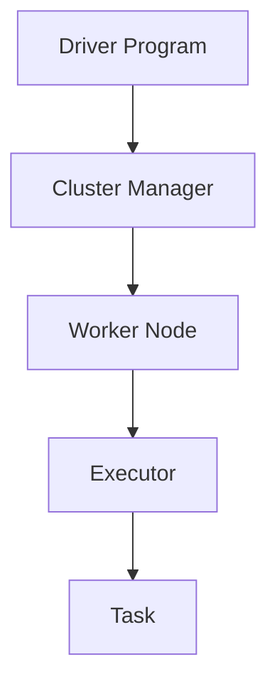

# Spark 架构概述

Apache Spark是一个快速、通用的集群计算系统，广泛用于大数据处理。它提供了高效的数据处理能力，支持批处理、流处理、机器学习和图计算等多种任务。本文将带你深入了解Spark的架构，帮助你理解其核心组件和工作原理。

## 什么是Spark架构？

Spark架构是一个分布式计算框架，由多个组件组成，这些组件协同工作以处理大规模数据集。Spark的核心设计目标是提供高效的内存计算能力，从而加速数据处理任务。

### 核心组件

Spark架构主要由以下几个核心组件组成：

1. **Driver Program**：驱动程序是Spark应用程序的入口点，负责将用户代码转换为任务，并将这些任务分发到集群中的工作节点上执行。
2. **Cluster Manager**：集群管理器负责管理集群资源，常见的集群管理器包括Standalone、YARN和Mesos。
3. **Worker Node**：工作节点是集群中实际执行任务的机器，每个工作节点上可以运行多个Executor。
4. **Executor**：Executor是工作节点上的进程，负责执行Driver Program分配的任务，并将结果返回给Driver Program。
5. **Task**：任务是Spark作业的最小执行单元，每个任务处理一个数据分区。



## Spark 工作原理

Spark的工作原理可以概括为以下几个步骤：

1. **用户提交应用程序**：用户通过Driver Program提交Spark应用程序。
2. **任务分配**：Driver Program将应用程序代码转换为一系列任务，并将这些任务分配给集群中的Executor。
3. **任务执行**：Executor在Worker Node上执行任务，并将结果返回给Driver Program。
4. **结果汇总**：Driver Program汇总所有任务的结果，并返回给用户。

### 代码示例

以下是一个简单的Spark应用程序示例，展示了如何创建一个RDD并对其进行操作：

```python
from pyspark import SparkContext

# 初始化SparkContext
sc = SparkContext("local", "Simple App")

# 创建一个RDD
data = [1, 2, 3, 4, 5]
rdd = sc.parallelize(data)

# 对RDD进行转换操作
squared_rdd = rdd.map(lambda x: x * x)

# 执行行动操作并输出结果
result = squared_rdd.collect()
print(result)
```

**输入**：`[1, 2, 3, 4, 5]`  
**输出**：`[1, 4, 9, 16, 25]`

:::note
在上面的代码中，`parallelize`方法将Python列表转换为RDD，`map`方法对RDD中的每个元素进行平方操作，`collect`方法将结果收集到Driver Program中。
:::

## 实际应用场景

Spark广泛应用于各种大数据处理场景，以下是一些典型的应用案例：

1. **日志分析**：Spark可以快速处理和分析大规模的日志数据，帮助企业了解用户行为、系统性能等。
2. **机器学习**：Spark提供了MLlib库，支持大规模的机器学习任务，如分类、回归、聚类等。
3. **实时流处理**：Spark Streaming可以处理实时数据流，适用于实时监控、实时推荐等场景。

:::tip
在实际应用中，Spark的性能优势主要体现在其内存计算能力上。通过将数据缓存在内存中，Spark可以显著减少磁盘I/O操作，从而加速数据处理。
:::

## 总结

Spark架构是一个强大的分布式计算框架，通过其核心组件和高效的内存计算能力，能够处理大规模数据集。本文介绍了Spark的核心组件、工作原理以及实际应用场景，帮助你初步理解Spark的架构。

### 附加资源

- [Apache Spark官方文档](https://spark.apache.org/docs/latest/)
- [Spark编程指南](https://spark.apache.org/docs/latest/rdd-programming-guide.html)
- [Spark Streaming编程指南](https://spark.apache.org/docs/latest/streaming-programming-guide.html)

### 练习

1. 尝试编写一个Spark应用程序，使用`filter`方法过滤出RDD中的偶数。
2. 研究Spark Streaming的API，并尝试编写一个简单的实时流处理应用程序。

通过不断练习和实践，你将能够更好地掌握Spark的架构和应用。