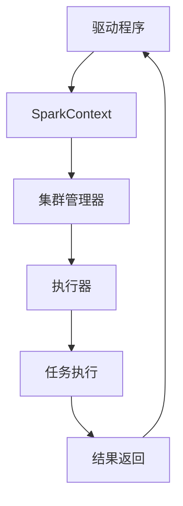

# Spark 应用程序结构

Apache Spark是一个强大的分布式计算框架，广泛应用于大数据处理。要充分利用Spark的功能，理解其应用程序的基本结构至关重要。本文将逐步介绍Spark应用程序的核心组成部分，并通过实际案例帮助你更好地掌握这些概念。

## 什么是Spark应用程序？

Spark应用程序是由一个**驱动程序**（Driver Program）和多个**执行器**（Executor）组成的分布式计算任务。驱动程序负责定义任务并协调执行器的工作，而执行器则负责在集群节点上执行具体的计算任务。

### Spark 应用程序的核心组件

1. **驱动程序（Driver Program）**  
   驱动程序是Spark应用程序的入口点。它负责定义RDD（弹性分布式数据集）和转换操作，并将任务分发给执行器。驱动程序通常运行在集群的主节点上。

2. **执行器（Executor）**  
   执行器是运行在集群工作节点上的进程，负责执行驱动程序分配的任务。每个执行器都有自己的内存和CPU资源，用于处理数据和执行计算。

3. **任务（Task）**  
   任务是Spark中最小的计算单元。每个任务对应一个RDD分区上的操作。执行器会并行运行多个任务以加速计算。

4. **RDD（弹性分布式数据集）**  
   RDD是Spark的核心数据结构，代表一个不可变的分布式数据集合。RDD支持两种操作：**转换操作**（Transformation）和**行动操作**（Action）。

5. **集群管理器（Cluster Manager）**  
   集群管理器负责管理集群资源，并将资源分配给Spark应用程序。常见的集群管理器包括YARN、Mesos和Spark自带的Standalone模式。

## Spark 应用程序的执行流程

以下是一个典型的Spark应用程序执行流程：

1. 驱动程序启动并初始化SparkContext。
2. SparkContext连接到集群管理器，申请资源。
3. 集群管理器分配资源，启动执行器。
4. 驱动程序将任务代码发送给执行器。
5. 执行器执行任务并将结果返回给驱动程序。
6. 驱动程序收集结果并完成计算。



## 代码示例：简单的Spark应用程序

以下是一个简单的Spark应用程序示例，展示了如何计算文本文件中单词的出现次数。

```python
from pyspark import SparkContext

# 初始化SparkContext
sc = SparkContext("local", "WordCountApp")

# 读取文本文件并创建RDD
text_file = sc.textFile("example.txt")

# 执行转换操作：将每行拆分为单词
words = text_file.flatMap(lambda line: line.split(" "))

# 执行转换操作：将单词映射为 (word, 1) 的键值对
word_counts = words.map(lambda word: (word, 1))

# 执行行动操作：统计每个单词的出现次数
result = word_counts.reduceByKey(lambda a, b: a + b)

# 输出结果
result.collect()
```

### 输入
假设 `example.txt` 文件内容如下：
```
hello world
hello spark
spark is awesome
```

### 输出
```python
[('hello', 2), ('world', 1), ('spark', 2), ('is', 1), ('awesome', 1)]
```

:::note
**注意**：在实际生产环境中，Spark应用程序通常运行在分布式集群上，而不是本地模式（`local`）。
:::

## 实际应用场景

### 场景：日志分析
假设你有一个包含大量服务器日志的文件，需要统计每个IP地址的访问次数。使用Spark可以轻松处理这种大规模数据。

1. 读取日志文件并创建RDD。
2. 使用 `map` 操作提取IP地址。
3. 使用 `reduceByKey` 操作统计每个IP地址的访问次数。
4. 将结果保存到文件或数据库中。

:::tip
**提示**：在处理大规模数据时，合理设置分区数可以提高计算效率。
:::

## 总结

Spark应用程序的结构包括驱动程序、执行器、任务和RDD等核心组件。驱动程序负责协调任务，执行器负责执行计算，而RDD则是Spark的核心数据结构。通过理解这些概念，你可以更好地设计和优化Spark应用程序。

## 附加资源与练习

- **资源**：
  - [Spark官方文档](https://spark.apache.org/docs/latest/)
  - 《Learning Spark》书籍
- **练习**：
  1. 尝试编写一个Spark应用程序，统计一段文本中每个字母的出现次数。
  2. 修改上述代码，使其在分布式集群上运行。

通过不断实践，你将更深入地理解Spark的工作原理，并能够处理更复杂的数据分析任务。