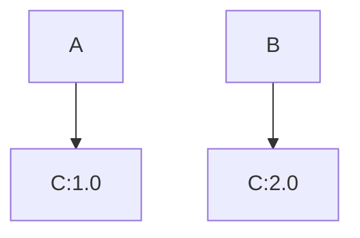

# Spark 依赖管理

在Apache Spark中，依赖管理是一个关键的概念，尤其是在处理复杂的分布式计算任务时。依赖管理不仅涉及到如何将外部库引入到Spark应用程序中，还包括如何解决依赖冲突、优化依赖加载以及确保应用程序的稳定性和性能。

## 什么是依赖管理？

依赖管理是指在软件开发过程中，管理项目所依赖的外部库或模块的过程。在Spark中，依赖管理尤为重要，因为Spark应用程序通常需要依赖多个外部库来完成特定的任务，例如数据处理、机器学习或图形计算。

## 为什么需要依赖管理？

1. **模块化开发**：通过依赖管理，可以将应用程序分解为多个模块，每个模块可以独立开发和测试。
2. **代码复用**：依赖管理允许开发者复用已有的库，避免重复造轮子。
3. **版本控制**：通过依赖管理，可以确保所有开发者使用相同版本的库，避免因版本不一致导致的问题。
4. **冲突解决**：当多个依赖库之间存在冲突时，依赖管理可以帮助解决这些冲突。

## 如何在Spark中添加依赖？

在Spark中，通常使用构建工具（如Maven或SBT）来管理依赖。以下是一个使用Maven添加依赖的示例：

```xml
<dependencies>
    <dependency>
        <groupId>org.apache.spark</groupId>
        <artifactId>spark-core_2.12</artifactId>
        <version>3.2.0</version>
    </dependency>
    <dependency>
        <groupId>org.apache.spark</groupId>
        <artifactId>spark-sql_2.12</artifactId>
        <version>3.2.0</version>
    </dependency>
</dependencies>
```

在这个示例中，我们添加了Spark Core和Spark SQL的依赖。`groupId`、`artifactId`和`version`分别指定了依赖的组织、模块和版本。

## 依赖冲突及其解决

当多个依赖库之间存在冲突时，可能会导致应用程序无法正常运行。常见的冲突包括版本冲突和类路径冲突。

### 版本冲突

版本冲突发生在两个或多个依赖库需要不同版本的同一库时。例如，假设我们有两个依赖库A和B，它们分别依赖于库C的1.0和2.0版本。



在这种情况下，Maven或SBT会自动选择一个版本（通常是较新的版本），但这可能会导致A或B无法正常工作。

### 解决版本冲突

1. **排除冲突依赖**：可以通过在依赖声明中排除冲突的依赖来解决版本冲突。

    ```xml
    <dependency>
        <groupId>com.example</groupId>
        <artifactId>A</artifactId>
        <version>1.0</version>
        <exclusions>
            <exclusion>
                <groupId>com.example</groupId>
                <artifactId>C</artifactId>
            </exclusion>
        </exclusions>
    </dependency>
    ```

2. **手动指定版本**：可以手动指定依赖库的版本，以确保所有依赖库使用相同的版本。

    ```xml
    <dependency>
        <groupId>com.example</groupId>
        <artifactId>C</artifactId>
        <version>2.0</version>
    </dependency>
    ```

## 实际案例：在Spark中使用外部库

假设我们正在开发一个Spark应用程序，需要使用一个外部的JSON解析库（如`json4s`）来处理JSON数据。我们可以通过以下步骤添加依赖并解决可能的冲突。

1. **添加依赖**：

    ```xml
    <dependency>
        <groupId>org.json4s</groupId>
        <artifactId>json4s-native_2.12</artifactId>
        <version>4.0.3</version>
    </dependency>
    ```

2. **解决冲突**：如果`json4s`与其他依赖库存在冲突，可以通过排除冲突的依赖或手动指定版本来解决。

## 总结

依赖管理是Spark开发中的一个重要环节，它确保了应用程序的稳定性和性能。通过合理使用构建工具（如Maven或SBT），开发者可以轻松地添加、管理和解决依赖冲突。在实际开发中，理解依赖管理的基本原理并掌握解决冲突的技巧，将有助于构建更加健壮的Spark应用程序。

## 附加资源与练习

- **练习**：尝试在一个Spark项目中添加多个依赖库，并解决可能出现的版本冲突。
- **资源**：
  - [Maven官方文档](https://maven.apache.org/guides/introduction/introduction-to-dependency-mechanism.html)
  - [SBT官方文档](https://www.scala-sbt.org/1.x/docs/Library-Dependencies.html)
