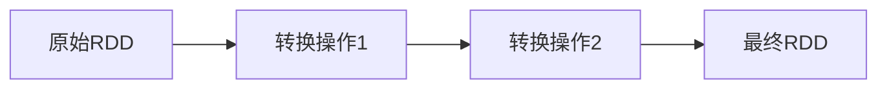

# RDD容错机制

在分布式计算中，容错机制是确保系统在发生故障时能够继续运行的关键。Spark的RDD（弹性分布式数据集）通过其独特的容错机制，能够在节点故障时自动恢复数据。本文将详细介绍RDD的容错机制，并通过示例和实际案例帮助你理解其工作原理。

## 什么是RDD容错机制？

RDD的容错机制是指当某个节点发生故障时，Spark能够自动恢复丢失的数据，并继续执行任务。这种机制依赖于RDD的两个核心特性：

1. **不可变性**：RDD是不可变的，一旦创建就不能被修改。如果需要修改，只能通过转换操作生成新的RDD。
2. **血统（Lineage）**：RDD记录了其生成过程中的所有转换操作，这些操作构成了RDD的血统。通过血统，Spark可以在数据丢失时重新计算丢失的分区。

## RDD容错机制的工作原理

### 1. 不可变性

RDD的不可变性意味着每个RDD都是只读的。任何对RDD的修改都会生成一个新的RDD，而不是修改原始RDD。这种特性使得RDD在分布式环境中更容易管理，因为不需要担心多个任务同时修改同一个RDD。

### 2. 血统（Lineage）

RDD的血统是指RDD的生成历史，即它是通过哪些转换操作从父RDD生成的。Spark通过记录这些转换操作，可以在数据丢失时重新计算丢失的分区。



在上图中，`最终RDD`的血统包含了从`原始RDD`到`最终RDD`的所有转换操作。如果`最终RDD`的某个分区丢失，Spark可以根据血统重新计算该分区。

## 代码示例

以下是一个简单的Spark代码示例，展示了RDD的容错机制：

```python
from pyspark import SparkContext

# 初始化SparkContext
sc = SparkContext("local", "RDD Fault Tolerance Example")

# 创建一个RDD
data = [1, 2, 3, 4, 5]
rdd = sc.parallelize(data)

# 对RDD进行转换操作
rdd2 = rdd.map(lambda x: x * 2)
rdd3 = rdd2.filter(lambda x: x > 5)

# 执行行动操作
result = rdd3.collect()

# 输出结果
print(result)  # 输出: [6, 8, 10]
```

在这个示例中，`rdd3`的血统包含了从`rdd`到`rdd3`的所有转换操作。如果`rdd3`的某个分区丢失，Spark可以根据血统重新计算该分区。

## 实际案例

假设你正在处理一个大型日志文件，并且需要计算每个用户的访问次数。由于日志文件非常大，你决定使用Spark进行分布式处理。在计算过程中，某个节点发生了故障，导致部分数据丢失。由于RDD的容错机制，Spark可以根据血统重新计算丢失的数据，而不需要从头开始处理整个日志文件。

## 总结

RDD的容错机制是Spark能够在分布式环境中高效运行的关键。通过RDD的不可变性和血统，Spark能够在节点故障时自动恢复数据，并继续执行任务。理解RDD的容错机制对于编写高效的Spark程序至关重要。

## 附加资源

- [Spark官方文档](https://spark.apache.org/docs/latest/rdd-programming-guide.html)
- 《Learning Spark》书籍
- [Spark RDD编程指南](https://spark.apache.org/docs/latest/rdd-programming-guide.html)

## 练习

1. 尝试编写一个Spark程序，使用多个转换操作生成一个RDD，并观察其血统。
2. 模拟一个节点故障，观察Spark如何重新计算丢失的分区。
