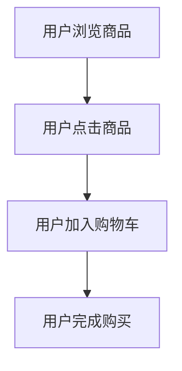

# 用户行为分析

用户行为分析是通过收集和分析用户在应用程序或网站上的行为数据，来了解用户偏好、优化产品设计以及提升用户体验的过程。在大数据时代，Apache Spark 是一个强大的工具，能够高效处理海量用户行为数据，并从中提取有价值的信息。

本文将逐步介绍如何使用 Spark 进行用户行为分析，包括数据收集、数据清洗、行为模式分析以及可视化展示。我们将通过一个实际案例，帮助你理解如何将这些技术应用到真实场景中。

---

## 1. 什么是用户行为分析？

用户行为分析是指通过跟踪和记录用户在应用程序或网站上的操作（如点击、浏览、购买等），来分析用户的行为模式、偏好和趋势。这些数据可以帮助企业优化产品设计、提升用户留存率、增加转化率等。

常见的用户行为数据包括：
- **页面浏览**：用户访问了哪些页面。
- **点击事件**：用户点击了哪些按钮或链接。
- **停留时间**：用户在某个页面停留了多长时间。
- **转化行为**：用户是否完成了特定目标（如注册、购买等）。

---

## 2. 使用 Spark 进行用户行为分析的优势

Apache Spark 是一个分布式计算框架，特别适合处理大规模数据集。以下是使用 Spark 进行用户行为分析的主要优势：
- **高效处理海量数据**：Spark 的内存计算能力可以显著提高数据处理速度。
- **丰富的 API**：Spark 提供了 Scala、Java、Python 和 R 等多种编程语言的 API，方便开发者使用。
- **内置机器学习库**：Spark MLlib 可以帮助你快速构建用户行为预测模型。

---

## 3. 用户行为分析的步骤

### 3.1 数据收集
用户行为数据通常通过埋点技术收集，例如在网站或应用中嵌入 JavaScript 代码，记录用户的操作。收集到的数据可以存储在日志文件或数据库中。

### 3.2 数据清洗
原始数据通常包含噪声和缺失值，需要进行清洗。常见的数据清洗操作包括：
- 去除重复数据
- 处理缺失值
- 格式化时间戳

以下是一个简单的数据清洗示例：

```python
from pyspark.sql import SparkSession
from pyspark.sql.functions import col

# 创建 SparkSession
spark = SparkSession.builder.appName("UserBehaviorAnalysis").getOrCreate()

# 读取原始数据
df = spark.read.csv("user_behavior_logs.csv", header=True, inferSchema=True)

# 数据清洗
cleaned_df = df.dropDuplicates().na.drop()
cleaned_df = cleaned_df.withColumn("timestamp", col("timestamp").cast("timestamp"))

cleaned_df.show()
```

### 3.3 行为模式分析
在数据清洗完成后，我们可以对用户行为进行分析。常见的分析任务包括：
- **用户活跃度分析**：统计用户的每日活跃量（DAU）。
- **用户路径分析**：分析用户在应用中的典型路径。
- **转化率分析**：计算用户从浏览到购买的转化率。

以下是一个计算每日活跃用户的示例：

```python
from pyspark.sql.functions import date_format

# 计算每日活跃用户
daily_active_users = cleaned_df.groupBy(date_format("timestamp", "yyyy-MM-dd").alias("date")).count()
daily_active_users.show()
```

### 3.4 可视化展示
分析结果通常需要以图表的形式展示。可以使用 Python 的 Matplotlib 或 Seaborn 库进行可视化。

---

## 4. 实际案例：电商网站用户行为分析

假设我们有一个电商网站的用户行为日志，包含以下字段：
- `user_id`：用户 ID
- `timestamp`：操作时间
- `action`：用户行为（如 "view"、"click"、"purchase"）
- `product_id`：商品 ID

我们的目标是分析用户的购买行为，找出哪些商品最受欢迎，以及用户的购买路径。

### 4.1 数据准备
首先，加载并清洗数据：

```python
# 读取数据
df = spark.read.csv("ecommerce_logs.csv", header=True, inferSchema=True)

# 清洗数据
cleaned_df = df.dropDuplicates().na.drop()
cleaned_df = cleaned_df.withColumn("timestamp", col("timestamp").cast("timestamp"))
```

### 4.2 分析热门商品
统计每个商品的浏览次数和购买次数：

```python
from pyspark.sql.functions import count, when

# 统计商品浏览次数
view_counts = cleaned_df.filter(col("action") == "view").groupBy("product_id").agg(count("*").alias("view_count"))

# 统计商品购买次数
purchase_counts = cleaned_df.filter(col("action") == "purchase").groupBy("product_id").agg(count("*").alias("purchase_count"))

# 合并结果
product_stats = view_counts.join(purchase_counts, "product_id", "outer").na.fill(0)
product_stats.show()
```

### 4.3 用户购买路径分析
分析用户从浏览到购买的典型路径：



---

## 5. 总结

通过本文的学习，你应该已经掌握了如何使用 Apache Spark 进行用户行为分析的基本流程。我们从数据收集、清洗、分析到可视化展示，逐步讲解了每个步骤的实现方法，并通过一个电商网站的案例加深了理解。

用户行为分析是一个强大的工具，可以帮助企业更好地理解用户需求，优化产品设计，并提升用户体验。希望你能将这些技术应用到实际项目中，创造出更大的价值。

---

## 6. 附加资源与练习

### 附加资源
- [Apache Spark 官方文档](https://spark.apache.org/docs/latest/)
- [用户行为分析的最佳实践](https://www.example.com)

### 练习
1. 尝试使用 Spark 分析你所在公司的用户行为数据。
2. 扩展本文的案例，分析用户的流失率，并找出流失的主要原因。
3. 使用 Spark MLlib 构建一个用户购买预测模型。

祝你学习愉快！