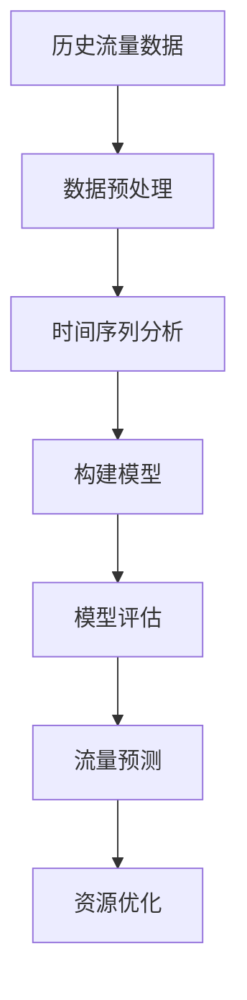

# 流量预测系统

## 介绍

流量预测系统是一种基于历史数据预测未来流量的工具。它在许多领域都有广泛应用，例如网络流量管理、交通流量预测、电商平台用户访问量预测等。通过分析历史数据，我们可以使用机器学习或统计模型来预测未来的流量趋势，从而为决策提供支持。

在本教程中，我们将使用 Apache Spark 构建一个简单的流量预测系统。我们将从数据预处理开始，逐步讲解如何构建模型并进行预测。

## 1. 数据预处理

在构建流量预测系统之前，我们需要对数据进行预处理。假设我们有一个包含时间戳和流量值的数据集，格式如下：

```csv
timestamp,value
2023-01-01 00:00:00,100
2023-01-01 01:00:00,150
2023-01-01 02:00:00,200
...
```

首先，我们需要将数据加载到 Spark DataFrame 中，并进行必要的清洗和转换。

```python
from pyspark.sql import SparkSession
from pyspark.sql.functions import col

# 创建 SparkSession
spark = SparkSession.builder.appName("TrafficPrediction").getOrCreate()

# 加载数据
df = spark.read.csv("traffic_data.csv", header=True, inferSchema=True)

# 转换时间戳列
df = df.withColumn("timestamp", col("timestamp").cast("timestamp"))

# 显示数据
df.show()
```

:::note
确保你的数据集中没有缺失值或异常值。如果有，可以使用 `fillna` 或 `dropna` 方法进行处理。
:::

## 2. 时间序列分析

时间序列分析是流量预测的核心。我们需要将数据按时间顺序排列，并提取出时间特征，例如小时、天、周等。

```python
from pyspark.sql.functions import hour, dayofweek, month

# 提取时间特征
df = df.withColumn("hour", hour(col("timestamp"))) \
       .withColumn("day_of_week", dayofweek(col("timestamp"))) \
       .withColumn("month", month(col("timestamp")))

# 显示提取后的数据
df.show()
```

:::tip
时间特征的提取可以帮助模型更好地理解数据的周期性。
:::

## 3. 构建模型

我们将使用 Spark MLlib 中的线性回归模型来进行流量预测。首先，我们需要将数据分为训练集和测试集。

```python
from pyspark.ml.feature import VectorAssembler
from pyspark.ml.regression import LinearRegression
from pyspark.ml.evaluation import RegressionEvaluator

# 特征向量化
assembler = VectorAssembler(inputCols=["hour", "day_of_week", "month"], outputCol="features")
df = assembler.transform(df)

# 划分训练集和测试集
train_data, test_data = df.randomSplit([0.8, 0.2], seed=42)

# 构建线性回归模型
lr = LinearRegression(featuresCol="features", labelCol="value")
lr_model = lr.fit(train_data)

# 预测
predictions = lr_model.transform(test_data)
predictions.select("timestamp", "value", "prediction").show()
```

:::caution
线性回归模型假设数据是线性的，如果数据具有非线性特征，可能需要使用更复杂的模型，如决策树回归或随机森林回归。
:::

## 4. 模型评估

为了评估模型的性能，我们可以使用均方误差（MSE）或均方根误差（RMSE）等指标。

```python
# 评估模型
evaluator = RegressionEvaluator(labelCol="value", predictionCol="prediction", metricName="rmse")
rmse = evaluator.evaluate(predictions)
print(f"Root Mean Squared Error (RMSE): {rmse}")
```

:::warning
如果模型的误差较大，可能需要重新调整特征或尝试其他模型。
:::

## 5. 实际案例

假设我们正在为一个电商平台构建流量预测系统。通过分析历史数据，我们发现流量在周末和节假日会有显著增加。我们可以利用这些信息来优化服务器资源分配，确保在高峰时段有足够的资源支持。



## 总结

在本教程中，我们学习了如何使用 Apache Spark 构建一个流量预测系统。我们从数据预处理开始，逐步讲解了时间序列分析、模型构建和评估。通过实际案例，我们展示了流量预测系统在电商平台中的应用。

## 附加资源

- [Apache Spark 官方文档](https://spark.apache.org/docs/latest/)
- [时间序列分析教程](https://www.analyticsvidhya.com/blog/2021/10/a-comprehensive-guide-to-time-series-analysis/)
- [机器学习模型评估方法](https://towardsdatascience.com/evaluating-machine-learning-models-1397a1b7b3e7)

## 练习

1. 尝试使用不同的时间特征（如季度、节假日）来改进模型。
2. 使用其他回归模型（如决策树回归）进行预测，并比较其性能。
3. 将模型部署到生产环境中，实时预测流量并优化资源分配。
