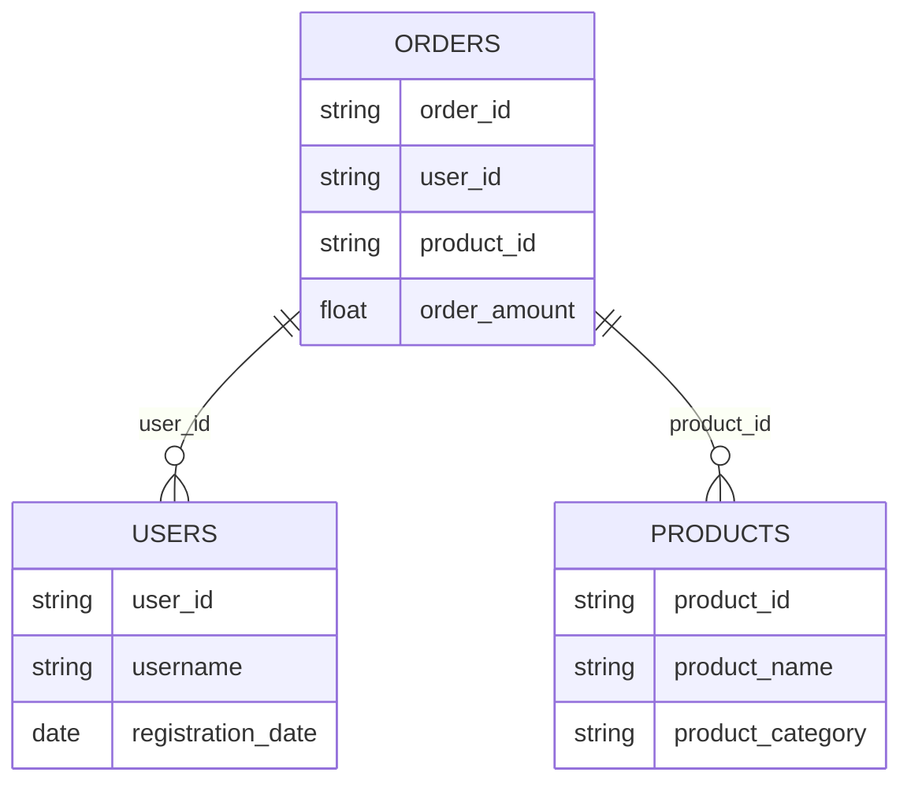

# 数据仓库构建

## 介绍

数据仓库（Data Warehouse）是一个用于存储和管理大量结构化数据的系统，旨在支持企业决策和分析。与传统的数据库不同，数据仓库专注于数据的集成、历史数据的存储以及复杂查询的优化。通过数据仓库，企业可以从多个数据源中提取数据，并将其整合到一个统一的视图中，以便进行高效的分析和报告。

在本教程中，我们将使用 Apache Spark 来构建一个简单的数据仓库。Spark 是一个强大的分布式计算框架，特别适合处理大规模数据集。我们将从基础概念开始，逐步讲解如何设计和实现一个数据仓库。

## 数据仓库的核心概念

### 1. 数据源（Data Sources）
数据仓库的数据通常来自多个数据源，例如关系型数据库、日志文件、API 等。这些数据源可能是结构化的、半结构化的或非结构化的。

### 2. ETL（Extract, Transform, Load）
ETL 是数据仓库构建的核心过程：
- **Extract**：从数据源中提取数据。
- **Transform**：对数据进行清洗、转换和整合。
- **Load**：将处理后的数据加载到数据仓库中。

### 3. 数据模型（Data Model）
数据仓库通常采用星型模型（Star Schema）或雪花模型（Snowflake Schema）来组织数据。这些模型通过事实表（Fact Table）和维度表（Dimension Table）来描述数据之间的关系。

### 4. 数据存储（Data Storage）
数据仓库的数据通常存储在分布式文件系统（如 HDFS）或云存储（如 S3）中，以便支持大规模数据处理。

## 使用 Spark 构建数据仓库

### 1. 数据提取（Extract）
首先，我们需要从不同的数据源中提取数据。假设我们有一个 CSV 文件和一个 MySQL 数据库作为数据源。

```python
from pyspark.sql import SparkSession

# 创建 SparkSession
spark = SparkSession.builder \
    .appName("Data Warehouse Example") \
    .getOrCreate()

# 从 CSV 文件中提取数据
csv_df = spark.read.csv("path/to/csv/file.csv", header=True, inferSchema=True)

# 从 MySQL 数据库中提取数据
mysql_df = spark.read \
    .format("jdbc") \
    .option("url", "jdbc:mysql://localhost:3306/database") \
    .option("dbtable", "table_name") \
    .option("user", "username") \
    .option("password", "password") \
    .load()
```

### 2. 数据转换（Transform）
接下来，我们需要对提取的数据进行清洗和转换。例如，我们可以将数据合并、过滤或进行聚合操作。

```python
# 合并两个数据源
merged_df = csv_df.join(mysql_df, on="common_column", how="inner")

# 过滤数据
filtered_df = merged_df.filter(merged_df["column_name"] > 100)

# 聚合数据
aggregated_df = filtered_df.groupBy("group_column").agg({"value_column": "sum"})
```

### 3. 数据加载（Load）
最后，我们将处理后的数据加载到数据仓库中。数据仓库可以是一个分布式文件系统，如 HDFS 或 S3。

```python
# 将数据保存到 Parquet 文件中
aggregated_df.write.parquet("path/to/output/parquet")
```

## 实际案例：电商数据仓库

假设我们正在为一个电商平台构建数据仓库。我们需要从订单系统、用户系统和产品系统中提取数据，并将其整合到一个统一的数据仓库中。

### 数据源
- **订单系统**：包含订单ID、用户ID、产品ID、订单金额等信息。
- **用户系统**：包含用户ID、用户名、注册日期等信息。
- **产品系统**：包含产品ID、产品名称、产品类别等信息。

### 数据模型
我们采用星型模型来组织数据：
- **事实表**：订单事实表，包含订单ID、用户ID、产品ID、订单金额等字段。
- **维度表**：用户维度表和产品维度表，分别包含用户和产品的详细信息。



### ETL 过程
1. **Extract**：从订单系统、用户系统和产品系统中提取数据。
2. **Transform**：将订单数据与用户数据和产品数据关联，生成订单事实表。
3. **Load**：将订单事实表和维度表保存到数据仓库中。

```python
# 提取数据
orders_df = spark.read.csv("path/to/orders.csv", header=True, inferSchema=True)
users_df = spark.read.csv("path/to/users.csv", header=True, inferSchema=True)
products_df = spark.read.csv("path/to/products.csv", header=True, inferSchema=True)

# 转换数据
orders_fact_df = orders_df.join(users_df, on="user_id", how="inner") \
                          .join(products_df, on="product_id", how="inner")

# 加载数据
orders_fact_df.write.parquet("path/to/data_warehouse/orders_fact")
users_df.write.parquet("path/to/data_warehouse/users_dim")
products_df.write.parquet("path/to/data_warehouse/products_dim")
```

## 总结

通过本教程，我们学习了如何使用 Apache Spark 构建一个简单的数据仓库。我们从数据提取、转换和加载（ETL）的基础概念开始，逐步讲解了如何设计和实现一个数据仓库。我们还通过一个电商平台的案例，展示了数据仓库在实际应用中的使用场景。

:::tip
如果你想进一步学习数据仓库的优化和高级功能，可以探索以下主题：
- 数据分区和分桶
- 数据压缩和存储格式优化
- 数据仓库的性能调优
:::

## 附加资源
- [Apache Spark 官方文档](https://spark.apache.org/docs/latest/)
- [数据仓库设计最佳实践](https://www.kimballgroup.com/data-warehouse-business-intelligence-resources/)

## 练习
1. 尝试从不同的数据源（如 JSON 文件、API）中提取数据，并将其整合到数据仓库中。
2. 设计一个雪花模型的数据仓库，并实现相应的 ETL 过程。
3. 探索如何使用 Spark 进行数据仓库的性能优化。

祝你学习愉快！