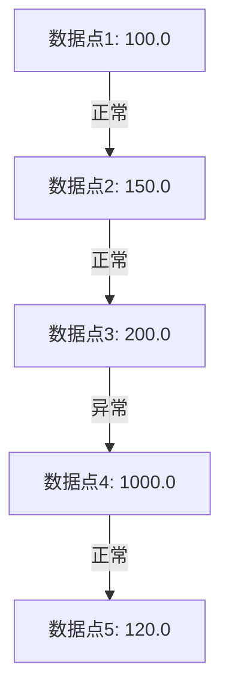

# 异常检测系统

异常检测（Anomaly Detection）是数据科学中的一个重要任务，旨在识别数据集中与大多数数据显著不同的数据点。这些异常点可能是由于错误、欺诈、设备故障或其他异常情况引起的。在本教程中，我们将使用 Apache Spark 构建一个简单的异常检测系统，帮助初学者理解其基本原理和实现方法。

## 什么是异常检测？

异常检测是一种识别数据集中异常值的技术。异常值是指那些与数据集中的大多数数据显著不同的数据点。这些异常值可能是由于数据录入错误、设备故障、欺诈行为或其他异常情况引起的。异常检测在许多领域都有广泛的应用，例如金融欺诈检测、网络入侵检测、医疗诊断等。

## 使用 Spark 构建异常检测系统

### 1. 数据准备

首先，我们需要准备一个数据集。假设我们有一个包含用户交易记录的数据集，其中包含交易金额和交易时间。我们的目标是识别出异常的交易记录。

```python
from pyspark.sql import SparkSession

# 创建 SparkSession
spark = SparkSession.builder.appName("AnomalyDetection").getOrCreate()

# 创建示例数据集
data = [
    (1, 100.0, "2023-10-01 12:00:00"),
    (2, 150.0, "2023-10-01 12:05:00"),
    (3, 200.0, "2023-10-01 12:10:00"),
    (4, 1000.0, "2023-10-01 12:15:00"),  # 异常值
    (5, 120.0, "2023-10-01 12:20:00")
]

# 创建 DataFrame
df = spark.createDataFrame(data, ["id", "amount", "timestamp"])
df.show()
```

**输出：**

```
+---+------+-------------------+
| id|amount|          timestamp|
+---+------+-------------------+
|  1| 100.0|2023-10-01 12:00:00|
|  2| 150.0|2023-10-01 12:05:00|
|  3| 200.0|2023-10-01 12:10:00|
|  4|1000.0|2023-10-01 12:15:00|
|  5| 120.0|2023-10-01 12:20:00|
+---+------+-------------------+
```

### 2. 计算统计量

接下来，我们需要计算数据集的统计量，例如均值和标准差，以便识别异常值。

```python
from pyspark.sql.functions import mean, stddev

# 计算均值和标准差
mean_amount = df.select(mean("amount")).collect()[0][0]
stddev_amount = df.select(stddev("amount")).collect()[0][0]

print(f"Mean: {mean_amount}, StdDev: {stddev_amount}")
```

**输出：**

```
Mean: 314.0, StdDev: 379.4733192202055
```

### 3. 定义异常检测规则

我们可以使用均值和标准差来定义异常检测规则。通常，如果一个数据点与均值的偏差超过一定倍数的标准差，则认为它是异常值。

```python
from pyspark.sql.functions import col

# 定义异常检测规则
threshold = 2  # 2倍标准差
df_with_anomalies = df.withColumn(
    "is_anomaly",
    (col("amount") > (mean_amount + threshold * stddev_amount)) |
    (col("amount") < (mean_amount - threshold * stddev_amount))
)

df_with_anomalies.show()
```

**输出：**

```
+---+------+-------------------+----------+
| id|amount|          timestamp|is_anomaly|
+---+------+-------------------+----------+
|  1| 100.0|2023-10-01 12:00:00|     false|
|  2| 150.0|2023-10-01 12:05:00|     false|
|  3| 200.0|2023-10-01 12:10:00|     false|
|  4|1000.0|2023-10-01 12:15:00|      true|
|  5| 120.0|2023-10-01 12:20:00|     false|
+---+------+-------------------+----------+
```

### 4. 可视化异常检测结果

为了更好地理解异常检测的结果，我们可以使用图表来可视化数据点和异常值。



## 实际应用案例

### 金融欺诈检测

在金融领域，异常检测常用于识别欺诈交易。例如，银行可以使用异常检测系统来监控客户的交易行为，识别出与客户正常交易模式显著不同的交易，从而及时发现潜在的欺诈行为。

### 网络入侵检测

在网络安全管理中，异常检测可以用于识别网络中的异常流量。例如，当网络流量突然激增或出现异常模式时，系统可以及时发出警报，帮助管理员采取措施防止潜在的网络攻击。

## 总结

在本教程中，我们学习了如何使用 Apache Spark 构建一个简单的异常检测系统。我们从数据准备开始，计算了数据集的统计量，定义了异常检测规则，并最终识别出了数据集中的异常值。异常检测在许多领域都有广泛的应用，例如金融欺诈检测、网络入侵检测等。

:::tip
如果你想进一步学习异常检测，可以尝试使用更复杂的算法，例如孤立森林（Isolation Forest）或自动编码器（Autoencoder），来提高检测的准确性。
:::

## 附加资源

- [Apache Spark 官方文档](https://spark.apache.org/docs/latest/)
- [异常检测算法综述](https://arxiv.org/abs/1901.03407)
- [金融欺诈检测案例研究](https://www.sciencedirect.com/science/article/pii/S1568494619305986)

## 练习

1. 修改代码，使用不同的阈值（例如 1.5 倍标准差）来检测异常值，并观察结果的变化。
2. 尝试使用其他统计量（例如中位数和四分位距）来定义异常检测规则。
3. 使用真实数据集（例如 Kaggle 上的信用卡欺诈数据集）来构建一个更复杂的异常检测系统。

祝你学习愉快！