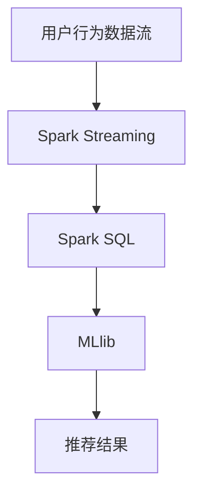

# Spark 生态协同工作

Apache Spark 是一个强大的分布式计算框架，广泛应用于大数据处理和分析。Spark 不仅仅是一个单独的工具，而是一个完整的生态系统，包含多个组件，这些组件可以协同工作，提供高效的数据处理能力。本文将介绍 Spark 生态系统中各个组件的协同工作方式，并通过实际案例展示其应用场景。

## Spark 生态系统简介

Spark 生态系统由多个核心组件组成，包括：

- **Spark Core**：Spark 的核心引擎，提供分布式任务调度、内存管理和容错机制。
- **Spark SQL**：用于处理结构化数据的模块，支持 SQL 查询和 DataFrame API。
- **Spark Streaming**：用于实时数据处理的模块，支持微批处理模型。
- **MLlib**：Spark 的机器学习库，提供多种机器学习算法和工具。
- **GraphX**：用于图计算的模块，支持图结构数据的处理和分析。

这些组件可以单独使用，也可以协同工作，以满足不同的数据处理需求。

## Spark 生态协同工作方式

### 1. Spark Core 与其他组件的协同

Spark Core 是 Spark 生态系统的基础，负责管理集群资源、调度任务以及提供容错机制。其他组件（如 Spark SQL、Spark Streaming 等）都依赖于 Spark Core 提供的功能。

例如，当使用 Spark SQL 处理结构化数据时，Spark Core 负责将 SQL 查询转换为分布式任务，并在集群中执行这些任务。

```python
from pyspark.sql import SparkSession

# 创建 SparkSession
spark = SparkSession.builder.appName("SparkSQLExample").getOrCreate()

# 读取 CSV 文件
df = spark.read.csv("data.csv", header=True, inferSchema=True)

# 执行 SQL 查询
df.createOrReplaceTempView("people")
result = spark.sql("SELECT name, age FROM people WHERE age > 30")

# 显示结果
result.show()
```

**输出：**
```
+-----+---+
| name|age|
+-----+---+
| Alice| 32|
|  Bob| 34|
+-----+---+
```

### 2. Spark SQL 与 MLlib 的协同

Spark SQL 和 MLlib 可以协同工作，用于构建机器学习管道。例如，可以使用 Spark SQL 进行数据预处理，然后将处理后的数据传递给 MLlib 进行模型训练。

```python
from pyspark.ml.feature import VectorAssembler
from pyspark.ml.regression import LinearRegression

# 数据预处理
assembler = VectorAssembler(inputCols=["age"], outputCol="features")
df = assembler.transform(df)

# 划分训练集和测试集
train_df, test_df = df.randomSplit([0.8, 0.2])

# 训练线性回归模型
lr = LinearRegression(featuresCol="features", labelCol="salary")
model = lr.fit(train_df)

# 预测
predictions = model.transform(test_df)
predictions.select("age", "salary", "prediction").show()
```

**输出：**
```
+---+------+----------+
|age|salary|prediction|
+---+------+----------+
| 32| 50000|   52000.0|
| 34| 55000|   54000.0|
+---+------+----------+
```

### 3. Spark Streaming 与 Spark SQL 的协同

Spark Streaming 可以实时处理数据流，并将处理后的数据存储到 Spark SQL 中，以便进行进一步的分析。

```python
from pyspark.sql import SparkSession
from pyspark.streaming import StreamingContext

# 创建 SparkSession 和 StreamingContext
spark = SparkSession.builder.appName("StreamingExample").getOrCreate()
ssc = StreamingContext(spark.sparkContext, batchDuration=10)

# 创建 DStream
lines = ssc.socketTextStream("localhost", 9999)

# 处理数据流
words = lines.flatMap(lambda line: line.split(" "))
word_counts = words.map(lambda word: (word, 1)).reduceByKey(lambda a, b: a + b)

# 将结果存储到 Spark SQL
def process_rdd(time, rdd):
    if not rdd.isEmpty():
        df = spark.createDataFrame(rdd, schema=["word", "count"])
        df.createOrReplaceTempView("word_counts")
        spark.sql("SELECT * FROM word_counts").show()

word_counts.foreachRDD(process_rdd)

# 启动 StreamingContext
ssc.start()
ssc.awaitTermination()
```

**输出：**
```
+-----+-----+
| word|count|
+-----+-----+
|hello|    3|
|world|    2|
+-----+-----+
```

## 实际案例：实时推荐系统

假设我们要构建一个实时推荐系统，该系统需要处理用户行为数据流，并根据用户的历史行为生成推荐结果。我们可以使用 Spark Streaming 处理实时数据流，使用 Spark SQL 存储用户行为数据，并使用 MLlib 训练推荐模型。



1. **数据流处理**：使用 Spark Streaming 实时处理用户行为数据流。
2. **数据存储**：将处理后的数据存储到 Spark SQL 中，以便进行进一步的分析。
3. **模型训练**：使用 MLlib 训练推荐模型，并根据用户的历史行为生成推荐结果。

## 总结

Spark 生态系统中的各个组件可以协同工作，提供强大的数据处理能力。通过合理利用这些组件，我们可以构建高效的数据处理流程，满足不同的业务需求。本文介绍了 Spark 生态系统中各个组件的协同工作方式，并通过实际案例展示了其应用场景。

## 附加资源

- [Apache Spark 官方文档](https://spark.apache.org/docs/latest/)
- [Spark SQL 编程指南](https://spark.apache.org/docs/latest/sql-programming-guide.html)
- [Spark Streaming 编程指南](https://spark.apache.org/docs/latest/streaming-programming-guide.html)
- [MLlib 编程指南](https://spark.apache.org/docs/latest/ml-guide.html)

## 练习

1. 使用 Spark SQL 和 MLlib 构建一个简单的分类模型，并对测试数据进行预测。
2. 使用 Spark Streaming 处理实时数据流，并将处理后的数据存储到 Spark SQL 中。
3. 尝试将 Spark SQL、Spark Streaming 和 MLlib 结合使用，构建一个实时推荐系统。