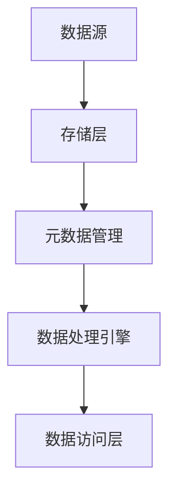

# 数据湖概念

## 什么是数据湖？

数据湖（Data Lake）是一种用于存储大量结构化、半结构化和非结构化数据的集中式存储库。与传统的数据库或数据仓库不同，数据湖允许以原始格式存储数据，而不需要预先定义数据结构或模式。这种灵活性使得数据湖成为现代数据分析和机器学习的重要基础设施。

:::note
数据湖的核心思想是“存储一切，按需处理”。这意味着数据可以在需要时被提取、转换和分析，而不需要在存储时进行预处理。
:::

## 数据湖的架构

数据湖通常由以下几个核心组件构成：

1. **存储层**：数据湖的存储层通常基于分布式文件系统（如HDFS）或云存储服务（如Amazon S3、Azure Data Lake Storage）。这些系统能够高效地存储海量数据。
2. **元数据管理**：元数据是描述数据的数据。在数据湖中，元数据管理工具（如Apache Atlas、AWS Glue）用于跟踪数据的来源、格式和内容。
3. **数据处理引擎**：数据湖通常与大数据处理引擎（如Apache Spark、Apache Flink）集成，以便对存储的数据进行分析和转换。
4. **数据访问层**：数据湖提供多种访问方式，包括SQL查询、API接口和机器学习工具。



## 数据湖的优势

1. **灵活性**：数据湖支持多种数据格式（如CSV、JSON、Parquet、Avro等），并且不需要预先定义模式。
2. **可扩展性**：数据湖可以轻松扩展到PB甚至EB级别，适合处理大规模数据。
3. **成本效益**：与数据仓库相比，数据湖的存储成本更低，尤其是在使用云存储服务时。
4. **支持多种分析**：数据湖不仅支持传统的批处理分析，还支持实时流处理、机器学习和数据科学工作负载。

## 数据湖的实际应用场景

### 案例1：电商平台的用户行为分析

假设某电商平台希望分析用户的浏览和购买行为。数据湖可以存储来自不同来源的数据，包括：
- 用户点击流数据（JSON格式）
- 交易数据（CSV格式）
- 产品目录数据（Parquet格式）

通过数据湖，平台可以使用Apache Spark对这些数据进行实时分析，生成用户画像和推荐系统。

```python
# 示例：使用Spark读取数据湖中的数据
from pyspark.sql import SparkSession

spark = SparkSession.builder.appName("UserBehaviorAnalysis").getOrCreate()

# 读取点击流数据
clickstream_df = spark.read.json("s3a://data-lake/clickstream/*.json")

# 读取交易数据
transactions_df = spark.read.csv("s3a://data-lake/transactions/*.csv", header=True)

# 读取产品目录数据
products_df = spark.read.parquet("s3a://data-lake/products/*.parquet")

# 进行数据分析
user_behavior_df = clickstream_df.join(transactions_df, "user_id").join(products_df, "product_id")
user_behavior_df.show()
```

### 案例2：物联网设备数据管理

在物联网（IoT）场景中，数据湖可以存储来自数百万台设备的数据。这些数据可能包括传感器读数、设备状态日志和事件数据。通过数据湖，企业可以实时监控设备状态并预测故障。

```python
# 示例：使用Spark处理物联网数据
from pyspark.sql import SparkSession

spark = SparkSession.builder.appName("IoTDataProcessing").getOrCreate()

# 读取传感器数据
sensor_data_df = spark.read.json("s3a://data-lake/sensor-data/*.json")

# 读取设备日志
device_logs_df = spark.read.csv("s3a://data-lake/device-logs/*.csv", header=True)

# 进行数据分析
device_status_df = sensor_data_df.join(device_logs_df, "device_id")
device_status_df.show()
```

## 总结

数据湖是现代数据架构中的重要组成部分，它提供了灵活、可扩展且经济高效的存储解决方案。通过数据湖，企业可以存储和分析来自多种来源的数据，从而支持复杂的分析任务和机器学习应用。

:::tip
如果您想进一步学习数据湖的相关技术，建议尝试以下练习：
1. 使用Apache Spark读取和转换存储在数据湖中的数据。
2. 探索如何使用元数据管理工具（如AWS Glue）对数据湖中的数据进行分类和搜索。
:::

## 附加资源

- [Apache Spark官方文档](https://spark.apache.org/docs/latest/)
- [AWS Data Lake Formation指南](https://aws.amazon.com/data-lake-formation/)
- [Azure Data Lake Storage文档](https://docs.microsoft.com/en-us/azure/storage/blobs/data-lake-storage-introduction)