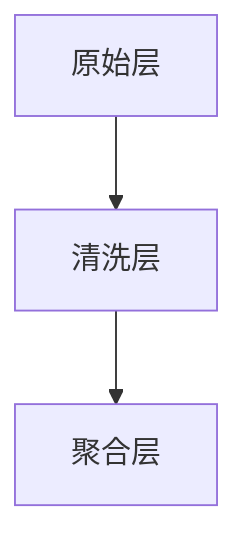

# 数据湖最佳实践

## 介绍

数据湖（Data Lake）是一种用于存储大量结构化、半结构化和非结构化数据的存储系统。与传统的数据库或数据仓库不同，数据湖允许以原始形式存储数据，而不需要预先定义模式。这种灵活性使得数据湖成为现代数据架构中的重要组成部分，尤其是在处理实时数据和大规模数据分析时。

然而，数据湖的灵活性也带来了挑战。如果没有适当的管理和最佳实践，数据湖可能会变成“数据沼泽”，导致数据难以查找、管理和分析。本文将介绍数据湖的最佳实践，帮助初学者构建高效、可维护的数据湖架构。

## 数据湖的核心概念

### 1. 数据存储
数据湖通常使用分布式文件系统（如HDFS）或对象存储（如Amazon S3）来存储数据。这些存储系统能够处理大规模数据，并提供高可用性和容错性。

### 2. 数据格式
在数据湖中，数据通常以开放格式（如Parquet、ORC、Avro）存储。这些格式不仅支持高效的数据压缩和查询，还能与多种数据处理工具（如Spark、Hive）兼容。

### 3. 元数据管理
元数据是描述数据的数据。在数据湖中，元数据管理至关重要，因为它帮助用户理解数据的来源、结构和用途。常见的元数据管理工具包括Apache Atlas和AWS Glue Data Catalog。

### 4. 数据治理
数据治理涉及数据的访问控制、数据质量管理和合规性。良好的数据治理确保数据湖中的数据安全、可靠且符合法规要求。

## 数据湖最佳实践

### 1. 分层存储架构
为了有效管理数据湖中的数据，建议采用分层存储架构。常见的分层包括：

- **原始层（Raw Layer）**：存储未经处理的原始数据。
- **清洗层（Cleansed Layer）**：存储经过清洗和标准化处理的数据。
- **聚合层（Aggregated Layer）**：存储经过聚合和汇总的数据，用于分析和报告。



### 2. 使用开放数据格式
选择开放数据格式（如Parquet、ORC）可以提高数据的可移植性和查询性能。以下是一个使用Parquet格式存储数据的示例：

```python
# 将数据保存为Parquet格式
df.write.format("parquet").save("s3://my-data-lake/raw-layer/data.parquet")
```

### 3. 元数据管理
使用元数据管理工具（如Apache Atlas）来记录数据的来源、结构和用途。以下是一个使用AWS Glue Data Catalog的示例：

```python
# 创建Glue数据目录表
glue_client.create_table(
    DatabaseName='my_database',
    TableInput={
        'Name': 'my_table',
        'StorageDescriptor': {
            'Location': 's3://my-data-lake/raw-layer/',
            'InputFormat': 'org.apache.hadoop.mapred.TextInputFormat',
            'OutputFormat': 'org.apache.hadoop.hive.ql.io.HiveIgnoreKeyTextOutputFormat',
            'SerdeInfo': {
                'SerializationLibrary': 'org.apache.hadoop.hive.serde2.lazy.LazySimpleSerDe'
            }
        }
    }
)
```

### 4. 数据治理
实施数据治理策略，确保数据湖中的数据安全、可靠且符合法规要求。以下是一些常见的数据治理措施：

- **访问控制**：使用IAM角色和策略来控制对数据的访问。
- **数据质量管理**：定期检查数据的准确性和完整性。
- **合规性**：确保数据湖符合GDPR、HIPAA等法规要求。

## 实际案例

### 案例：实时数据湖中的用户行为分析
假设我们正在构建一个实时数据湖，用于分析用户行为数据。以下是如何应用数据湖最佳实践的步骤：

1. **数据采集**：使用Kafka将用户行为数据实时采集到数据湖的原始层。
2. **数据清洗**：使用Spark Streaming对原始数据进行清洗和标准化处理，并将结果存储到清洗层。
3. **数据聚合**：使用Spark SQL对清洗后的数据进行聚合，生成用户行为报告，并将结果存储到聚合层。
4. **元数据管理**：使用AWS Glue Data Catalog记录数据的来源和结构。
5. **数据治理**：实施访问控制和数据质量管理策略，确保数据的安全性和可靠性。

```python
# 使用Spark Streaming处理实时数据
from pyspark.sql import SparkSession
from pyspark.sql.functions import *

spark = SparkSession.builder.appName("UserBehaviorAnalysis").getOrCreate()

# 从Kafka读取数据
df = spark.readStream.format("kafka").option("kafka.bootstrap.servers", "localhost:9092").option("subscribe", "user_behavior").load()

# 清洗数据
cleaned_df = df.selectExpr("CAST(value AS STRING)").withColumn("event_time", to_timestamp(col("event_time")))

# 将清洗后的数据写入清洗层
cleaned_df.writeStream.format("parquet").option("path", "s3://my-data-lake/cleansed-layer/").start()
```

## 总结

数据湖是现代数据架构中的重要组成部分，但如果没有适当的管理和最佳实践，数据湖可能会变成“数据沼泽”。通过采用分层存储架构、使用开放数据格式、实施元数据管理和数据治理策略，可以构建高效、可维护的数据湖架构。

## 附加资源与练习

- **资源**：
  - [Apache Spark官方文档](https://spark.apache.org/docs/latest/)
  - [AWS Glue Data Catalog文档](https://docs.aws.amazon.com/glue/latest/dg/components-overview.html)
  - [Parquet文件格式介绍](https://parquet.apache.org/documentation/latest/)

- **练习**：
  1. 使用Spark Streaming从Kafka读取数据，并将数据存储到数据湖的原始层。
  2. 使用Spark SQL对数据进行清洗和聚合，并将结果存储到清洗层和聚合层。
  3. 使用AWS Glue Data Catalog记录数据的元数据。

通过以上练习，您将更好地理解数据湖的最佳实践，并能够在实际项目中应用这些知识。