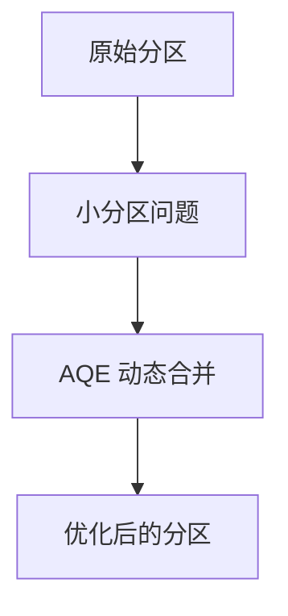

## 介绍

Apache Spark 是一个快速、通用的集群计算系统，广泛用于大数据处理。随着技术的不断发展，Spark 也在不断引入新特性，以提升性能、简化开发流程并支持更多应用场景。本文将带您预览 Spark 的最新特性，帮助您了解这些新功能如何改进现有的数据处理流程。

## Spark 新特性概览

### 1. **Structured Streaming 的改进**

Structured Streaming 是 Spark 用于处理实时数据流的核心模块。最新版本中，Structured Streaming 引入了以下改进：

- **增强的流式聚合**：支持更复杂的聚合操作，例如窗口聚合和会话窗口。
- **更好的容错机制**：通过改进的检查点和状态管理，确保流处理任务的高可用性。

#### 代码示例

以下是一个简单的 Structured Streaming 示例，展示如何对实时数据进行窗口聚合：

```python
from pyspark.sql import SparkSession
from pyspark.sql.functions import window

# 创建 SparkSession
spark = SparkSession.builder.appName("StructuredStreamingExample").getOrCreate()

# 读取流数据
streamingDF = spark.readStream.format("socket").option("host", "localhost").option("port", 9999).load()

# 定义窗口聚合
windowedCounts = streamingDF.groupBy(
    window(streamingDF.timestamp, "10 minutes", "5 minutes"),
    streamingDF.value
).count()

# 启动流查询
query = windowedCounts.writeStream.outputMode("complete").format("console").start()

query.awaitTermination()
```

**输入**：实时数据流（例如从 `localhost:9999` 接收的数据）。<br />
**输出**：每 10 分钟窗口内的数据计数。

### 2. **Delta Lake 集成**

Delta Lake 是一个开源存储层，为 Spark 提供了 ACID 事务、数据版本控制和数据湖管理功能。最新版本的 Spark 进一步优化了与 Delta Lake 的集成，使其更易于使用。

#### 实际案例

假设您需要管理一个数据湖，并确保数据的一致性和可追溯性。通过 Delta Lake，您可以轻松实现以下功能：

- **数据版本控制**：回滚到历史版本以修复错误。
- **ACID 事务**：确保并发写入操作的一致性。

```python
# 创建 Delta 表
df.write.format("delta").save("/path/to/delta-table")

# 读取 Delta 表
deltaDF = spark.read.format("delta").load("/path/to/delta-table")

# 查询历史版本
spark.sql("DESCRIBE HISTORY delta.`/path/to/delta-table`").show()
```

### 3. **性能优化：自适应查询执行（AQE）**

自适应查询执行（Adaptive Query Execution, AQE）是 Spark 3.0 引入的一项重要特性，旨在动态优化查询计划。最新版本中，AQE 进一步增强了以下功能：

- **动态分区合并**：自动调整分区大小以减少小文件问题。
- **动态 Join 策略选择**：根据运行时统计信息选择最优的 Join 策略。

#### 示例场景

假设您有一个包含大量小分区的数据集，AQE 可以自动合并这些小分区，从而减少任务数量并提高性能。



### 4. **Python API 的增强**

Spark 的 Python API（PySpark）在最新版本中得到了显著增强，包括：

- **类型提示支持**：提升代码的可读性和可维护性。
- **Pandas API 集成**：通过 `pandas-on-Spark` 提供更强大的数据处理能力。

#### 代码示例

以下是一个使用类型提示和 Pandas API 的示例：

```python
from pyspark.sql import SparkSession
import pyspark.pandas as ps

# 创建 SparkSession
spark = SparkSession.builder.appName("PySparkExample").getOrCreate()

# 使用 Pandas API
df = ps.DataFrame({"A": [1, 2, 3], "B": [4, 5, 6]})
print(df.head())
```

**输出**：

```
   A  B
0  1  4
1  2  5
2  3  6
```

## 总结

Spark 的最新特性为大数据处理带来了显著的性能提升和功能增强。无论是 Structured Streaming 的改进、Delta Lake 的集成，还是自适应查询执行和 Python API 的增强，这些新功能都使得 Spark 更加强大和易用。

:::tip 提示
如果您是初学者，建议从 Structured Streaming 和 PySpark 的基础功能开始学习，逐步探索这些新特性。
:::

## 附加资源

- [Apache Spark 官方文档](https://spark.apache.org/docs/latest/)
- [Delta Lake 官方指南](https://docs.delta.io/latest/index.html)
- [Structured Streaming 编程指南](https://spark.apache.org/docs/latest/structured-streaming-programming-guide.html)

## 练习

1. 尝试运行本文中的 Structured Streaming 示例，并观察输出结果。
2. 使用 Delta Lake 创建一个数据表，并练习查询历史版本。
3. 探索 PySpark 的 Pandas API，尝试将现有的 Pandas 代码迁移到 PySpark。

祝您学习愉快！