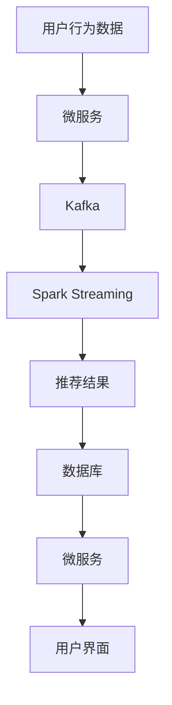
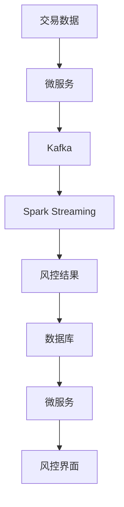

## 介绍

在现代数据处理系统中，Apache Spark 和微服务架构是两个非常重要的技术。Spark 是一个强大的分布式计算框架，能够高效处理大规模数据集。而微服务架构则是一种将应用程序拆分为多个小型、独立服务的架构风格，每个服务都可以独立开发、部署和扩展。

将 Spark 与微服务架构结合使用，可以构建出高效、可扩展的数据处理系统。本文将逐步介绍如何实现这一目标，并提供代码示例和实际应用场景。

## Spark 与微服务架构的基本概念

### Apache Spark

Apache Spark 是一个开源的分布式计算系统，提供了高效的数据处理能力。它支持多种编程语言（如 Scala、Java、Python 和 R），并且可以在多种集群管理器（如 Hadoop YARN、Apache Mesos 和 Kubernetes）上运行。

### 微服务架构

微服务架构是一种将应用程序拆分为多个小型、独立服务的架构风格。每个服务都运行在自己的进程中，并通过轻量级的通信机制（如 HTTP/REST 或消息队列）进行交互。微服务架构的主要优点包括：

- **独立性**：每个服务可以独立开发、部署和扩展。
- **灵活性**：可以使用不同的技术栈来开发不同的服务。
- **可扩展性**：可以根据需求单独扩展某个服务。

## 将 Spark 与微服务架构结合

将 Spark 与微服务架构结合使用，通常涉及以下几个方面：

1. **数据采集与预处理**：使用微服务采集数据，并将其发送到 Spark 进行预处理。
2. **分布式计算**：使用 Spark 进行大规模数据处理和分析。
3. **结果存储与展示**：将处理结果存储到数据库或数据仓库中，并通过微服务展示给用户。

### 示例：数据采集与预处理

假设我们有一个微服务，用于采集用户行为数据。我们可以使用 Kafka 作为消息队列，将数据发送到 Spark 进行预处理。

```python
from pyspark.sql import SparkSession
from pyspark.streaming import StreamingContext

# 创建 SparkSession
spark = SparkSession.builder \
    .appName("UserBehaviorProcessing") \
    .getOrCreate()

# 创建 StreamingContext
ssc = StreamingContext(spark.sparkContext, batchDuration=10)

# 从 Kafka 读取数据
kafkaStream = ssc.kafkaStream("user-behavior-topic")

# 对数据进行预处理
processedStream = kafkaStream.map(lambda x: preprocess_data(x))

# 将处理后的数据存储到 HDFS
processedStream.saveAsTextFiles("hdfs://path/to/output")

# 启动 StreamingContext
ssc.start()
ssc.awaitTermination()
```

### 示例：分布式计算

在 Spark 中进行分布式计算通常涉及以下步骤：

1. **数据加载**：从 HDFS、S3 或其他存储系统加载数据。
2. **数据处理**：使用 Spark 的 DataFrame 或 RDD API 进行数据处理。
3. **结果存储**：将处理结果存储到数据库或数据仓库中。

```python
# 加载数据
df = spark.read.csv("hdfs://path/to/input")

# 数据处理
result_df = df.filter(df["age"] > 18).groupBy("gender").count()

# 结果存储
result_df.write.csv("hdfs://path/to/output")
```

### 示例：结果存储与展示

处理结果可以存储到数据库（如 MySQL、PostgreSQL）或数据仓库（如 Amazon Redshift、Google BigQuery）中，并通过微服务展示给用户。

```python
# 将结果存储到 MySQL
result_df.write \
    .format("jdbc") \
    .option("url", "jdbc:mysql://localhost:3306/db") \
    .option("dbtable", "results") \
    .option("user", "root") \
    .option("password", "password") \
    .save()
```

## 实际应用场景

### 电商推荐系统

在电商推荐系统中，可以使用微服务采集用户行为数据（如点击、购买等），并将数据发送到 Spark 进行实时处理。Spark 可以分析用户行为，生成推荐结果，并将结果存储到数据库中。最后，推荐结果可以通过微服务展示给用户。



### 金融风控系统

在金融风控系统中，可以使用微服务采集交易数据，并将数据发送到 Spark 进行实时分析。Spark 可以检测异常交易，并将结果存储到数据库中。最后，风控结果可以通过微服务展示给风控人员。



## 总结

将 Apache Spark 与微服务架构结合使用，可以构建出高效、可扩展的数据处理系统。本文介绍了如何实现这一目标，并提供了代码示例和实际应用场景。希望本文能帮助你更好地理解 Spark 与微服务架构的结合使用。

## 附加资源与练习

- **附加资源**：
  - [Apache Spark 官方文档](https://spark.apache.org/docs/latest/)
  - [微服务架构设计模式](https://microservices.io/patterns/microservices.html)
  - [Kafka 官方文档](https://kafka.apache.org/documentation/)

- **练习**：
  1. 尝试使用 Spark 和微服务架构构建一个简单的推荐系统。
  2. 使用 Kafka 作为消息队列，将数据发送到 Spark 进行实时处理。
  3. 将处理结果存储到数据库中，并通过微服务展示给用户。

:::tip
如果你在练习中遇到问题，可以参考本文的代码示例，或者查阅相关文档。
:::