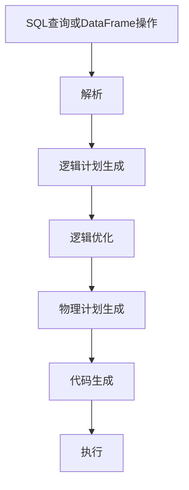

# Catalyst优化器

Catalyst优化器是Apache Spark SQL的核心组件之一，负责将用户编写的SQL查询或DataFrame操作转换为高效的执行计划。它通过一系列优化规则和策略，自动优化查询性能，减少计算资源的使用。对于初学者来说，理解Catalyst优化器的工作原理是掌握Spark SQL的关键一步。

## 什么是Catalyst优化器？

Catalyst优化器是一个基于规则的查询优化器，专门为Spark SQL设计。它的主要任务是将用户提交的SQL查询或DataFrame操作转换为物理执行计划。在这个过程中，Catalyst会应用多种优化规则，例如谓词下推、列裁剪、常量折叠等，以生成最优的执行计划。

:::tip
Catalyst优化器的设计灵感来自于函数式编程语言（如Scala）和数据库查询优化技术。它通过树形结构表示查询计划，并利用模式匹配和递归规则来优化查询。
:::

## Catalyst优化器的工作流程

Catalyst优化器的工作流程可以分为以下几个阶段：

1. **解析（Parsing）**：将SQL查询或DataFrame操作解析为抽象语法树（AST）。
2. **逻辑计划生成（Logical Plan Generation）**：将AST转换为逻辑计划（Logical Plan）。
3. **逻辑优化（Logical Optimization）**：应用一系列优化规则对逻辑计划进行优化。
4. **物理计划生成（Physical Plan Generation）**：将优化后的逻辑计划转换为物理计划（Physical Plan）。
5. **代码生成（Code Generation）**：将物理计划转换为可执行的Java字节码。



### 1. 解析

在解析阶段，Catalyst会将SQL查询或DataFrame操作转换为抽象语法树（AST）。例如，以下SQL查询：

```sql
SELECT name, age FROM users WHERE age > 30
```

会被解析为一个树形结构，表示查询的逻辑结构。

### 2. 逻辑计划生成

解析完成后，Catalyst会将AST转换为逻辑计划。逻辑计划是一个树形结构，表示查询的逻辑操作。例如，上述查询的逻辑计划可能如下：

```scala
Project(name, age)
  Filter(age > 30)
    TableScan(users)
```

### 3. 逻辑优化

在逻辑优化阶段，Catalyst会应用一系列优化规则来改进逻辑计划。常见的优化规则包括：

- **谓词下推（Predicate Pushdown）**：将过滤条件尽可能地下推到数据源，减少需要处理的数据量。
- **列裁剪（Column Pruning）**：只选择查询中需要的列，减少数据传输和处理的开销。
- **常量折叠（Constant Folding）**：在编译时计算常量表达式，减少运行时的计算量。

例如，经过优化后，上述查询的逻辑计划可能变为：

```scala
Project(name, age)
  TableScan(users, age > 30)
```

### 4. 物理计划生成

在物理计划生成阶段，Catalyst会将优化后的逻辑计划转换为物理计划。物理计划是Spark实际执行的计划，它包含了具体的执行策略，例如使用哪种Join算法、如何分区数据等。

### 5. 代码生成

最后，Catalyst会通过代码生成器将物理计划转换为Java字节码。这一步可以显著提高查询的执行效率，因为生成的代码可以直接在JVM上运行，而不需要解释执行。

## 实际案例

假设我们有一个包含用户信息的DataFrame，我们希望查询年龄大于30岁的用户：

```scala
val df = spark.read.json("path/to/users.json")
val result = df.filter($"age" > 30).select("name", "age")
result.show()
```

在这个例子中，Catalyst优化器会自动应用谓词下推和列裁剪等优化规则，生成高效的执行计划。

:::note
你可以通过调用 `result.explain(true)` 来查看Catalyst生成的逻辑计划和物理计划，了解优化器的具体工作过程。
:::

## 总结

Catalyst优化器是Spark SQL的核心组件，它通过一系列优化规则和策略，自动优化查询性能。对于初学者来说，理解Catalyst的工作流程和优化规则，可以帮助你编写更高效的Spark SQL查询和DataFrame操作。

## 附加资源

- [Spark SQL官方文档](https://spark.apache.org/docs/latest/sql-programming-guide.html)
- 《Learning Spark》书籍中的Catalyst优化器章节
- [Databricks博客：深入理解Catalyst优化器](https://databricks.com/blog/2015/04/13/deep-dive-into-spark-sqls-catalyst-optimizer.html)

## 练习

1. 编写一个简单的Spark SQL查询，并使用 `explain(true)` 查看Catalyst生成的逻辑计划和物理计划。
2. 尝试修改查询条件，观察Catalyst优化器如何应用谓词下推和列裁剪。
3. 阅读Catalyst优化器的源代码，了解其内部实现细节。