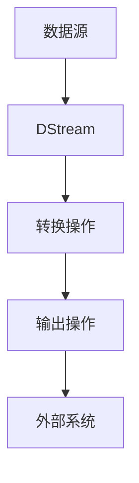

# Spark Streaming 架构

Spark Streaming 是 Apache Spark 生态系统中的一个重要组件，用于处理实时数据流。它允许开发者以类似于批处理的方式处理实时数据，同时利用 Spark 的强大计算能力。本文将详细介绍 Spark Streaming 的架构，并通过示例帮助初学者理解其工作原理。

## 什么是 Spark Streaming？

Spark Streaming 是一种微批处理（Micro-Batch）的流处理框架。它将实时数据流划分为一系列小批次（通常为几秒钟），然后使用 Spark 的批处理引擎对这些小批次进行处理。这种方式既保留了批处理的简单性，又提供了接近实时的处理能力。

## Spark Streaming 的核心架构

Spark Streaming 的架构主要由以下几个组件组成：

1. **数据源（Data Sources）**：数据源是 Spark Streaming 的输入，可以是 Kafka、Flume、Kinesis 等消息队列系统，也可以是 TCP 套接字或文件系统。
2. **DStream（Discretized Stream）**：DStream 是 Spark Streaming 的核心抽象，代表一个连续的数据流。DStream 由一系列 RDD（Resilient Distributed Dataset）组成，每个 RDD 包含一个时间窗口内的数据。
3. **转换操作（Transformations）**：与 Spark 的 RDD 类似，DStream 也支持多种转换操作，如 `map`、`filter`、`reduceByKey` 等。这些操作允许开发者对数据流进行处理。
4. **输出操作（Output Operations）**：输出操作用于将处理后的数据写入外部系统，如数据库、文件系统或控制台。
5. **流上下文（StreamingContext）**：`StreamingContext` 是 Spark Streaming 的入口点，负责管理数据流的生命周期。

### 数据流图

以下是一个简单的 Spark Streaming 数据流图：



## 代码示例

以下是一个简单的 Spark Streaming 示例，从 TCP 套接字读取数据并统计单词数量：

```python
from pyspark import SparkContext
from pyspark.streaming import StreamingContext

# 创建 SparkContext 和 StreamingContext
sc = SparkContext("local[2]", "NetworkWordCount")
ssc = StreamingContext(sc, 1)  # 批处理间隔为1秒

# 创建 DStream，从 TCP 套接字读取数据
lines = ssc.socketTextStream("localhost", 9999)

# 对每行数据进行处理
words = lines.flatMap(lambda line: line.split(" "))
pairs = words.map(lambda word: (word, 1))
word_counts = pairs.reduceByKey(lambda x, y: x + y)

# 输出结果
word_counts.pprint()

# 启动流处理
ssc.start()
ssc.awaitTermination()
```

### 输入和输出

假设输入数据流如下：

```
hello world
hello spark
```

输出结果将类似于：

```
(hello, 2)
(world, 1)
(spark, 1)
```

## 实际应用场景

Spark Streaming 在许多实际场景中都有广泛应用，例如：

1. **实时日志分析**：从日志文件中实时提取信息并进行分析。
2. **实时推荐系统**：根据用户行为实时更新推荐结果。
3. **实时欺诈检测**：实时监控交易数据，检测异常行为。

## 总结

Spark Streaming 提供了一种简单而强大的方式来处理实时数据流。通过将数据流划分为小批次，Spark Streaming 能够利用 Spark 的批处理引擎进行高效处理。本文介绍了 Spark Streaming 的核心架构，并通过代码示例展示了其基本用法。

## 附加资源

- [Spark Streaming 官方文档](https://spark.apache.org/docs/latest/streaming-programming-guide.html)
- [Spark Streaming 编程指南](https://spark.apache.org/docs/latest/streaming-programming-guide.html)

:::tip
尝试修改示例代码，处理来自 Kafka 的数据流，并统计每个主题的消息数量。
:::