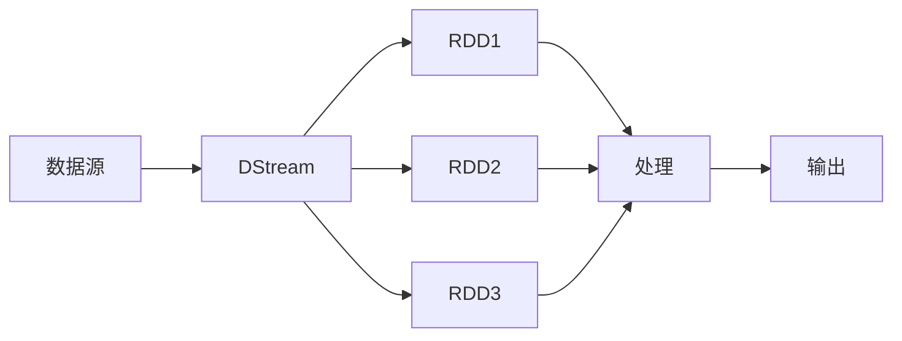

# DStream基本概念

## 介绍

在Spark Streaming中，DStream（Discretized Stream，离散流）是核心抽象之一。它代表了一个连续的数据流，被分割成一系列小的、离散的RDD（弹性分布式数据集）。DStream允许你以微批次的方式处理实时数据流，类似于批处理，但具有实时性。

DStream可以从多种数据源（如Kafka、Flume、Kinesis等）中获取数据，并通过Spark的转换操作进行处理。最终，处理后的数据可以输出到文件系统、数据库或实时仪表板中。

## DStream的工作原理

DStream的核心思想是将连续的数据流分割成一系列小的、固定时间间隔的RDD。每个RDD包含在该时间间隔内到达的所有数据。这些RDD可以通过Spark的转换操作（如`map`、`filter`、`reduceByKey`等）进行处理。



如上图所示，DStream将连续的数据流分割成多个RDD，每个RDD代表一个时间间隔内的数据。这些RDD可以通过Spark的转换操作进行处理，最终输出结果。

## 创建DStream

在Spark Streaming中，可以通过`StreamingContext`来创建DStream。以下是一个简单的示例，展示了如何从TCP套接字中读取数据并创建DStream：

```scala
import org.apache.spark.streaming.{Seconds, StreamingContext}
import org.apache.spark.{SparkConf, SparkContext}

val conf = new SparkConf().setAppName("DStreamExample").setMaster("local[2]")
val sc = new SparkContext(conf)
val ssc = new StreamingContext(sc, Seconds(10))

val lines = ssc.socketTextStream("localhost", 9999)
val words = lines.flatMap(_.split(" "))
val wordCounts = words.map(word => (word, 1)).reduceByKey(_ + _)

wordCounts.print()
ssc.start()
ssc.awaitTermination()
```

在这个示例中，我们创建了一个`StreamingContext`，并设置批处理间隔为10秒。然后，我们从TCP套接字中读取数据，并将其转换为DStream。接着，我们对DStream进行了一系列转换操作，最终打印出每个单词的计数。

## DStream的转换操作

DStream支持多种转换操作，类似于RDD的转换操作。以下是一些常见的DStream转换操作：

- `map(func)`：对DStream中的每个元素应用函数`func`。
- `flatMap(func)`：对DStream中的每个元素应用函数`func`，并将结果展平。
- `filter(func)`：过滤DStream中的元素，保留满足条件的元素。
- `reduceByKey(func)`：对具有相同键的元素进行聚合操作。

以下是一个示例，展示了如何使用`map`和`reduceByKey`操作：

```scala
val words = lines.flatMap(_.split(" "))
val wordCounts = words.map(word => (word, 1)).reduceByKey(_ + _)
wordCounts.print()
```

在这个示例中，我们首先将每行文本拆分为单词，然后对每个单词进行计数，并最终打印出每个单词的计数。

## 实际应用场景

DStream在实际应用中有广泛的用途。以下是一些常见的应用场景：

1. **实时日志处理**：从日志文件中实时读取数据，并进行分析和统计。
2. **实时推荐系统**：根据用户的实时行为数据，动态调整推荐内容。
3. **实时监控**：监控系统的实时状态，并在异常情况下触发警报。

例如，假设我们有一个实时日志流，我们希望统计每个IP地址的访问次数。我们可以使用DStream来实现这一功能：

```scala
val logs = ssc.socketTextStream("localhost", 9999)
val ipCounts = logs.map(log => (log.split(" ")(0), 1)).reduceByKey(_ + _)
ipCounts.print()
```

在这个示例中，我们从日志流中提取IP地址，并统计每个IP地址的访问次数。

## 总结

DStream是Spark Streaming中的核心抽象，它允许你以微批次的方式处理实时数据流。通过将连续的数据流分割成一系列小的RDD，DStream使得实时数据处理变得简单而高效。你可以使用DStream从多种数据源中读取数据，并通过Spark的转换操作进行处理。

## 附加资源

- [Spark Streaming官方文档](https://spark.apache.org/docs/latest/streaming-programming-guide.html)
- [Spark Streaming编程指南](https://spark.apache.org/docs/latest/streaming-programming-guide.html)

## 练习

1. 尝试从Kafka中读取数据并创建DStream。
2. 使用DStream实现一个简单的实时单词计数程序。
3. 探索DStream的其他转换操作，如`window`和`join`。

希望这篇内容能帮助你更好地理解DStream的基本概念及其在Spark Streaming中的应用！