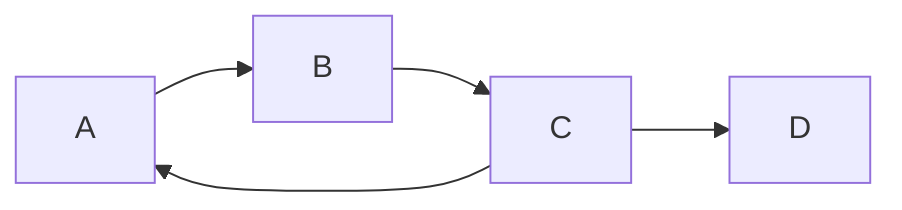

# 三角形计数

在图论中，**三角形计数**是一种用于计算图中三角形数量的算法。三角形是指由三个顶点组成的闭合环，其中每对顶点之间都有一条边相连。三角形计数在许多实际应用中非常重要，例如社交网络分析、推荐系统和社区检测。

## 什么是三角形计数？

三角形计数是图计算中的一个基本问题，它用于计算图中所有由三个顶点组成的闭合环的数量。具体来说，给定一个图 `G = (V, E)`，其中 `V` 是顶点集，`E` 是边集，三角形计数的目标是找出所有满足 `(u, v) ∈ E`、`(v, w) ∈ E` 和 `(w, u) ∈ E` 的三元组 `(u, v, w)`。

三角形计数算法可以帮助我们理解图的结构，例如图的聚类系数（Clustering Coefficient），它衡量了图中节点形成紧密连接的趋势。

## Spark GraphX 中的三角形计数

Spark GraphX 提供了一个内置的三角形计数算法，可以高效地计算图中的三角形数量。该算法基于图的邻接表表示，并通过迭代计算每个顶点的邻居之间的交集来找到三角形。

### 代码示例

以下是一个使用 Spark GraphX 进行三角形计数的简单示例：

```scala
import org.apache.spark._
import org.apache.spark.graphx._
import org.apache.spark.rdd.RDD

// 创建 SparkContext
val conf = new SparkConf().setAppName("TriangleCounting").setMaster("local")
val sc = new SparkContext(conf)

// 创建顶点和边
val vertices: RDD[(VertexId, String)] = sc.parallelize(Array(
  (1L, "A"), (2L, "B"), (3L, "C"), (4L, "D")
))

val edges: RDD[Edge[String]] = sc.parallelize(Array(
  Edge(1L, 2L, "edge1"), Edge(2L, 3L, "edge2"),
  Edge(3L, 1L, "edge3"), Edge(3L, 4L, "edge4")
))

// 创建图
val graph = Graph(vertices, edges)

// 计算三角形数量
val triangleCount = graph.triangleCount().vertices.collect()

// 输出结果
triangleCount.foreach(println)
```

### 输入与输出

假设我们有以下图结构：



在这个图中，三角形 `(A, B, C)` 是唯一的一个三角形。因此，运行上述代码后，输出将显示每个顶点参与的三角形数量：

```
(1,1)  // 顶点 A 参与 1 个三角形
(2,1)  // 顶点 B 参与 1 个三角形
(3,1)  // 顶点 C 参与 1 个三角形
(4,0)  // 顶点 D 参与 0 个三角形
```

## 实际应用场景

### 社交网络分析

在社交网络中，三角形计数可以用于衡量社区的紧密程度。例如，如果某个用户的朋友之间也有很多相互连接，那么这个用户所在的社区可能更加紧密。通过计算三角形数量，我们可以识别出这些紧密连接的社区。

### 推荐系统

在推荐系统中，三角形计数可以帮助我们发现用户之间的潜在关系。例如，如果两个用户有共同的朋友，并且这些朋友之间也有相互连接，那么这两个用户可能也有相似的兴趣。通过分析这些三角形，我们可以为用户提供更精准的推荐。

### 社区检测

在社区检测中，三角形计数可以用于识别图中的密集子图。密集子图通常表示一个社区或群组，其中成员之间有很强的相互连接。通过计算三角形数量，我们可以更好地理解图的结构，并识别出这些社区。

## 总结

三角形计数是图计算中的一个重要算法，它可以帮助我们理解图的结构，并在社交网络分析、推荐系统和社区检测等领域中发挥重要作用。Spark GraphX 提供了一个高效的三角形计数算法，使得我们可以轻松地在大规模图上进行计算。

## 附加资源与练习

- **练习 1**：尝试在一个更大的图上运行三角形计数算法，并分析结果。
- **练习 2**：修改代码，计算图的全局聚类系数（Global Clustering Coefficient）。
- **资源**：阅读 [Spark GraphX 官方文档](https://spark.apache.org/docs/latest/graphx-programming-guide.html) 以了解更多关于图计算的内容。

:::tip
如果你对图计算的其他算法感兴趣，可以继续学习 PageRank、连通分量等算法，它们在图分析中也非常重要。
:::