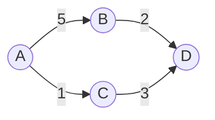

# 图计算应用场景

图计算是一种处理和分析图结构数据的计算模式。图结构数据由节点（顶点）和边组成，节点表示实体，边表示实体之间的关系。图计算广泛应用于社交网络分析、推荐系统、路径优化、欺诈检测等领域。本文将介绍图计算的核心概念及其在实际中的应用场景。

## 什么是图计算？

图计算是一种专门用于处理图结构数据的计算模式。图由节点（顶点）和边组成，节点表示实体，边表示实体之间的关系。图计算的核心目标是通过分析节点和边的关系，发现隐藏的模式、趋势或异常。

例如，在社交网络中，用户是节点，用户之间的关注关系是边。通过图计算，我们可以分析用户的影响力、社区结构或信息传播路径。

## 图计算的核心概念

### 1. 节点（顶点）
节点是图的基本单位，表示实体。例如，在社交网络中，节点可以是用户；在交通网络中，节点可以是城市。

### 2. 边
边表示节点之间的关系。边可以是有向的（如用户A关注用户B）或无向的（如用户A和用户B是朋友）。

### 3. 属性
节点和边可以附加属性。例如，用户节点可以有年龄、性别等属性；边可以有权重，表示关系的强度。

### 4. 图算法
图算法是用于分析图数据的计算方法，常见算法包括：
- **PageRank**：用于衡量节点的重要性。
- **连通分量**：用于发现图中的子图。
- **最短路径**：用于找到两个节点之间的最短路径。

## 图计算的实际应用场景

### 1. 社交网络分析
社交网络是典型的图结构数据。通过图计算，可以分析用户的影响力、社区结构以及信息传播路径。

**示例：PageRank 算法**
PageRank 是一种衡量节点重要性的算法，常用于搜索引擎排名。以下是一个简单的 PageRank 实现示例：

```scala
import org.apache.spark.graphx.GraphLoader

// 加载图数据
val graph = GraphLoader.edgeListFile(sc, "data/social-network-edges.txt")

// 运行 PageRank 算法
val ranks = graph.pageRank(0.0001).vertices

// 输出结果
ranks.collect().foreach(println)
```

**输入：**
```
1 2
2 3
3 1
4 1
```

**输出：**
```
(1, 1.0)
(2, 0.5)
(3, 0.5)
(4, 0.0)
```

### 2. 推荐系统
推荐系统利用图计算分析用户与商品之间的关系。例如，通过分析用户购买历史和商品相似性，可以为用户推荐相关商品。

**示例：协同过滤**
协同过滤是一种基于用户行为的推荐算法。以下是一个简单的协同过滤示例：

```scala
val userItemGraph = GraphLoader.edgeListFile(sc, "data/user-item-edges.txt")

// 计算用户与商品的相似性
val similarities = userItemGraph.triplets.map(triplet =>
  (triplet.srcId, triplet.dstId, 1.0 / (1 + math.abs(triplet.srcAttr - triplet.dstAttr)))
```

### 3. 路径优化
在交通网络中，图计算可以用于优化路径规划。例如，通过计算最短路径，可以为用户推荐最快的行驶路线。

**示例：Dijkstra 算法**
Dijkstra 算法是一种用于计算最短路径的经典算法。以下是一个简单的实现：



```scala
val shortestPath = graph.shortestPaths.landmarks(Seq(1L)).vertices
```

### 4. 欺诈检测
在金融领域，图计算可以用于检测欺诈行为。例如，通过分析用户交易关系，可以发现异常的交易模式。

**示例：社区检测**
社区检测算法可以用于发现异常的子图。以下是一个简单的社区检测示例：

```scala
val communities = graph.connectedComponents().vertices
```

## 总结

图计算是一种强大的工具，适用于处理复杂的关系数据。通过 Spark GraphX，我们可以轻松实现各种图算法，并应用于社交网络分析、推荐系统、路径优化和欺诈检测等场景。

:::tip 提示
如果你想深入学习图计算，可以尝试以下练习：
1. 使用 Spark GraphX 实现一个简单的社交网络分析。
2. 尝试修改 PageRank 算法，使其适用于你的数据集。
3. 探索其他图算法，如最短路径或社区检测。
:::

## 附加资源
- [Spark GraphX 官方文档](https://spark.apache.org/docs/latest/graphx-programming-guide.html)
- 《图算法：理论与实践》——一本深入讲解图算法的书籍。