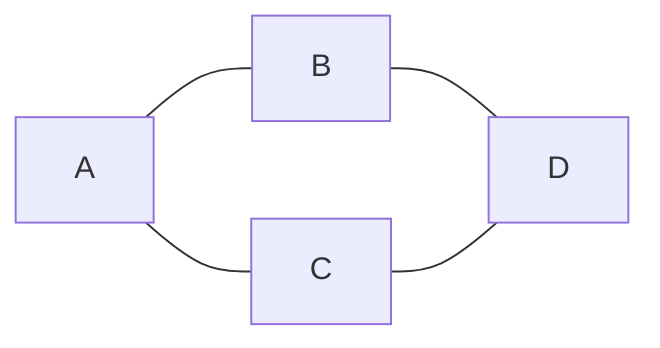

# 图的表示方法

图（Graph）是图计算中的核心数据结构，用于表示实体（节点）及其之间的关系（边）。图的表示方法直接影响算法的效率和实现方式。本文将介绍几种常见的图的表示方法，并通过实际案例帮助你理解其应用场景。

## 什么是图？

图由**节点（Vertex）**和**边（Edge）**组成。节点表示实体，边表示实体之间的关系。例如，在社交网络中，节点可以是用户，边可以是用户之间的好友关系。

图可以分为**有向图**和**无向图**：
- **有向图**：边有方向，表示单向关系。
- **无向图**：边没有方向，表示双向关系。

## 图的表示方法

### 1. 邻接矩阵（Adjacency Matrix）

邻接矩阵是一个二维数组，用于表示图中节点之间的连接关系。矩阵的行和列分别代表节点，矩阵中的值表示节点之间是否存在边。

- **无向图**：邻接矩阵是对称的。
- **有向图**：邻接矩阵不一定对称。

#### 示例

假设有一个无向图，包含 4 个节点（A、B、C、D），其邻接矩阵如下：



对应的邻接矩阵为：

|   | A | B | C | D |
|---|---|---|---|---|
| A | 0 | 1 | 1 | 0 |
| B | 1 | 0 | 0 | 1 |
| C | 1 | 0 | 0 | 1 |
| D | 0 | 1 | 1 | 0 |

:::note
邻接矩阵适合表示稠密图（边数接近节点数的平方），但对于稀疏图（边数远小于节点数的平方）会浪费大量空间。
:::

### 2. 邻接表（Adjacency List）

邻接表使用链表或数组的数组来表示图。每个节点对应一个链表，链表中存储与该节点直接相连的其他节点。

#### 示例

对于上述无向图，邻接表表示如下：

- A: [B, C]
- B: [A, D]
- C: [A, D]
- D: [B, C]

:::tip
邻接表适合表示稀疏图，因为它只存储实际存在的边，节省空间。
:::

### 3. 边列表（Edge List）

边列表是一种简单的表示方法，直接存储图中的所有边。每条边用一个元组表示，包含两个节点。

#### 示例

对于上述无向图，边列表表示如下：

```python
edges = [(A, B), (A, C), (B, D), (C, D)]
```

:::caution
边列表适合存储边数较少的图，但在查询某个节点的邻居时需要遍历整个列表，效率较低。
:::

### 4. 其他表示方法

除了上述常见方法，还有一些高级表示方法，例如：
- **压缩稀疏行（CSR）**：适合存储大规模稀疏图。
- **邻接多重表**：适合存储多重图（两个节点之间有多条边）。

## 实际案例

### 案例 1：社交网络分析

在社交网络中，用户是节点，好友关系是边。使用邻接表可以高效地存储和查询用户的好友列表。

```python
# 邻接表表示社交网络
social_network = {
    "Alice": ["Bob", "Charlie"],
    "Bob": ["Alice", "David"],
    "Charlie": ["Alice", "David"],
    "David": ["Bob", "Charlie"]
}
```

### 案例 2：网页链接分析

在网页链接分析中，网页是节点，超链接是边。使用邻接矩阵可以快速判断两个网页之间是否存在链接。

```python
# 邻接矩阵表示网页链接
web_links = [
    [0, 1, 1, 0],  # 网页 A 链接到 B 和 C
    [1, 0, 0, 1],  # 网页 B 链接到 A 和 D
    [1, 0, 0, 1],  # 网页 C 链接到 A 和 D
    [0, 1, 1, 0]   # 网页 D 链接到 B 和 C
]
```

## 总结

图的表示方法有多种，每种方法都有其优缺点：
- **邻接矩阵**：适合稠密图，查询速度快，但空间复杂度高。
- **邻接表**：适合稀疏图，空间效率高，但查询速度较慢。
- **边列表**：简单直观，但查询效率低。

选择合适的表示方法取决于具体的应用场景和图的结构。

## 附加资源与练习

1. **练习**：尝试用邻接表和邻接矩阵表示一个有向图，并比较两者的空间复杂度。
2. **资源**：
   - [Spark GraphX 官方文档](https://spark.apache.org/docs/latest/graphx-programming-guide.html)
   - 《算法导论》中关于图算法的章节。

希望本文能帮助你更好地理解图的表示方法！如果有任何问题，欢迎在评论区留言。