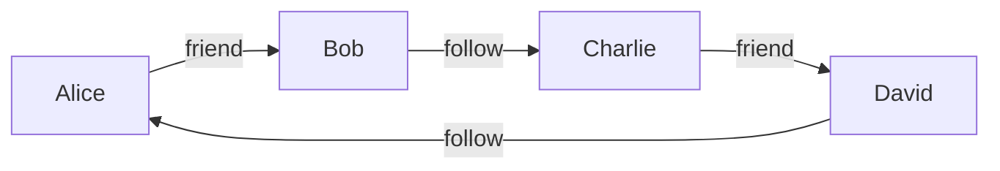

# 图的创建

在 Spark GraphX 中，图是由顶点（Vertex）和边（Edge）组成的数据结构。顶点代表图中的实体，而边则代表实体之间的关系。理解如何创建图是掌握图计算的第一步。本文将详细介绍如何在 Spark GraphX 中创建图，并通过实际案例帮助你更好地理解这一概念。

## 什么是图？

图是一种数学结构，用于表示对象之间的关系。在计算机科学中，图通常用于建模复杂的关系网络，例如社交网络、网页链接、交通网络等。图由两部分组成：

- **顶点（Vertex）**：代表图中的实体，例如社交网络中的用户。
- **边（Edge）**：代表实体之间的关系，例如用户之间的好友关系。

在 Spark GraphX 中，图是通过 `Graph` 类来表示的，它由两个 RDD（弹性分布式数据集）组成：一个用于存储顶点，另一个用于存储边。

## 创建图的基本步骤

在 Spark GraphX 中创建图通常包括以下步骤：

1. **创建顶点 RDD**：顶点 RDD 是一个包含顶点 ID 和顶点属性的键值对 RDD。
2. **创建边 RDD**：边 RDD 是一个包含源顶点 ID、目标顶点 ID 和边属性的 RDD。
3. **构建图**：使用顶点 RDD 和边 RDD 创建 `Graph` 对象。

### 1. 创建顶点 RDD

顶点 RDD 是一个包含顶点 ID 和顶点属性的键值对 RDD。顶点 ID 必须是唯一的，通常是一个长整型（`Long`）。顶点属性可以是任何类型的数据，例如字符串、整数或自定义对象。

```scala
import org.apache.spark.graphx._

// 创建顶点 RDD
val vertices: RDD[(VertexId, String)] = sc.parallelize(Seq(
  (1L, "Alice"),
  (2L, "Bob"),
  (3L, "Charlie"),
  (4L, "David")
))
```

在这个例子中，我们创建了四个顶点，每个顶点都有一个唯一的 ID 和一个字符串属性（表示用户的名字）。

### 2. 创建边 RDD

边 RDD 是一个包含源顶点 ID、目标顶点 ID 和边属性的 RDD。边属性可以是任何类型的数据，例如权重、标签等。

```scala
// 创建边 RDD
val edges: RDD[Edge[String]] = sc.parallelize(Seq(
  Edge(1L, 2L, "friend"),
  Edge(2L, 3L, "follow"),
  Edge(3L, 4L, "friend"),
  Edge(4L, 1L, "follow")
))
```

在这个例子中，我们创建了四条边，每条边都有一个源顶点 ID、一个目标顶点 ID 和一个字符串属性（表示关系的类型）。

### 3. 构建图

使用顶点 RDD 和边 RDD 创建 `Graph` 对象。

```scala
// 构建图
val graph: Graph[String, String] = Graph(vertices, edges)
```

现在，我们已经成功创建了一个图对象 `graph`，它包含了四个顶点和四条边。

## 实际案例：社交网络图

让我们通过一个实际案例来进一步理解图的创建。假设我们要建模一个简单的社交网络，其中用户之间有两种关系：`friend` 和 `follow`。

### 案例描述

- **顶点**：用户（Alice、Bob、Charlie、David）
- **边**：用户之间的关系（`friend` 或 `follow`）

### 代码实现

```scala
import org.apache.spark.graphx._
import org.apache.spark.rdd.RDD

// 创建顶点 RDD
val users: RDD[(VertexId, String)] = sc.parallelize(Seq(
  (1L, "Alice"),
  (2L, "Bob"),
  (3L, "Charlie"),
  (4L, "David")
))

// 创建边 RDD
val relationships: RDD[Edge[String]] = sc.parallelize(Seq(
  Edge(1L, 2L, "friend"),
  Edge(2L, 3L, "follow"),
  Edge(3L, 4L, "friend"),
  Edge(4L, 1L, "follow")
))

// 构建图
val socialNetwork: Graph[String, String] = Graph(users, relationships)
```

### 可视化图结构

我们可以使用 Mermaid 来可视化这个图结构：



在这个图中，每个顶点代表一个用户，每条边代表用户之间的关系。

## 总结

在本文中，我们学习了如何在 Spark GraphX 中创建图。我们首先介绍了图的基本概念，然后逐步讲解了如何创建顶点 RDD 和边 RDD，最后通过一个实际案例展示了如何构建一个社交网络图。

:::tip
在实际应用中，图计算可以用于许多场景，例如社交网络分析、推荐系统、路径规划等。掌握图的创建是理解这些应用的基础。
:::

## 附加资源与练习

- **练习**：尝试创建一个包含更多顶点和边的图，并使用 `graph.vertices` 和 `graph.edges` 方法查看图的内容。
- **资源**：阅读 [Spark GraphX 官方文档](https://spark.apache.org/docs/latest/graphx-programming-guide.html) 以了解更多高级图操作。

通过本文的学习，你应该已经掌握了如何在 Spark GraphX 中创建图。接下来，你可以继续学习图的遍历、图算法等更高级的主题。