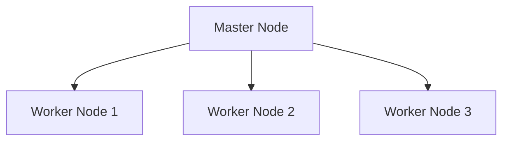

# Standalone模式部署

## 介绍

Apache Spark是一个强大的分布式计算框架，广泛用于大数据处理。Spark支持多种部署模式，其中**Standalone模式**是最简单的一种。Standalone模式是Spark自带的集群管理器，允许你在不依赖外部资源管理器（如YARN或Mesos）的情况下运行Spark应用程序。

在Standalone模式下，Spark集群由一个**Master节点**和多个**Worker节点**组成。Master节点负责资源调度和任务分配，而Worker节点负责执行任务。这种模式非常适合初学者学习和测试Spark集群的基本功能。

## Standalone模式的架构

在Standalone模式下，Spark集群的架构如下：



- **Master节点**：负责管理集群资源，调度任务，并监控Worker节点的状态。
- **Worker节点**：负责执行任务，并向Master节点报告状态。

## 部署步骤

### 1. 下载并安装Spark

首先，你需要从[Apache Spark官网](https://spark.apache.org/downloads.html)下载最新版本的Spark。选择适合你操作系统的预编译包，并解压到本地目录。

```bash
tar -xzf spark-3.x.x-bin-hadoop3.tgz
cd spark-3.x.x-bin-hadoop3
```

### 2. 配置Master节点

在Master节点上，编辑`conf/spark-env.sh`文件，设置必要的环境变量。例如：

```bash
export SPARK_MASTER_HOST=<master-ip>
export SPARK_MASTER_PORT=7077
```

然后，启动Master节点：

```bash
./sbin/start-master.sh
```

启动后，你可以在浏览器中访问`http://<master-ip>:8080`，查看Master节点的Web UI。

### 3. 配置Worker节点

在每个Worker节点上，编辑`conf/spark-env.sh`文件，设置`SPARK_WORKER_CORES`和`SPARK_WORKER_MEMORY`等参数。例如：

```bash
export SPARK_WORKER_CORES=4
export SPARK_WORKER_MEMORY=4g
```

然后，启动Worker节点，并连接到Master节点：

```bash
./sbin/start-worker.sh spark://<master-ip>:7077
```

### 4. 提交应用程序

现在，你可以提交Spark应用程序到集群中运行。例如，运行一个简单的WordCount程序：

```bash
./bin/spark-submit --master spark://<master-ip>:7077 --class org.apache.spark.examples.SparkPi examples/jars/spark-examples_2.12-3.x.x.jar
```

### 5. 监控和管理集群

你可以通过Master节点的Web UI（`http://<master-ip>:8080`）监控集群的状态，查看正在运行的任务、Worker节点的状态等信息。

## 实际案例

假设你有一个包含大量文本文件的数据集，你需要统计每个单词出现的次数。你可以使用Standalone模式部署Spark集群，并运行一个WordCount程序。

```scala
val textFile = sc.textFile("hdfs://<namenode>:9000/path/to/textfile")
val counts = textFile.flatMap(line => line.split(" "))
                    .map(word => (word, 1))
                    .reduceByKey(_ + _)
counts.saveAsTextFile("hdfs://<namenode>:9000/path/to/output")
```

在这个例子中，`sc`是SparkContext对象，`textFile`是输入文件，`counts`是每个单词的计数结果。

## 总结

Standalone模式是Spark最简单的集群部署方式，适合初学者学习和测试。通过本文，你已经了解了如何配置和运行一个Standalone模式的Spark集群，并提交了一个简单的应用程序。

## 附加资源

- [Apache Spark官方文档](https://spark.apache.org/docs/latest/)
- [Spark编程指南](https://spark.apache.org/docs/latest/rdd-programming-guide.html)
- [Spark Standalone模式配置指南](https://spark.apache.org/docs/latest/spark-standalone.html)

## 练习

1. 尝试在你的本地机器上部署一个Standalone模式的Spark集群。
2. 编写一个简单的Spark应用程序，统计一个文本文件中每个单词的出现次数，并提交到集群中运行。
3. 通过Master节点的Web UI监控集群的状态，并查看任务的执行情况。
