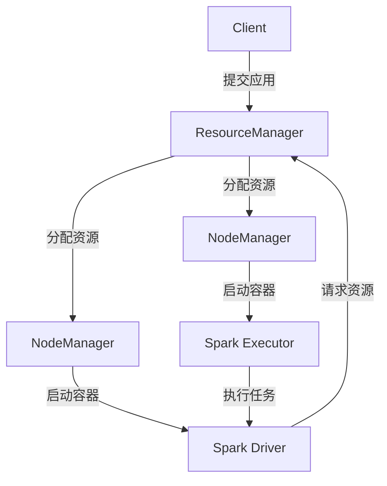

# YARN模式部署

Apache Spark是一个强大的分布式计算框架，而YARN（Yet Another Resource Negotiator）是Hadoop生态系统中的资源管理器。将Spark部署在YARN模式下，可以充分利用YARN的资源管理能力，实现高效的集群资源分配和任务调度。本文将详细介绍如何在YARN模式下部署Spark，并解释其背后的原理。

## 什么是YARN模式？

YARN模式是Spark的一种部署模式，它允许Spark应用程序在YARN集群上运行。在这种模式下，YARN负责资源的管理和分配，而Spark则专注于任务的执行。YARN模式的主要优势在于它可以与其他Hadoop生态系统组件（如HDFS）无缝集成，并且能够动态分配资源。

## YARN模式的工作原理

在YARN模式下，Spark应用程序的驱动程序（Driver）和Executor都运行在YARN容器中。YARN负责启动和管理这些容器，并根据应用程序的需求动态调整资源分配。



## 部署步骤

### 1. 环境准备

在开始之前，确保你已经安装了以下软件：

- Hadoop（包含YARN）
- Spark
- Java

### 2. 配置Spark

在Spark的配置文件`spark-defaults.conf`中，添加以下配置：

```bash
spark.master            yarn
spark.submit.deployMode cluster
spark.yarn.jars         hdfs://<namenode>:<port>/path/to/spark/jars/*
```

### 3. 提交Spark应用程序

使用`spark-submit`命令提交应用程序到YARN集群：

```bash
spark-submit \
  --class org.apache.spark.examples.SparkPi \
  --master yarn \
  --deploy-mode cluster \
  --num-executors 3 \
  --executor-memory 2G \
  --executor-cores 2 \
  /path/to/spark/examples/jars/spark-examples_2.12-3.2.1.jar \
  100
```

### 4. 监控应用程序

提交应用程序后，你可以通过YARN的Web UI或命令行工具监控应用程序的状态：

```bash
yarn application -list
```

## 实际案例

假设你有一个大数据处理任务，需要从HDFS中读取大量数据并进行复杂的计算。使用YARN模式部署Spark应用程序，可以充分利用集群资源，提高计算效率。

```scala
val data = spark.read.textFile("hdfs://<namenode>:<port>/path/to/data")
val wordCounts = data.flatMap(line => line.split(" ")).map(word => (word, 1)).reduceByKey(_ + _)
wordCounts.saveAsTextFile("hdfs://<namenode>:<port>/path/to/output")
```

## 总结

YARN模式是Spark在Hadoop生态系统中部署的一种高效方式。通过YARN的资源管理能力，Spark应用程序可以动态分配资源，提高计算效率。本文详细介绍了YARN模式的部署步骤，并通过实际案例展示了其应用场景。

## 附加资源

- [Apache Spark官方文档](https://spark.apache.org/docs/latest/running-on-yarn.html)
- [Hadoop YARN官方文档](https://hadoop.apache.org/docs/current/hadoop-yarn/hadoop-yarn-site/YARN.html)
- [Spark on YARN: A Comprehensive Guide](https://www.databricks.com/blog/2015/04/15/spark-on-yarn-a-comprehensive-guide.html)

## 练习

1. 尝试在本地搭建一个Hadoop集群，并在YARN模式下运行一个简单的Spark应用程序。
2. 修改Spark应用程序的资源配置（如`executor-memory`和`executor-cores`），观察其对性能的影响。
3. 使用YARN的Web UI监控Spark应用程序的运行状态，并分析资源使用情况。

:::tip
在部署过程中，如果遇到问题，可以查看YARN和Spark的日志文件，通常可以在`/var/log/hadoop-yarn`和`/var/log/spark`目录下找到。
:::