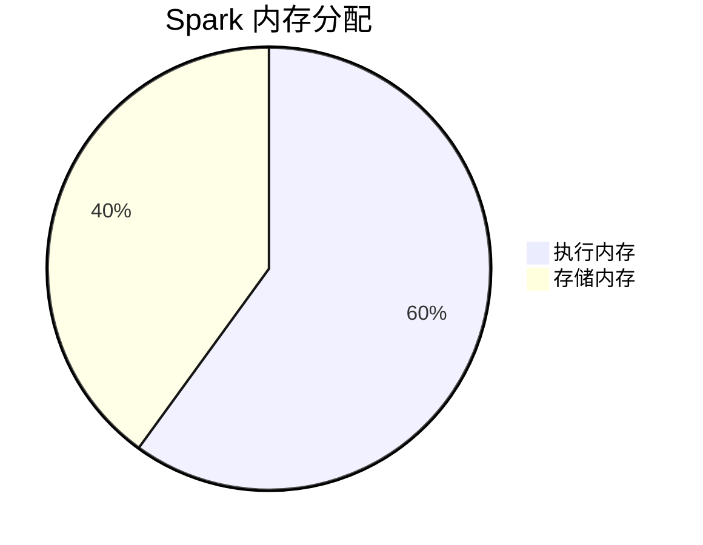

# 内存调优

在 Apache Spark 中，内存调优是提升应用程序性能的关键步骤之一。Spark 是一个基于内存的计算框架，因此合理配置和管理内存资源可以显著提高任务的执行效率。本文将介绍内存调优的基本概念、优化策略以及实际应用场景，帮助你更好地理解如何优化 Spark 应用程序的内存使用。

## 什么是内存调优？

内存调优是指通过调整 Spark 的内存配置参数，优化内存的使用方式，从而提高应用程序的性能。Spark 的内存主要分为两类：

1. **执行内存（Execution Memory）**：用于存储任务执行过程中产生的中间数据，例如 Shuffle、Join 和 Aggregation 操作的结果。
2. **存储内存（Storage Memory）**：用于缓存 RDD、DataFrame 或 Dataset，以便在后续任务中重复使用。

内存调优的目标是确保这两类内存的分配合理，避免内存不足或浪费的情况。

## Spark 内存管理机制

在 Spark 中，内存管理是通过 `UnifiedMemoryManager` 实现的。它将执行内存和存储内存统一管理，允许两者在必要时动态共享内存。以下是 Spark 内存管理的基本结构：



:::note
默认情况下，执行内存和存储内存的比例为 60:40。你可以通过配置参数 `spark.memory.fraction` 和 `spark.memory.storageFraction` 来调整这一比例。
:::

## 内存调优的关键参数

以下是一些常用的内存调优参数：

1. **`spark.executor.memory`**：设置每个 Executor 的内存大小。例如，`--executor-memory 4G` 表示每个 Executor 分配 4GB 内存。
2. **`spark.memory.fraction`**：设置执行内存和存储内存的总比例。默认值为 0.6，表示 60% 的内存用于执行和存储。
3. **`spark.memory.storageFraction`**：设置存储内存占 `spark.memory.fraction` 的比例。默认值为 0.5，表示存储内存占 50%。
4. **`spark.sql.shuffle.partitions`**：设置 Shuffle 操作的分区数。增加分区数可以减少每个分区的数据量，从而降低内存压力。

## 内存调优的实际案例

### 案例 1：调整 Executor 内存

假设你有一个 Spark 应用程序，任务执行过程中频繁出现 `OutOfMemoryError` 错误。这可能是因为 Executor 的内存不足。你可以尝试增加 Executor 的内存：

```bash
spark-submit --executor-memory 8G --class com.example.MyApp my-app.jar
```

### 案例 2：优化 Shuffle 分区数

如果你的应用程序涉及大量的 Shuffle 操作，默认的分区数可能会导致某些分区数据量过大，从而引发内存不足的问题。你可以通过增加分区数来缓解这一问题：

```scala
spark.conf.set("spark.sql.shuffle.partitions", "200")
```

### 案例 3：缓存常用数据集

如果你的应用程序需要多次访问某个数据集，可以将其缓存到内存中，以减少重复计算的开销：

```scala
val df = spark.read.parquet("data.parquet")
df.cache()
df.count() // 触发缓存
```

## 总结

内存调优是 Spark 性能优化的重要组成部分。通过合理配置内存参数、优化 Shuffle 操作以及缓存常用数据集，你可以显著提升 Spark 应用程序的执行效率。以下是一些额外的资源和建议，帮助你进一步学习：

- [Spark 官方文档 - 内存调优](https://spark.apache.org/docs/latest/tuning.html#memory-tuning)
- 练习：尝试在一个真实的 Spark 应用程序中调整内存参数，观察性能变化。

希望本文能帮助你更好地理解 Spark 内存调优的概念和实践。如果你有任何问题或建议，欢迎在评论区留言！