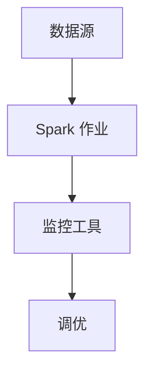

# 外部数据源最佳实践

在现代大数据处理中，Apache Spark 是一个强大的分布式计算框架，能够处理海量数据。然而，Spark 本身并不存储数据，而是依赖于外部数据源（如数据库、文件系统、云存储等）来读取和写入数据。因此，高效地与外部数据源集成是 Spark 应用成功的关键。

本文将介绍如何在 Spark 中集成外部数据源，并提供一些最佳实践，帮助初学者优化数据处理流程。

## 1. 什么是外部数据源？

外部数据源是指 Spark 应用之外的数据存储系统，例如：

- **关系型数据库**：MySQL、PostgreSQL、Oracle 等。
- **NoSQL 数据库**：MongoDB、Cassandra、HBase 等。
- **文件系统**：HDFS、S3、本地文件系统等。
- **消息队列**：Kafka、RabbitMQ 等。

Spark 提供了丰富的 API 和连接器，能够与这些外部数据源无缝集成。

## 2. 为什么需要最佳实践？

与外部数据源集成时，可能会遇到以下挑战：

- **性能瓶颈**：数据读取或写入速度慢。
- **数据一致性**：在分布式环境中确保数据的一致性。
- **资源管理**：合理分配计算和存储资源。

通过遵循最佳实践，可以有效解决这些问题，提升 Spark 应用的性能和可靠性。

## 3. 最佳实践

### 3.1 选择合适的连接器

Spark 提供了多种连接器来与外部数据源交互。选择适合的连接器是第一步。

- **JDBC 连接器**：用于连接关系型数据库。
- **MongoDB 连接器**：用于连接 MongoDB。
- **Hadoop 文件系统连接器**：用于连接 HDFS。

例如，使用 JDBC 连接器读取 MySQL 数据：

```scala
val jdbcDF = spark.read
  .format("jdbc")
  .option("url", "jdbc:mysql://localhost:3306/mydb")
  .option("dbtable", "mytable")
  .option("user", "myuser")
  .option("password", "mypassword")
  .load()
```

### 3.2 优化数据读取

为了提高数据读取性能，可以采取以下措施：

- **分区读取**：将数据分成多个分区并行读取。
- **列裁剪**：只读取需要的列，减少数据传输量。
- **谓词下推**：将过滤条件推送到数据源，减少读取的数据量。

例如，使用分区读取 MySQL 数据：

```scala
val jdbcDF = spark.read
  .format("jdbc")
  .option("url", "jdbc:mysql://localhost:3306/mydb")
  .option("dbtable", "mytable")
  .option("user", "myuser")
  .option("password", "mypassword")
  .option("numPartitions", "10")
  .option("partitionColumn", "id")
  .option("lowerBound", "1")
  .option("upperBound", "1000")
  .load()
```

### 3.3 优化数据写入

在写入数据时，可以采取以下措施：

- **批量写入**：减少写入操作的次数，提高写入效率。
- **并行写入**：将数据分成多个分区并行写入。
- **事务管理**：确保数据写入的一致性。

例如，批量写入数据到 MySQL：

```scala
jdbcDF.write
  .format("jdbc")
  .option("url", "jdbc:mysql://localhost:3306/mydb")
  .option("dbtable", "mytable")
  .option("user", "myuser")
  .option("password", "mypassword")
  .option("batchsize", "10000")
  .mode("append")
  .save()
```

### 3.4 数据缓存与持久化

对于频繁访问的数据，可以将其缓存到内存中，以减少重复读取的开销。

```scala
val cachedDF = jdbcDF.cache()
cachedDF.show()
```

:::tip
缓存数据时，请确保内存资源充足，避免内存溢出。
:::

### 3.5 监控与调优

使用 Spark 的监控工具（如 Spark UI）来监控作业的执行情况，并根据需要进行调优。



## 4. 实际案例

假设我们有一个电商网站，需要从 MySQL 数据库中读取订单数据，并将其写入到 HDFS 中进行分析。

1. **读取订单数据**：

```scala
val ordersDF = spark.read
  .format("jdbc")
  .option("url", "jdbc:mysql://localhost:3306/ecommerce")
  .option("dbtable", "orders")
  .option("user", "admin")
  .option("password", "password")
  .load()
```

2. **写入到 HDFS**：

```scala
ordersDF.write
  .format("parquet")
  .mode("overwrite")
  .save("hdfs://localhost:9000/data/orders")
```

通过上述步骤，我们成功地将订单数据从 MySQL 迁移到 HDFS，为后续的分析工作奠定了基础。

## 5. 总结

与外部数据源集成是 Spark 应用中的重要环节。通过选择合适的连接器、优化数据读取与写入、缓存数据以及监控调优，可以显著提升 Spark 应用的性能和可靠性。

## 6. 附加资源与练习

- **资源**：
  - [Spark 官方文档](https://spark.apache.org/docs/latest/)
  - [Spark SQL 编程指南](https://spark.apache.org/docs/latest/sql-programming-guide.html)

- **练习**：
  1. 尝试从 PostgreSQL 数据库中读取数据，并将其写入到 S3 中。
  2. 使用谓词下推优化读取操作，只读取特定时间范围内的数据。

通过不断实践和探索，你将能够熟练掌握 Spark 与外部数据源的集成技巧。