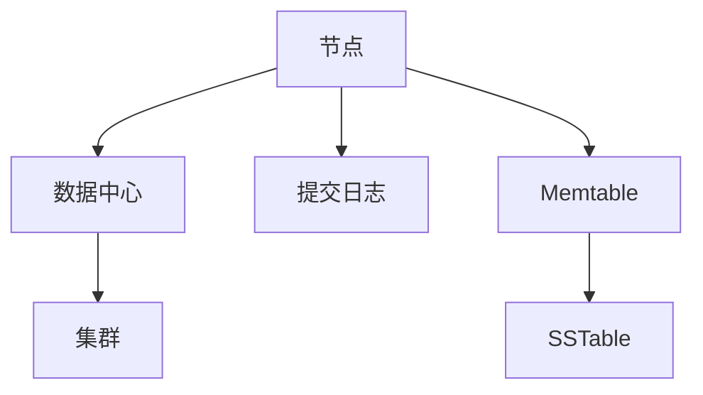

# Cassandra 简介

Apache Cassandra 是一个高度可扩展的分布式 NoSQL 数据库，设计用于处理大量数据跨多个数据中心和云环境。它以其高可用性、无单点故障和线性可扩展性而闻名。Cassandra 最初由 Facebook 开发，后来成为 Apache 软件基金会的顶级项目。

## 什么是 Cassandra？

Cassandra 是一个分布式数据库管理系统，旨在处理大量数据跨多个商品服务器，提供高可用性而没有单点故障。它是一个 NoSQL 数据库，意味着它不使用传统的表格关系模型，而是使用一种称为宽列存储的模型。

### 核心特点

- **分布式和去中心化**：Cassandra 没有主节点，所有节点都是平等的，这消除了单点故障。
- **高可用性**：通过数据复制和分布式架构，Cassandra 确保数据的高可用性。
- **线性可扩展性**：通过简单地添加更多节点来扩展 Cassandra 集群，性能线性增长。
- **灵活的数据模型**：支持动态列，允许每行有不同的列。

## Cassandra 架构

Cassandra 的架构设计允许它在多个数据中心之间无缝运行，提供低延迟的数据访问。以下是 Cassandra 架构的关键组件：

1. **节点（Node）**：存储数据的单个机器。
2. **数据中心（Data Center）**：一组相关的节点。
3. **集群（Cluster）**：包含一个或多个数据中心的完整 Cassandra 系统。
4. **提交日志（Commit Log）**：用于崩溃恢复的数据写入日志。
5. **Memtable**：内存中的数据结构，用于存储最近写入的数据。
6. **SSTable**：磁盘上的不可变数据文件，用于存储 Memtable 中的数据。



## 实际应用场景

Cassandra 被广泛应用于需要高吞吐量和低延迟的应用程序中，例如：

- **社交媒体平台**：用于存储用户生成的内容，如帖子、评论和消息。
- **物联网（IoT）**：用于收集和存储来自数百万设备的数据。
- **推荐系统**：用于存储和处理用户行为数据，以提供个性化推荐。

## 代码示例

以下是一个简单的 Cassandra 查询示例，展示如何创建一个键空间（Keyspace）和表（Table），并插入一些数据。

```sql
-- 创建一个键空间
CREATE KEYSPACE my_keyspace WITH replication = {'class': 'SimpleStrategy', 'replication_factor': 1};

-- 使用键空间
USE my_keyspace;

-- 创建一个表
CREATE TABLE users (
    user_id UUID PRIMARY KEY,
    name TEXT,
    email TEXT
);

-- 插入数据
INSERT INTO users (user_id, name, email) VALUES (uuid(), 'Alice', 'alice@example.com');
INSERT INTO users (user_id, name, email) VALUES (uuid(), 'Bob', 'bob@example.com');

-- 查询数据
SELECT * FROM users;
```

**输出：**

```
 user_id                               | name  | email
--------------------------------------+-------+-------------------
 123e4567-e89b-12d3-a456-426614174000 | Alice | alice@example.com
 123e4567-e89b-12d3-a456-426614174001 | Bob   | bob@example.com
```

## 总结

Cassandra 是一个强大的分布式数据库，适用于需要高可用性和线性可扩展性的应用程序。它的去中心化架构和灵活的数据模型使其成为处理大规模数据的理想选择。

## 附加资源

- [Apache Cassandra 官方文档](https://cassandra.apache.org/doc/latest/)
- [Cassandra 数据模型指南](https://docs.datastax.com/en/cassandra-oss/3.x/cassandra/data_modeling/data_modeling_intro.html)
- [Cassandra 实战教程](https://academy.datastax.com/)

:::tip
练习：尝试在你的本地环境中安装 Cassandra，并创建一个简单的键空间和表，插入一些数据并进行查询。
:::