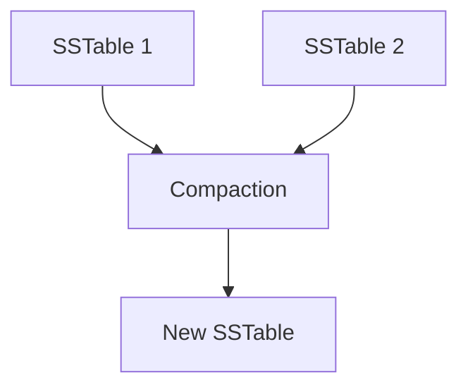

# Cassandra 术语表

Cassandra是一个高度可扩展的分布式NoSQL数据库，广泛应用于需要处理大量数据的场景。为了帮助初学者更好地理解Cassandra，本文将介绍一些关键术语及其定义。

## 1. 节点（Node）

**节点**是Cassandra集群中的单个服务器。每个节点都存储数据的一部分，并负责处理读写请求。节点之间通过Gossip协议进行通信，以确保集群的状态一致。

:::note
Gossip协议是一种分布式系统中用于节点间通信的协议，它通过定期交换信息来维护集群的状态。
:::

## 2. 集群（Cluster）

**集群**是由多个节点组成的集合，这些节点共同工作以存储和管理数据。Cassandra集群是分布式的，意味着数据可以在多个节点之间复制和分布。

## 3. 键空间（Keyspace）

**键空间**是Cassandra中的顶级命名空间，类似于关系数据库中的数据库。它定义了数据的复制策略和配置。每个键空间可以包含多个表。

```sql
CREATE KEYSPACE my_keyspace
WITH replication = {'class': 'SimpleStrategy', 'replication_factor': 3};
```

:::tip
`replication_factor` 定义了数据在集群中的副本数量。较高的复制因子可以提高数据的可用性和容错性。
:::

## 4. 表（Table）

**表**是Cassandra中存储数据的结构，类似于关系数据库中的表。表由行和列组成，但Cassandra的表是宽列存储（Wide-Column Store），这意味着每行可以有不同的列。

```sql
CREATE TABLE my_keyspace.my_table (
    user_id UUID PRIMARY KEY,
    name TEXT,
    email TEXT
);
```

## 5. 分区键（Partition Key）

**分区键**是用于确定数据在集群中分布方式的列。Cassandra使用分区键的哈希值来决定数据存储在哪个节点上。

```sql
CREATE TABLE my_keyspace.my_table (
    user_id UUID,
    name TEXT,
    email TEXT,
    PRIMARY KEY (user_id)
);
```

:::caution
选择合适的分区键非常重要，因为它直接影响数据的分布和查询性能。
:::

## 6. 集群键（Clustering Key）

**集群键**用于在分区内对数据进行排序。它通常与分区键一起使用，以定义数据的存储顺序。

```sql
CREATE TABLE my_keyspace.my_table (
    user_id UUID,
    event_time TIMESTAMP,
    event_name TEXT,
    PRIMARY KEY (user_id, event_time)
) WITH CLUSTERING ORDER BY (event_time DESC);
```

## 7. 副本（Replica）

**副本**是数据在集群中的多个副本。Cassandra通过复制策略确保数据的高可用性和容错性。每个数据副本存储在不同的节点上。

## 8. 一致性级别（Consistency Level）

**一致性级别**定义了在读写操作中需要多少个副本确认才能认为操作成功。常见的一致性级别包括 `ONE`、`QUORUM` 和 `ALL`。

```sql
CONSISTENCY QUORUM;
```

:::warning
选择一致性级别时需要在性能和一致性之间进行权衡。较高的级别提供更强的一致性，但可能会影响性能。
:::

## 9. 墓碑（Tombstone）

**墓碑**是Cassandra中用于标记已删除数据的特殊记录。由于Cassandra是分布式系统，删除操作不会立即从磁盘中移除数据，而是通过墓碑标记数据为已删除。

## 10. 压缩（Compaction）

**压缩**是Cassandra中的一种后台进程，用于合并和清理SSTable（Sorted String Table）文件，以优化存储和查询性能。



## 实际案例

假设我们有一个用户活动跟踪系统，我们需要存储用户的登录事件。我们可以使用以下表结构：

```sql
CREATE TABLE user_activity (
    user_id UUID,
    event_time TIMESTAMP,
    event_name TEXT,
    PRIMARY KEY (user_id, event_time)
) WITH CLUSTERING ORDER BY (event_time DESC);
```

在这个例子中，`user_id` 是分区键，`event_time` 是集群键。数据将按用户ID分布，并在每个用户的分区内按时间排序。

## 总结

本文介绍了Cassandra中的一些关键术语，包括节点、集群、键空间、表、分区键、集群键、副本、一致性级别、墓碑和压缩。理解这些术语是掌握Cassandra的基础。

## 附加资源

- [Cassandra官方文档](https://cassandra.apache.org/doc/latest/)
- [Cassandra数据模型指南](https://docs.datastax.com/en/cassandra-oss/3.x/cassandra/data_modeling/data_modeling_concepts.html)
- [Cassandra一致性级别详解](https://docs.datastax.com/en/cassandra-oss/3.x/cassandra/dml/dmlConfigConsistency.html)

## 练习

1. 创建一个名为 `my_keyspace` 的键空间，并设置复制因子为3。
2. 在 `my_keyspace` 中创建一个表 `user_activity`，包含 `user_id`、`event_time` 和 `event_name` 列。
3. 插入一些数据并查询按用户ID和时间排序的结果。

通过这些练习，你将更好地理解Cassandra的基本概念和操作。