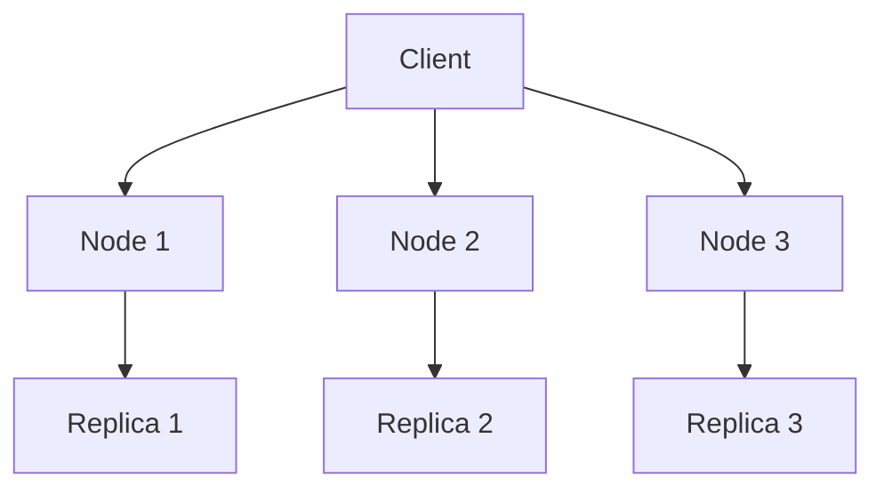

## 介绍

在数据库领域，关系型数据库（如MySQL、PostgreSQL）长期以来一直是主流选择。然而，随着大数据和分布式系统的兴起，NoSQL数据库（如Cassandra）逐渐成为处理海量数据的首选。本文将对比Cassandra与关系型数据库，帮助初学者理解它们的核心差异以及适用场景。

## 数据模型

### 关系型数据库

关系型数据库使用表格（表）来存储数据，表之间通过外键建立关系。数据以行和列的形式组织，支持复杂的查询和事务操作。

```sql
CREATE TABLE users (
    id INT PRIMARY KEY,
    name VARCHAR(100),
    email VARCHAR(100)
);
```

### Cassandra

Cassandra采用宽列存储模型，数据以键值对的形式存储在列族（Column Family）中。它没有固定的表结构，支持动态添加列。

```cql
CREATE TABLE users (
    user_id UUID PRIMARY KEY,
    name TEXT,
    email TEXT
);
```

:::note
Cassandra的宽列模型非常适合存储半结构化数据，例如日志、时间序列数据等。
:::

## 性能与扩展性

### 关系型数据库

关系型数据库通常采用垂直扩展（增加单台服务器的资源）来提高性能。然而，这种扩展方式在数据量极大时可能会遇到瓶颈。

### Cassandra

Cassandra设计为分布式数据库，支持水平扩展（增加更多服务器）。它通过分区和复制机制实现高可用性和高性能。



:::tip
Cassandra的分布式架构使其在处理大规模数据时表现出色，特别适合需要高吞吐量和低延迟的场景。
:::

## 事务与一致性

### 关系型数据库

关系型数据库支持ACID事务（原子性、一致性、隔离性、持久性），确保数据的完整性和一致性。

```sql
BEGIN TRANSACTION;
UPDATE accounts SET balance = balance - 100 WHERE id = 1;
UPDATE accounts SET balance = balance + 100 WHERE id = 2;
COMMIT;
```

### Cassandra

Cassandra采用最终一致性模型，牺牲强一致性以换取高可用性和分区容错性。它支持轻量级事务（Lightweight Transactions），但不支持复杂的多行事务。

```cql
BEGIN BATCH
    UPDATE users SET email = 'new@example.com' WHERE user_id = uuid();
    INSERT INTO user_logs (user_id, log) VALUES (uuid(), 'Email updated');
APPLY BATCH;
```

:::caution
Cassandra的最终一致性模型可能导致数据在短时间内不一致，因此在需要强一致性的场景中需谨慎使用。
:::

## 适用场景

### 关系型数据库

- 需要复杂查询和事务的应用（如金融系统）。
- 数据结构固定且关系明确的场景（如ERP系统）。

### Cassandra

- 需要高吞吐量和低延迟的应用（如实时分析、日志存储）。
- 数据结构灵活且数据量巨大的场景（如物联网、社交网络）。

## 实际案例

### 关系型数据库案例

假设您正在开发一个电子商务平台，需要处理订单、库存和用户信息。关系型数据库可以很好地支持这些复杂的关系和事务操作。

```sql
SELECT o.order_id, u.name, p.product_name
FROM orders o
JOIN users u ON o.user_id = u.id
JOIN products p ON o.product_id = p.id
WHERE o.status = 'shipped';
```

### Cassandra 案例

假设您正在开发一个物联网平台，需要存储来自数百万设备的时间序列数据。Cassandra的高吞吐量和分布式特性使其成为理想选择。

```cql
SELECT * FROM sensor_data
WHERE device_id = 'device-123'
AND timestamp > '2023-01-01'
AND timestamp < '2023-01-31';
```

## 总结

Cassandra和关系型数据库各有优缺点，选择哪种数据库取决于您的具体需求。如果您需要处理复杂的关系和事务，关系型数据库是更好的选择。如果您需要处理海量数据并实现高可用性和高性能，Cassandra可能是更合适的解决方案。

## 附加资源

- [Cassandra官方文档](https://cassandra.apache.org/doc/latest/)
- [MySQL官方文档](https://dev.mysql.com/doc/)
- [NoSQL vs SQL: What's the Difference?](https://www.mongodb.com/nosql-explained)

## 练习

1. 在Cassandra中创建一个表，用于存储博客文章及其评论。
2. 在关系型数据库中设计一个表结构，用于存储学生和课程信息。
3. 比较Cassandra和关系型数据库在存储时间序列数据时的性能差异。

:::tip
完成练习后，尝试在实际项目中应用所学知识，以加深理解。
:::