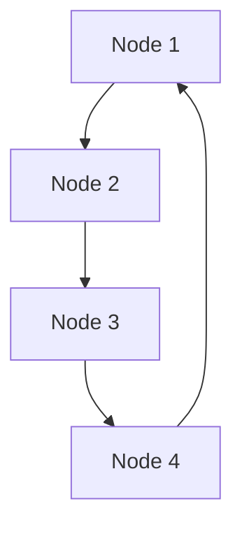

# Cassandra 节点与集群

## 介绍

Apache Cassandra 是一个高度可扩展的分布式 NoSQL 数据库，设计用于处理大量数据跨多个节点和集群。在 Cassandra 中，**节点（Node）** 和 **集群（Cluster）** 是核心概念，理解它们对于掌握 Cassandra 的工作原理至关重要。

- **节点**：节点是 Cassandra 数据库中的一个独立实例，通常运行在一台物理或虚拟机器上。每个节点都存储数据的一部分，并与其他节点协同工作以提供高可用性和容错性。
- **集群**：集群是由多个节点组成的集合，这些节点共同工作以存储和管理数据。集群中的节点通过 Gossip 协议进行通信，确保数据的一致性和可用性。

## Cassandra 节点

### 节点的角色

在 Cassandra 中，每个节点都有以下主要职责：

1. **数据存储**：节点负责存储数据的一部分。Cassandra 使用分布式哈希表（DHT）来确定数据在集群中的存储位置。
2. **数据复制**：为了提高数据的可用性和容错性，Cassandra 会在多个节点上复制数据。每个数据副本称为一个 **副本（Replica）**。
3. **请求处理**：节点接收来自客户端的读写请求，并根据一致性级别（Consistency Level）处理这些请求。

### 节点的配置

在 Cassandra 中，节点的配置主要通过 `cassandra.yaml` 文件进行。以下是一些关键的配置项：

- `cluster_name`：指定集群的名称，所有节点必须使用相同的集群名称。
- `listen_address`：节点监听的 IP 地址，用于与其他节点通信。
- `rpc_address`：节点用于接收客户端请求的 IP 地址。
- `seed_provider`：指定种子节点（Seed Nodes），新节点通过种子节点加入集群。

```yaml
cluster_name: 'MyCassandraCluster'
listen_address: '192.168.1.1'
rpc_address: '192.168.1.1'
seed_provider:
  - class_name: org.apache.cassandra.locator.SimpleSeedProvider
    parameters:
      - seeds: "192.168.1.1,192.168.1.2"
```

## Cassandra 集群

### 集群的组成

Cassandra 集群由多个节点组成，这些节点可以是物理机、虚拟机或容器。集群中的节点通过 Gossip 协议进行通信，以维护集群的状态信息。

### 集群的拓扑结构

Cassandra 集群的拓扑结构通常是 **环形结构**，数据通过一致性哈希算法分布在集群中的各个节点上。每个节点负责存储一部分数据，并且数据会在多个节点上进行复制。



### 数据分布与复制

Cassandra 使用 **分区器（Partitioner）** 来确定数据在集群中的分布。默认的分区器是 `Murmur3Partitioner`，它使用一致性哈希算法将数据均匀地分布在集群中。

数据复制策略由 **复制策略（Replication Strategy）** 决定，常见的复制策略包括：

- **SimpleStrategy**：适用于单数据中心环境，数据在集群中的所有节点上进行复制。
- **NetworkTopologyStrategy**：适用于多数据中心环境，数据在每个数据中心内的节点上进行复制。

```sql
CREATE KEYSPACE my_keyspace
WITH replication = {'class': 'NetworkTopologyStrategy', 'DC1': 3, 'DC2': 2};
```

在上面的示例中，`my_keyspace` 键空间在 `DC1` 数据中心有 3 个副本，在 `DC2` 数据中心有 2 个副本。

## 实际案例

假设我们有一个电子商务网站，需要存储用户的订单数据。为了提高数据的可用性和容错性，我们决定使用 Cassandra 来存储这些数据。

1. **集群配置**：我们配置了一个由 5 个节点组成的 Cassandra 集群，分布在两个数据中心（DC1 和 DC2）。
2. **数据分布**：订单数据通过一致性哈希算法分布在集群中的各个节点上，并且在每个数据中心内进行复制。
3. **高可用性**：即使某个节点或数据中心发生故障，订单数据仍然可以从其他节点或数据中心访问。

## 总结

Cassandra 的节点和集群是其分布式架构的核心。通过理解节点和集群的工作原理，你可以更好地设计和优化 Cassandra 数据库，以满足高可用性和可扩展性的需求。

## 附加资源

- [Cassandra 官方文档](https://cassandra.apache.org/doc/latest/)
- [Cassandra 数据分布与复制策略](https://docs.datastax.com/en/cassandra-oss/3.x/cassandra/architecture/archDataDistribute.html)
- [Cassandra 配置指南](https://docs.datastax.com/en/cassandra-oss/3.x/cassandra/configuration/configCassandra_yaml.html)

## 练习

1. 在你的本地环境中配置一个由 3 个节点组成的 Cassandra 集群。
2. 创建一个键空间，并使用 `NetworkTopologyStrategy` 配置数据复制策略。
3. 模拟一个节点故障，观察集群如何保持数据的可用性。

:::tip
在配置 Cassandra 集群时，确保所有节点的 `cluster_name` 和 `seed_provider` 配置一致，以避免节点无法加入集群的问题。
:::