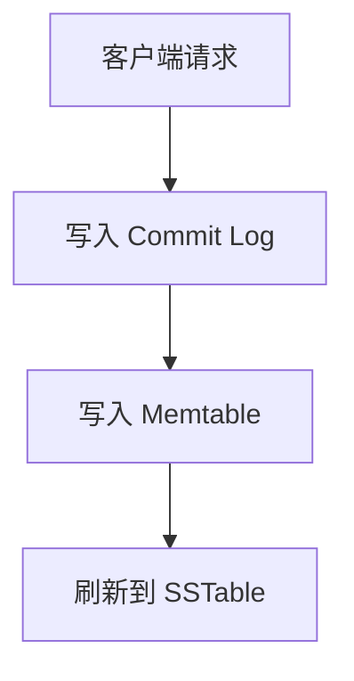
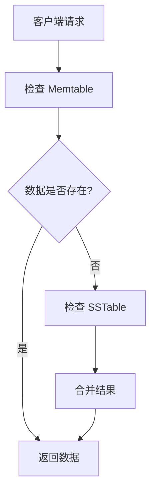

## 介绍

Apache Cassandra 是一个高度可扩展的分布式 NoSQL 数据库，以其高性能和高可用性而闻名。理解 Cassandra 的读写路径是掌握其工作原理的关键。本文将详细介绍 Cassandra 的读写路径，帮助你理解数据是如何在 Cassandra 中存储和检索的。

## 写路径

### 写操作的基本流程

当客户端向 Cassandra 发送写请求时，数据会经历以下步骤：

1. **客户端请求**：客户端向 Cassandra 节点发送写请求。
2. **写入 Commit Log**：数据首先被写入到 Commit Log 中，以确保数据的持久性。
3. **写入 Memtable**：数据随后被写入到内存中的 Memtable。
4. **刷新到 SSTable**：当 Memtable 达到一定大小时，数据会被刷新到磁盘上的 SSTable 中。



### 详细步骤

1. **客户端请求**：客户端通过 CQL（Cassandra Query Language）向 Cassandra 节点发送写请求。
2. **写入 Commit Log**：Commit Log 是一个只追加的日志文件，用于在系统崩溃时恢复数据。所有写操作都会首先记录到 Commit Log 中。
3. **写入 Memtable**：Memtable 是一个内存中的数据结构，用于临时存储写入的数据。每个表都有一个对应的 Memtable。
4. **刷新到 SSTable**：当 Memtable 达到配置的大小阈值时，数据会被刷新到磁盘上的 SSTable 中。SSTable 是不可变的，一旦写入就不能修改。

:::note
Commit Log 和 Memtable 的写入是同步的，确保数据不会丢失。
:::

## 读路径

### 读操作的基本流程

当客户端向 Cassandra 发送读请求时，数据会经历以下步骤：

1. **客户端请求**：客户端向 Cassandra 节点发送读请求。
2. **检查 Memtable**：首先检查内存中的 Memtable 是否有请求的数据。
3. **检查 SSTable**：如果 Memtable 中没有找到数据，则检查磁盘上的 SSTable。
4. **合并结果**：如果数据分布在多个 SSTable 中，Cassandra 会合并这些结果并返回给客户端。



### 详细步骤

1. **客户端请求**：客户端通过 CQL 向 Cassandra 节点发送读请求。
2. **检查 Memtable**：Cassandra 首先检查内存中的 Memtable，看看是否有请求的数据。
3. **检查 SSTable**：如果 Memtable 中没有找到数据，Cassandra 会检查磁盘上的 SSTable。SSTable 是按时间顺序组织的，Cassandra 会从最新的 SSTable 开始查找。
4. **合并结果**：如果数据分布在多个 SSTable 中，Cassandra 会合并这些结果并返回给客户端。合并过程中，Cassandra 会使用时间戳来确定哪个版本的数据是最新的。

:::tip
Cassandra 使用 Bloom Filter 来快速确定某个 SSTable 是否包含请求的数据，从而减少磁盘 I/O。
:::

## 实际案例

### 场景描述

假设我们有一个电子商务网站，需要存储用户的订单信息。订单信息包括订单 ID、用户 ID、订单日期和订单金额。我们使用 Cassandra 来存储这些订单数据。

### 写操作示例

```sql
INSERT INTO orders (order_id, user_id, order_date, amount) 
VALUES ('12345', 'user1', '2023-10-01', 100.00);
```

在这个例子中，数据首先被写入到 Commit Log 和 Memtable 中，随后当 Memtable 达到一定大小时，数据会被刷新到 SSTable 中。

### 读操作示例

```sql
SELECT * FROM orders WHERE order_id = '12345';
```

在这个例子中，Cassandra 首先检查 Memtable，如果没有找到数据，则检查 SSTable，并返回最新的订单信息。

## 总结

Cassandra 的读写路径是其高性能和高可用性的核心。通过理解写路径中的 Commit Log、Memtable 和 SSTable，以及读路径中的 Memtable、SSTable 和 Bloom Filter，你可以更好地掌握 Cassandra 的工作原理。

## 附加资源

- [Cassandra 官方文档](https://cassandra.apache.org/doc/latest/)
- [Cassandra 数据模型](https://cassandra.apache.org/doc/latest/cassandra/data_modeling/index.html)
- [Cassandra 性能调优](https://cassandra.apache.org/doc/latest/cassandra/operating/performance_tuning.html)

## 练习

1. 尝试在本地 Cassandra 实例中创建一个表，并插入一些数据。观察数据是如何写入到 Commit Log 和 Memtable 中的。
2. 编写一个查询语句，从 Cassandra 中读取数据，并解释 Cassandra 是如何找到这些数据的。

通过以上练习，你将更深入地理解 Cassandra 的读写路径。