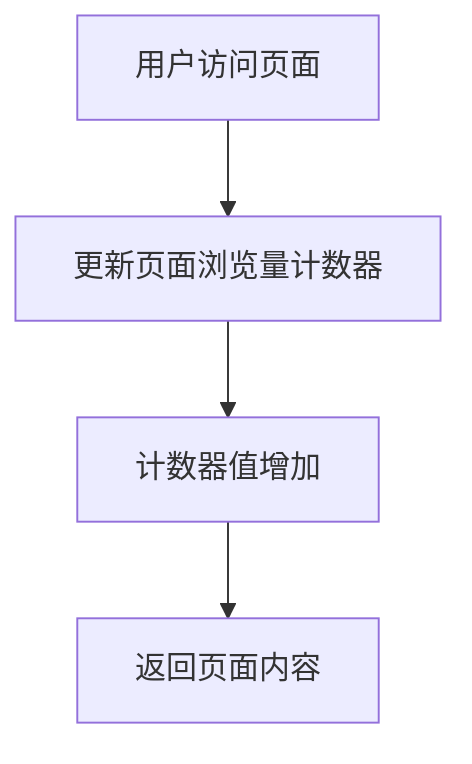

# Cassandra 计数器表

在Cassandra中，计数器表（Counter Table）是一种特殊类型的表，专门用于存储和更新计数器值。计数器表的主要用途是高效地处理需要频繁更新的计数操作，例如网站的页面浏览量、点赞数、评论数等。与普通表不同，计数器表的列值只能是计数器类型（`counter`），并且只能通过增加或减少操作来更新。

## 计数器表的基本概念

计数器表的列类型必须是`counter`，这意味着你不能直接插入或更新一个具体的值，而是只能通过增加或减少操作来修改计数器的值。计数器表的设计使得它在高并发环境下能够高效地处理计数操作。

### 创建计数器表

要创建一个计数器表，你需要使用`CREATE TABLE`语句，并指定列的类型为`counter`。以下是一个简单的示例：

```sql
CREATE TABLE page_views (
    page_id UUID PRIMARY KEY,
    views counter
);
```

在这个示例中，`page_views`表包含两个列：`page_id`作为主键，`views`作为计数器列。

### 更新计数器

更新计数器表的值时，只能使用`UPDATE`语句，并且只能通过增加或减少操作来修改计数器的值。以下是一个更新计数器的示例：

```sql
UPDATE page_views SET views = views + 1 WHERE page_id = uuid();
```

在这个示例中，我们将`page_id`为某个UUID的页面的`views`计数器增加了1。

:::note
计数器表不支持直接插入数据。你只能通过`UPDATE`语句来增加或减少计数器的值。
:::

## 计数器表的实际应用

计数器表在许多实际场景中非常有用，尤其是在需要频繁更新计数的场景中。以下是一些常见的应用场景：

### 1. 页面浏览量统计

假设你有一个网站，需要统计每个页面的浏览量。你可以使用计数器表来存储每个页面的浏览量，并在每次用户访问页面时更新计数器。

```sql
UPDATE page_views SET views = views + 1 WHERE page_id = uuid();
```

### 2. 社交媒体点赞数统计

在社交媒体应用中，你可以使用计数器表来存储每个帖子的点赞数。每当用户点赞或取消点赞时，你可以更新计数器。

```sql
UPDATE post_likes SET likes = likes + 1 WHERE post_id = uuid();
```

### 3. 评论数统计

在博客或论坛中，你可以使用计数器表来存储每个帖子或文章的评论数。每当有新的评论时，你可以更新计数器。

```sql
UPDATE post_comments SET comments = comments + 1 WHERE post_id = uuid();
```

## 计数器表的限制

虽然计数器表在某些场景下非常有用，但它们也有一些限制：

1. **不支持直接插入数据**：你只能通过`UPDATE`语句来增加或减少计数器的值。
2. **不支持删除操作**：你不能直接删除计数器表中的行。如果需要删除计数器，你需要删除整个表并重新创建。
3. **并发更新**：在高并发环境下，计数器表的更新操作可能会导致性能问题。Cassandra通过使用轻量级事务（Lightweight Transactions）来解决这个问题，但这可能会增加延迟。

## 总结

计数器表是Cassandra中一种非常有用的数据结构，特别适合用于需要频繁更新计数的场景。通过使用计数器表，你可以高效地处理页面浏览量、点赞数、评论数等统计操作。然而，计数器表也有一些限制，因此在设计数据模型时需要仔细考虑这些限制。

## 附加资源与练习

1. **练习**：创建一个计数器表，用于存储用户的登录次数。每次用户登录时，更新计数器。
2. **进一步阅读**：查阅Cassandra官方文档，了解更多关于计数器表的高级用法和最佳实践。



通过以上内容，你应该对Cassandra中的计数器表有了一个全面的了解。希望这些知识能够帮助你在实际项目中更好地使用Cassandra进行数据建模和统计操作。