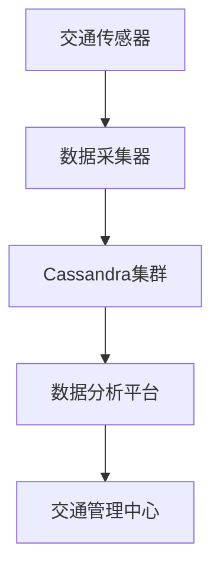

# Cassandra 在物联网中的应用

## 介绍

物联网（IoT）是指通过互联网连接的各种设备，如传感器、智能家居设备、工业机器等。这些设备生成大量数据，通常需要高效、可扩展的数据库来存储和处理这些数据。Apache Cassandra是一个分布式NoSQL数据库，因其高可用性、无单点故障和线性可扩展性，成为处理物联网数据的理想选择。

在本篇文章中，我们将探讨Cassandra如何应用于物联网场景，并通过实际案例和代码示例展示其优势。

---

## Cassandra 在物联网中的优势

Cassandra在物联网中的应用主要得益于以下几个特点：

1. **高可用性**：Cassandra采用分布式架构，数据在多个节点上复制，确保即使某些节点失效，系统仍能正常运行。
2. **线性可扩展性**：随着物联网设备数量的增加，Cassandra可以通过添加更多节点轻松扩展。
3. **高性能写入**：Cassandra优化了写入操作，非常适合处理高频率的传感器数据。
4. **灵活的数据模型**：Cassandra支持灵活的模式设计，能够适应物联网中多样化的数据类型。

---

## 实际应用场景

### 1. 智能家居数据存储

在智能家居场景中，各种设备（如温度传感器、智能灯泡、安防摄像头）会持续生成数据。这些数据需要被实时存储和分析。

#### 数据模型设计

假设我们有一个温度传感器，每隔5秒发送一次温度数据。我们可以设计如下的Cassandra表：

```sql
CREATE TABLE temperature_data (
    sensor_id UUID,
    timestamp TIMESTAMP,
    temperature FLOAT,
    PRIMARY KEY (sensor_id, timestamp)
);
```

- `sensor_id`：传感器的唯一标识。
- `timestamp`：数据生成的时间戳。
- `temperature`：传感器读取的温度值。

#### 数据插入示例

```sql
INSERT INTO temperature_data (sensor_id, timestamp, temperature)
VALUES (uuid(), '2023-10-01 12:00:00', 22.5);
```

#### 数据查询示例

查询某个传感器在过去一小时内的温度数据：

```sql
SELECT * FROM temperature_data
WHERE sensor_id = ?
AND timestamp >= '2023-10-01 11:00:00'
AND timestamp <= '2023-10-01 12:00:00';
```

---

### 2. 工业物联网（IIoT）中的设备监控

在工业物联网中，设备（如电机、泵、传送带）的状态需要被实时监控。Cassandra可以存储这些设备的状态数据，并支持快速查询。

#### 数据模型设计

```sql
CREATE TABLE device_status (
    device_id UUID,
    timestamp TIMESTAMP,
    status TEXT,
    PRIMARY KEY (device_id, timestamp)
);
```

- `device_id`：设备的唯一标识。
- `timestamp`：状态更新的时间戳。
- `status`：设备的状态（如“运行中”、“故障”）。

#### 数据插入示例

```sql
INSERT INTO device_status (device_id, timestamp, status)
VALUES (uuid(), '2023-10-01 12:00:00', '运行中');
```

#### 数据查询示例

查询某个设备在过去24小时内的状态变化：

```sql
SELECT * FROM device_status
WHERE device_id = ?
AND timestamp >= '2023-10-01 00:00:00'
AND timestamp <= '2023-10-01 23:59:59';
```

---

## 实际案例

### 案例：智能城市中的交通监控

在一个智能城市项目中，Cassandra被用于存储交通传感器数据。这些传感器安装在主要道路上，实时收集车辆流量、速度和拥堵情况。

#### 数据流图



- 传感器数据通过数据采集器发送到Cassandra集群。
- 数据分析平台从Cassandra中读取数据，生成实时交通报告。
- 交通管理中心根据报告调整信号灯和交通流。

---

## 总结

Cassandra在物联网中的应用非常广泛，尤其是在需要处理高频率、大规模数据的场景中。其分布式架构和高性能写入能力使其成为物联网数据存储的理想选择。

通过本文的示例和案例，您已经了解了如何设计Cassandra表、插入和查询数据，以及Cassandra在智能家居和工业物联网中的实际应用。

---

## 附加资源与练习

### 资源
- [Cassandra官方文档](https://cassandra.apache.org/doc/latest/)
- [IoT数据管理最佳实践](https://www.iotworldtoday.com/)

### 练习
1. 设计一个Cassandra表，用于存储智能电表的用电数据。
2. 编写一个查询，获取某个电表在过去一周内的用电量。
3. 思考如何优化Cassandra表设计以支持更复杂的查询需求。

:::tip
如果您是Cassandra的初学者，建议从简单的数据模型开始，逐步扩展到更复杂的场景。
:::