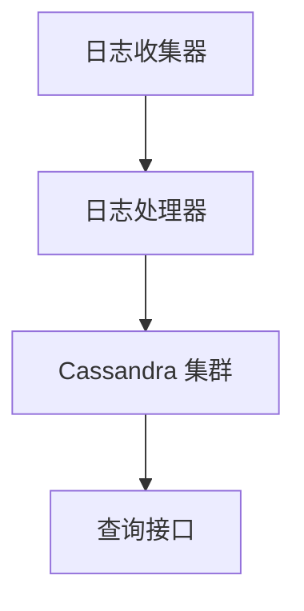

## 介绍

在现代分布式系统中，日志系统是至关重要的组件。它们用于记录应用程序的行为、错误信息、用户活动等数据，以便开发者和运维人员能够快速诊断问题并优化系统性能。然而，随着数据量的增长，传统的日志存储方案（如关系型数据库）往往难以应对高吞吐量和海量数据的需求。

Apache Cassandra 是一个高度可扩展的分布式 NoSQL 数据库，特别适合处理大规模的日志数据。它的分布式架构、高可用性和无单点故障特性使其成为构建日志系统的理想选择。

## 为什么选择Cassandra？

Cassandra 在日志系统中的应用有以下几个关键优势：

1. **高可扩展性**：Cassandra 可以轻松扩展到多个节点，以应对不断增长的日志数据。
2. **高可用性**：Cassandra 采用分布式架构，数据在多个节点上复制，确保系统在节点故障时仍能正常运行。
3. **高性能**：Cassandra 的写入性能非常高，适合处理大量的日志数据。
4. **灵活的数据模型**：Cassandra 的宽列存储模型允许灵活地存储和查询日志数据。

## Cassandra 日志系统的架构

一个典型的基于 Cassandra 的日志系统通常包括以下组件：

1. **日志收集器**：负责从应用程序中收集日志数据。
2. **日志处理器**：对日志数据进行预处理（如格式化、过滤等）。
3. **Cassandra 集群**：存储和处理日志数据。
4. **查询接口**：提供对日志数据的查询和分析功能。



## 实际案例：构建一个简单的日志系统

让我们通过一个简单的例子来展示如何使用 Cassandra 构建一个日志系统。

### 1. 创建日志表

首先，我们需要在 Cassandra 中创建一个表来存储日志数据。假设每条日志包含以下字段：

- `timestamp`：日志的时间戳
- `level`：日志级别（如 INFO、ERROR 等）
- `message`：日志消息
- `source`：日志来源（如应用程序名称）

```sql
CREATE TABLE logs (
    timestamp timestamp,
    level text,
    message text,
    source text,
    PRIMARY KEY ((source), timestamp)
) WITH CLUSTERING ORDER BY (timestamp DESC);
```

:::note
**注意**：我们使用 `source` 作为分区键，以确保来自同一来源的日志存储在同一个节点上。`timestamp` 作为聚类键，以便按时间顺序存储日志。
:::

### 2. 插入日志数据

接下来，我们可以向表中插入一些日志数据。

```sql
INSERT INTO logs (timestamp, level, message, source) VALUES ('2023-10-01 12:00:00', 'INFO', 'Application started', 'App1');
INSERT INTO logs (timestamp, level, message, source) VALUES ('2023-10-01 12:01:00', 'ERROR', 'Failed to connect to database', 'App1');
INSERT INTO logs (timestamp, level, message, source) VALUES ('2023-10-01 12:02:00', 'INFO', 'User logged in', 'App2');
```

### 3. 查询日志数据

我们可以通过以下查询来检索特定来源的日志数据。

```sql
SELECT * FROM logs WHERE source = 'App1' AND timestamp >= '2023-10-01 12:00:00' AND timestamp <= '2023-10-01 12:02:00';
```

**输出**：

| timestamp           | level | message                     | source |
|---------------------|-------|-----------------------------|--------|
| 2023-10-01 12:01:00 | ERROR | Failed to connect to database | App1   |
| 2023-10-01 12:00:00 | INFO  | Application started         | App1   |

:::tip
**提示**：通过调整查询条件，您可以轻松地按时间范围、日志级别等过滤日志数据。
:::

## 实际应用场景

Cassandra 在许多大型企业的日志系统中得到了广泛应用。例如：

- **Netflix**：Netflix 使用 Cassandra 来存储和分析其流媒体服务的日志数据，以监控系统性能和用户行为。
- **Instagram**：Instagram 使用 Cassandra 来存储其应用程序的日志数据，以便快速诊断和解决问题。

## 总结

Cassandra 是一个强大的工具，特别适合构建高效、可扩展的日志系统。它的分布式架构和高性能使其能够处理大量的日志数据，同时确保系统的高可用性和可靠性。

通过本文的示例，您已经了解了如何使用 Cassandra 构建一个简单的日志系统。希望这些知识能够帮助您在实际项目中应用 Cassandra。

## 附加资源

- [Cassandra 官方文档](https://cassandra.apache.org/doc/latest/)
- [Cassandra 数据建模指南](https://docs.datastax.com/en/dse/6.7/cql/cql/cql_using/useWhenDataModel.html)
- [Cassandra 性能调优](https://docs.datastax.com/en/dse/6.7/dse-admin/datastax_enterprise/operations/opsTuneDse.html)

## 练习

1. 尝试在本地或云环境中部署一个 Cassandra 集群。
2. 创建一个更复杂的日志表，包含更多的字段（如用户 ID、请求 ID 等）。
3. 编写一个脚本，模拟生成大量日志数据并插入到 Cassandra 中。
4. 使用 Cassandra 的查询功能，分析日志数据并生成报告。

通过完成这些练习，您将更深入地理解 Cassandra 在日志系统中的应用。