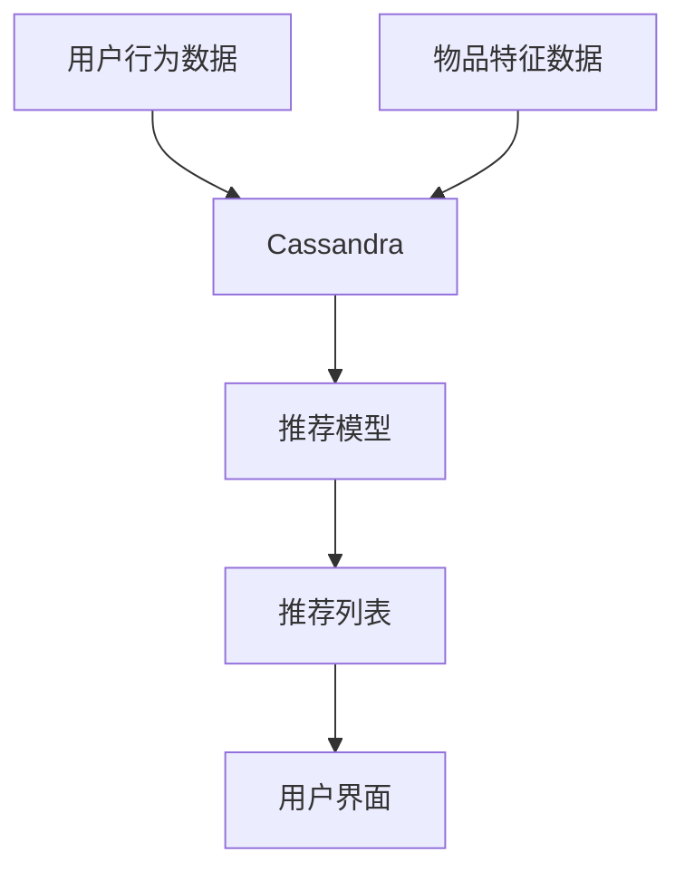

## 介绍

推荐系统是现代互联网应用中不可或缺的一部分，广泛应用于电商、社交媒体、流媒体平台等场景。推荐系统的核心目标是根据用户的历史行为、偏好和其他相关数据，为用户提供个性化的内容推荐。为了实现这一目标，推荐系统需要处理海量数据，并能够快速响应用户请求。Cassandra作为一种分布式NoSQL数据库，因其高可用性、可扩展性和低延迟的特性，成为推荐系统的理想选择。

本文将逐步讲解Cassandra在推荐系统中的应用，并通过实际案例和代码示例帮助初学者理解其工作原理。

## Cassandra 在推荐系统中的优势

1. **高可用性**：Cassandra采用分布式架构，数据分布在多个节点上，即使部分节点失效，系统仍能正常运行。
2. **可扩展性**：Cassandra支持线性扩展，可以通过增加节点来应对数据量的增长。
3. **低延迟**：Cassandra的读写性能优异，能够快速响应用户请求，适合实时推荐场景。
4. **灵活的数据模型**：Cassandra支持宽列存储，适合存储用户行为数据、物品特征等复杂数据结构。

## 推荐系统的基本架构

推荐系统通常由以下几个部分组成：

1. **数据收集**：收集用户行为数据（如点击、购买、评分等）和物品特征数据。
2. **数据存储**：将收集到的数据存储在数据库中，Cassandra是常用的选择之一。
3. **模型训练**：基于存储的数据，训练推荐模型（如协同过滤、内容推荐等）。
4. **推荐生成**：根据模型预测结果，生成个性化推荐列表。
5. **推荐展示**：将推荐结果展示给用户。

## Cassandra 在推荐系统中的实际应用

### 1. 存储用户行为数据

用户行为数据是推荐系统的基础，Cassandra可以高效地存储和查询这些数据。以下是一个简单的用户行为数据表结构示例：

```sql
CREATE TABLE user_behavior (
    user_id UUID,
    item_id UUID,
    behavior_type TEXT,
    timestamp TIMESTAMP,
    PRIMARY KEY (user_id, timestamp)
) WITH CLUSTERING ORDER BY (timestamp DESC);
```

在这个表中，`user_id` 是用户唯一标识，`item_id` 是物品唯一标识，`behavior_type` 表示用户行为类型（如点击、购买等），`timestamp` 记录行为发生的时间。

### 2. 存储物品特征数据

物品特征数据是推荐模型的重要输入，Cassandra可以存储这些数据并支持高效查询。以下是一个物品特征数据表结构示例：

```sql
CREATE TABLE item_features (
    item_id UUID,
    feature_name TEXT,
    feature_value TEXT,
    PRIMARY KEY (item_id, feature_name)
);
```

在这个表中，`item_id` 是物品唯一标识，`feature_name` 是特征名称，`feature_value` 是特征值。

### 3. 实时推荐生成

Cassandra的低延迟特性使其非常适合实时推荐场景。以下是一个简单的实时推荐查询示例：

```sql
SELECT item_id FROM user_behavior
WHERE user_id = ? AND behavior_type = 'click'
ORDER BY timestamp DESC
LIMIT 10;
```

这个查询会返回用户最近点击的10个物品，这些物品可以作为实时推荐的候选集。

## 实际案例：电商推荐系统

假设我们正在为一个电商平台构建推荐系统，以下是Cassandra在该系统中的应用场景：

1. **用户行为数据存储**：用户在平台上的点击、购买、评分等行为数据存储在Cassandra中。
2. **物品特征数据存储**：商品的类别、价格、品牌等特征数据存储在Cassandra中。
3. **实时推荐生成**：根据用户最近的行为数据，实时生成推荐列表并展示给用户。

以下是一个简化的推荐系统架构图：



## 总结

Cassandra在推荐系统中的应用展示了其作为分布式数据库的强大能力。通过高效存储和查询用户行为数据、物品特征数据，Cassandra能够支持实时推荐生成，满足现代推荐系统对高可用性、可扩展性和低延迟的需求。

## 附加资源与练习

- **资源**：
  - [Cassandra官方文档](https://cassandra.apache.org/doc/latest/)
  - [推荐系统经典论文](https://www.cs.umd.edu/~samir/498/Amazon-Recommendations.pdf)

- **练习**：
  1. 使用Cassandra创建一个简单的用户行为数据表，并插入一些示例数据。
  2. 编写一个查询，返回某个用户最近点击的5个物品。
  3. 尝试扩展物品特征数据表，添加更多特征字段，并查询某个物品的所有特征。

通过以上学习和练习，你将能够更好地理解Cassandra在推荐系统中的应用，并为构建自己的推荐系统打下坚实基础。