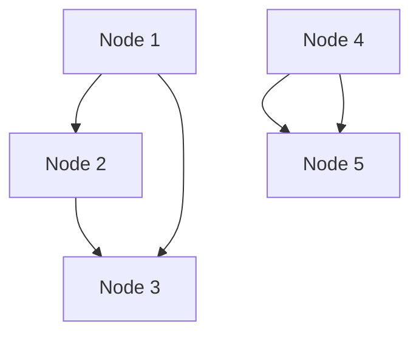
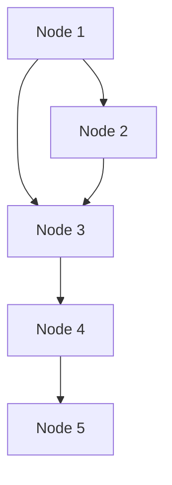

# Cassandra 混沌测试

## 介绍

混沌测试（Chaos Testing）是一种通过故意引入故障或异常情况来测试系统在极端条件下的表现的方法。对于分布式数据库系统如Cassandra来说，混沌测试尤为重要，因为它可以帮助我们发现系统中的潜在问题，并确保系统在面对网络分区、节点故障或其他异常情况时仍能保持高可用性和一致性。

在Cassandra中，混沌测试通常通过模拟网络延迟、节点宕机、数据丢失等场景来进行。通过这种方式，我们可以验证Cassandra的容错机制是否能够正常工作，并确保系统在真实生产环境中能够稳定运行。

## 混沌测试的基本概念

### 1. 故障注入
故障注入是混沌测试的核心。它通过人为地引入故障来模拟真实世界中的异常情况。常见的故障注入方式包括：
- **网络延迟**：模拟网络通信的延迟，测试系统在高延迟环境下的表现。
- **节点宕机**：模拟某个节点突然宕机，测试系统的容错能力。
- **数据丢失**：模拟数据丢失或损坏，测试系统的数据恢复能力。

### 2. 监控与验证
在进行混沌测试时，必须对系统的各项指标进行实时监控，以确保系统在故障注入后仍能正常运行。常见的监控指标包括：
- **延迟**：请求的响应时间是否在可接受范围内。
- **吞吐量**：系统是否能够处理预期的请求量。
- **一致性**：数据是否保持一致，是否存在数据丢失或重复。

### 3. 恢复测试
混沌测试不仅关注系统在故障发生时的表现，还关注系统在故障恢复后的表现。恢复测试的目的是验证系统是否能够自动恢复正常状态，或者是否需要进行人工干预。

## 实际应用场景

### 场景1：模拟网络分区
假设我们有一个由5个节点组成的Cassandra集群。我们可以通过混沌测试工具（如Chaos Monkey）模拟网络分区，将集群分成两个部分：3个节点和2个节点。然后，我们可以观察系统在这两个分区之间的表现，确保数据一致性和可用性。



在这个场景中，我们可以通过以下步骤进行测试：
1. 使用工具模拟网络分区。
2. 向集群发送读写请求，观察系统的响应。
3. 恢复网络分区，验证数据是否一致。

### 场景2：模拟节点宕机
我们可以模拟某个节点突然宕机，观察系统是否能够自动将请求重定向到其他节点，并确保数据不会丢失。



在这个场景中，我们可以通过以下步骤进行测试：
1. 使用工具模拟节点宕机。
2. 向集群发送读写请求，观察系统的响应。
3. 恢复节点，验证数据是否一致。

## 代码示例

以下是一个使用`cassandra-stress`工具进行混沌测试的简单示例。`cassandra-stress`是Cassandra自带的一个压力测试工具，可以用来模拟高负载情况下的系统表现。

```bash
# 启动cassandra-stress测试
cassandra-stress write n=1000000 -rate threads=50
```

在这个示例中，我们模拟了100万次写入操作，并发线程数为50。通过这种方式，我们可以观察系统在高负载情况下的表现。

## 总结

混沌测试是确保Cassandra系统稳定性和可靠性的重要手段。通过模拟各种故障场景，我们可以发现系统中的潜在问题，并在生产环境中避免这些问题。混沌测试不仅帮助我们验证系统的容错能力，还帮助我们了解系统在极端条件下的表现。

## 附加资源与练习

- **练习1**：使用`cassandra-stress`工具进行混沌测试，模拟网络延迟和节点宕机，观察系统的表现。
- **练习2**：尝试使用其他混沌测试工具（如Chaos Monkey）对Cassandra集群进行测试，记录测试结果并分析系统的容错能力。

通过不断进行混沌测试，我们可以逐步提高Cassandra系统的稳定性和可靠性，确保其在生产环境中能够稳定运行。