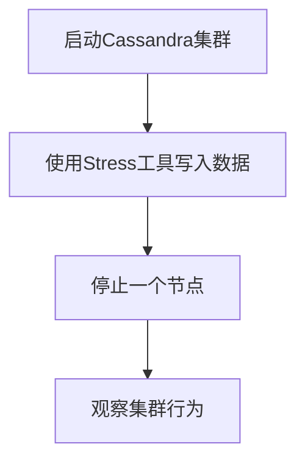

# Cassandra 故障注入

## 介绍

在分布式系统中，故障是不可避免的。为了确保系统在故障发生时仍能正常运行，我们需要对其进行测试。**故障注入**是一种测试技术，通过人为引入故障来模拟真实世界中的问题，从而验证系统的容错性和稳定性。在Cassandra中，故障注入可以帮助我们测试集群在节点故障、网络延迟或数据丢失等情况下的表现。

## 什么是故障注入？

故障注入是一种测试方法，通过在系统中引入故障来观察系统的行为。这些故障可以是硬件故障、网络延迟、数据丢失等。通过故障注入，我们可以验证系统是否能够正确处理这些异常情况，并确保其在高可用性和容错性方面的表现。

## Cassandra 中的故障注入

Cassandra是一个高度可扩展的分布式数据库，设计用于处理大规模数据。由于其分布式特性，Cassandra在面对节点故障或网络问题时需要具备良好的容错能力。通过故障注入，我们可以模拟这些情况，并观察Cassandra的行为。

### 常见的故障注入场景

1. **节点故障**：模拟一个或多个节点宕机，观察集群是否能够继续正常运行。
2. **网络延迟**：模拟网络延迟或分区，测试系统的响应时间和数据一致性。
3. **数据丢失**：模拟数据丢失或损坏，验证系统的数据恢复能力。

## 实施故障注入

在Cassandra中，我们可以使用多种工具和技术来实施故障注入。以下是一些常见的方法：

### 1. 使用Cassandra Stress工具

Cassandra Stress是Cassandra自带的一个工具，可以用于生成负载并测试集群的性能。我们可以通过配置Stress工具来模拟故障。

```bash
cassandra-stress write n=1000000 -node 127.0.0.1 -rate threads=50
```

在这个例子中，我们使用Cassandra Stress工具向集群写入100万条记录，并设置50个线程来模拟高负载。

### 2. 使用故障注入库

有一些第三方库可以帮助我们在Cassandra中实施故障注入。例如，**Chaos Monkey**是一个常用的工具，可以随机终止节点或引入网络延迟。

```java
ChaosMonkey monkey = new ChaosMonkey(cluster);
monkey.start();
```

在这个例子中，我们使用Chaos Monkey库来随机终止集群中的节点。

### 3. 手动注入故障

我们也可以手动注入故障，例如通过关闭某个节点的服务或断开网络连接。

```bash
sudo service cassandra stop
```

在这个例子中，我们手动停止了Cassandra服务，模拟节点故障。

## 实际案例

假设我们有一个由5个节点组成的Cassandra集群。我们想要测试在某个节点宕机的情况下，集群是否能够继续正常运行。

1. **步骤1**：启动Cassandra集群并确保所有节点正常运行。
2. **步骤2**：使用Cassandra Stress工具向集群写入数据。
3. **步骤3**：手动停止其中一个节点的服务。
4. **步骤4**：观察集群的行为，检查是否能够继续写入和读取数据。



在这个案例中，我们发现即使有一个节点宕机，Cassandra集群仍然能够继续正常运行，证明了其良好的容错性。

## 总结

故障注入是测试分布式系统容错性和稳定性的重要手段。通过模拟节点故障、网络延迟或数据丢失，我们可以验证Cassandra在面对这些异常情况时的表现。本文介绍了如何在Cassandra中实施故障注入，并提供了一个实际案例来展示其应用。

## 附加资源

- [Cassandra官方文档](https://cassandra.apache.org/doc/latest/)
- [Chaos Monkey GitHub仓库](https://github.com/Netflix/chaosmonkey)
- [Cassandra Stress工具指南](https://cassandra.apache.org/doc/latest/tools/stress.html)

## 练习

1. 使用Cassandra Stress工具向你的集群写入100万条记录，并观察集群的性能。
2. 手动停止一个节点，观察集群的行为，并记录你的发现。
3. 尝试使用Chaos Monkey库随机终止节点，并测试集群的容错性。

通过这些练习，你将更深入地理解Cassandra的故障注入和容错机制。