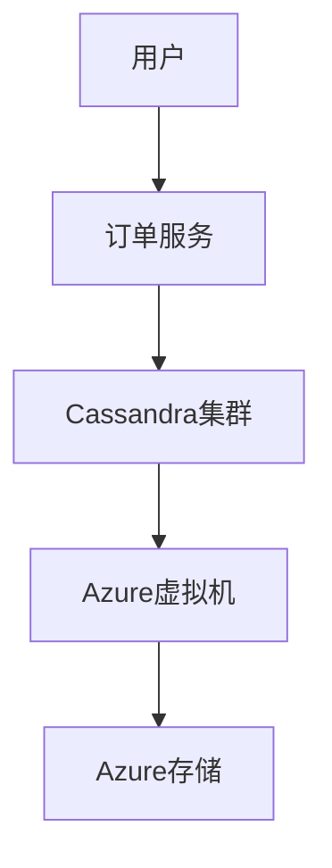

# Cassandra 在Azure上的部署

Apache Cassandra是一个高度可扩展的分布式NoSQL数据库，广泛用于处理大规模数据。随着云原生技术的普及，越来越多的企业选择在云平台上部署Cassandra，以充分利用云的弹性和可扩展性。本文将详细介绍如何在Azure上部署Cassandra，并探讨其与云原生的关系。

## 什么是Cassandra？

Cassandra是一个开源的分布式数据库管理系统，设计用于处理大量数据跨多个数据中心和云平台。它具有高可用性、无单点故障和线性可扩展性等特点，非常适合需要高吞吐量和低延迟的应用场景。

## 为什么在Azure上部署Cassandra？

Azure是微软提供的云服务平台，支持多种开源技术，包括Cassandra。在Azure上部署Cassandra可以带来以下好处：

- **弹性扩展**：Azure的虚拟机规模集（VM Scale Sets）可以轻松扩展Cassandra集群。
- **高可用性**：Azure的全球数据中心网络确保Cassandra集群的高可用性。
- **集成服务**：Azure提供多种服务（如Azure Kubernetes Service、Azure Monitor）与Cassandra集成，简化运维。

## 在Azure上部署Cassandra的步骤

### 1. 创建Azure虚拟机

首先，我们需要在Azure上创建虚拟机来运行Cassandra节点。可以使用Azure CLI或Azure门户来完成此操作。

```bash
az vm create \
  --resource-group myResourceGroup \
  --name myCassandraVM \
  --image UbuntuLTS \
  --admin-username azureuser \
  --generate-ssh-keys
```

### 2. 安装Cassandra

在虚拟机上安装Cassandra。以下是在Ubuntu上安装Cassandra的命令：

```bash
echo "deb https://downloads.apache.org/cassandra/debian 40x main" | sudo tee -a /etc/apt/sources.list.d/cassandra.sources.list
curl https://downloads.apache.org/cassandra/KEYS | sudo apt-key add -
sudo apt-get update
sudo apt-get install cassandra
```

### 3. 配置Cassandra集群

编辑Cassandra的配置文件`cassandra.yaml`，配置集群的种子节点和其他参数。

```yaml
cluster_name: 'MyCassandraCluster'
seed_provider:
  - class_name: org.apache.cassandra.locator.SimpleSeedProvider
    parameters:
      - seeds: "10.0.0.1,10.0.0.2"
listen_address: 10.0.0.1
rpc_address: 10.0.0.1
endpoint_snitch: GossipingPropertyFileSnitch
```

### 4. 启动Cassandra服务

在所有节点上启动Cassandra服务：

```bash
sudo systemctl start cassandra
sudo systemctl enable cassandra
```

### 5. 验证集群状态

使用`nodetool`命令验证集群状态：

```bash
nodetool status
```

输出应显示所有节点的状态为`UN`（Up Normal）。

## 实际案例：电商平台的订单管理系统

假设我们正在为一个电商平台构建订单管理系统，该系统需要处理数百万订单并确保高可用性。我们选择在Azure上部署Cassandra集群，以利用其高吞吐量和低延迟特性。

### 架构图



### 实现步骤

1. **数据模型设计**：设计订单表，包括订单ID、用户ID、订单日期等字段。
2. **集群部署**：在Azure上部署Cassandra集群，配置种子节点和网络。
3. **数据写入**：通过订单服务将订单数据写入Cassandra集群。
4. **数据查询**：通过订单服务查询订单数据，确保低延迟和高吞吐量。

## 总结

在Azure上部署Cassandra可以为应用提供高可用性、弹性扩展和低延迟的数据处理能力。通过本文的步骤，初学者可以轻松在Azure上部署Cassandra集群，并将其应用于实际场景中。

## 附加资源

- [Apache Cassandra官方文档](https://cassandra.apache.org/doc/latest/)
- [Azure虚拟机文档](https://docs.microsoft.com/azure/virtual-machines/)
- [Cassandra数据模型设计指南](https://cassandra.apache.org/doc/latest/cassandra/data_modeling/)

## 练习

1. 在Azure上创建一个包含3个节点的Cassandra集群。
2. 设计一个简单的数据模型，并在Cassandra中创建表。
3. 使用`nodetool`命令监控集群状态，并记录结果。

通过完成这些练习，您将更深入地理解Cassandra在Azure上的部署和管理。