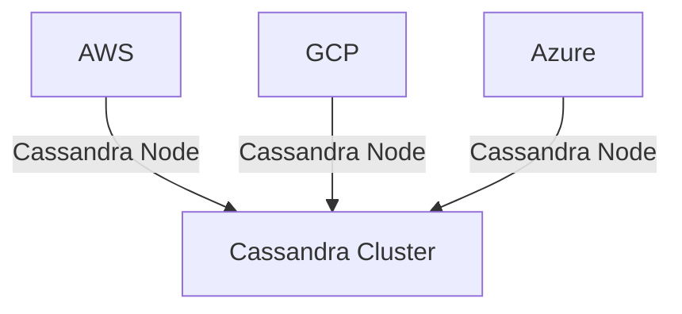

# Cassandra 多云部署

在现代云原生架构中，多云部署已成为一种常见的策略，旨在提高系统的可用性、容错性和数据冗余。Apache Cassandra作为一个分布式NoSQL数据库，天生支持分布式架构，非常适合在多云环境中部署。本文将详细介绍如何在多云环境中部署Cassandra，并探讨其实际应用场景。

## 什么是多云部署？

多云部署是指将应用程序或服务部署在多个云服务提供商的环境中。这种策略可以帮助企业避免依赖单一云服务提供商，从而提高系统的弹性和可用性。对于Cassandra来说，多云部署意味着将Cassandra集群的节点分布在不同的云服务提供商（如AWS、GCP、Azure等）中，以确保即使某个云服务提供商出现故障，整个系统仍能正常运行。

## 为什么选择Cassandra进行多云部署？

Cassandra是一个高度可扩展的分布式数据库，具有以下特点：

- **无单点故障**：Cassandra采用去中心化的架构，所有节点都是对等的，没有主从之分。
- **高可用性**：数据在多个节点之间复制，即使部分节点失效，系统仍能正常运行。
- **跨数据中心支持**：Cassandra天生支持跨数据中心的部署，非常适合多云环境。

这些特性使得Cassandra成为多云部署的理想选择。

## 多云部署的架构

在多云环境中部署Cassandra时，通常会将Cassandra集群的节点分布在不同的云服务提供商中。以下是一个典型的多云部署架构：



在这个架构中，Cassandra集群的节点分布在AWS、GCP和Azure三个云服务提供商中。每个云服务提供商中的节点都可以独立处理读写请求，并且数据会在所有节点之间进行复制。

## 配置Cassandra多云部署

### 1. 配置Cassandra节点

首先，你需要在每个云服务提供商中启动Cassandra节点。假设你已经在AWS、GCP和Azure中分别启动了三个节点，接下来需要配置这些节点以加入同一个Cassandra集群。

在每个节点的`cassandra.yaml`配置文件中，设置`seed_provider`和`listen_address`等参数。例如：

```yaml
seed_provider:
  - class_name: org.apache.cassandra.locator.SimpleSeedProvider
    parameters:
      - seeds: "aws_node_ip,gcp_node_ip,azure_node_ip"

listen_address: "current_node_ip"
```

### 2. 配置跨云网络

由于Cassandra节点分布在不同的云服务提供商中，因此需要确保这些节点之间能够互相通信。你可以使用VPN或专线连接来建立跨云网络。

### 3. 配置数据复制策略

Cassandra使用`NetworkTopologyStrategy`来配置数据在不同数据中心（或云服务提供商）之间的复制策略。你可以在创建Keyspace时指定复制策略：

```sql
CREATE KEYSPACE my_keyspace
WITH REPLICATION = {
  'class': 'NetworkTopologyStrategy',
  'AWS': 3,
  'GCP': 3,
  'Azure': 3
};
```

在这个例子中，数据会在AWS、GCP和Azure中分别复制3份。

## 实际应用场景

### 场景1：全球分布式应用

假设你正在开发一个全球分布式应用，用户遍布世界各地。为了提高应用的响应速度和可用性，你可以在AWS、GCP和Azure中分别部署Cassandra节点。这样，用户可以从最近的云服务提供商访问数据，从而提高性能。

### 场景2：灾难恢复

在多云环境中部署Cassandra还可以提高系统的灾难恢复能力。即使某个云服务提供商出现故障，其他云服务提供商中的Cassandra节点仍能继续提供服务，确保数据不丢失。

## 总结

Cassandra的多云部署策略可以帮助企业提高系统的可用性、容错性和数据冗余。通过将Cassandra节点分布在多个云服务提供商中，你可以确保即使某个云服务提供商出现故障，整个系统仍能正常运行。本文介绍了如何配置Cassandra多云部署，并探讨了其实际应用场景。

## 附加资源

- [Apache Cassandra官方文档](https://cassandra.apache.org/doc/latest/)
- [Cassandra多云部署最佳实践](https://www.datastax.com/blog/cassandra-multi-cloud-deployment-best-practices)

## 练习

1. 尝试在AWS和GCP中分别启动一个Cassandra节点，并配置它们加入同一个集群。
2. 创建一个Keyspace，并使用`NetworkTopologyStrategy`配置数据复制策略。
3. 模拟一个云服务提供商故障的场景，观察Cassandra集群的行为。
