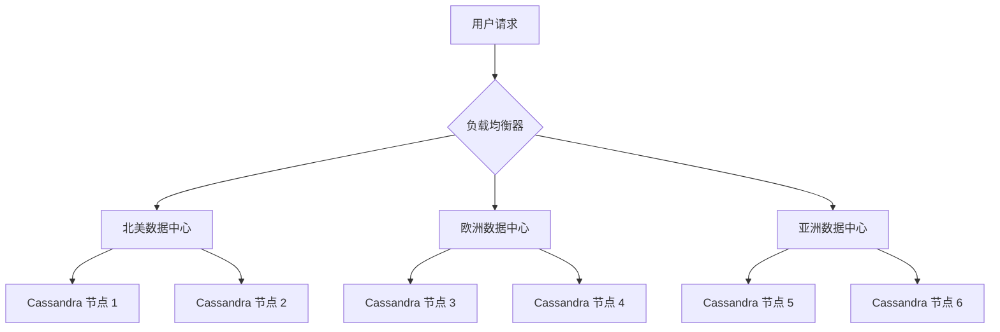

# Cassandra 云原生架构

## 介绍

Apache Cassandra 是一个高度可扩展的分布式 NoSQL 数据库，设计用于处理大量数据跨多个数据中心和云环境的分布式存储。随着云原生技术的兴起，Cassandra 也逐渐成为云原生架构中的重要组成部分。云原生架构强调容器化、微服务、动态编排和持续交付，Cassandra 的分布式特性使其非常适合在云原生环境中运行。

本文将逐步介绍 Cassandra 在云原生环境中的架构设计，并通过实际案例展示其应用场景。

---

## Cassandra 的核心特性

在深入探讨 Cassandra 的云原生架构之前，我们需要了解其核心特性：

1. **分布式架构**：Cassandra 采用无中心节点的分布式架构，数据分布在多个节点上，确保高可用性和容错性。
2. **线性扩展**：通过添加更多节点，Cassandra 可以轻松扩展以处理更多数据和请求。
3. **最终一致性**：Cassandra 使用最终一致性模型，允许在分布式环境中实现高性能和高可用性。
4. **多数据中心支持**：Cassandra 支持跨多个数据中心的部署，适合全球分布的应用程序。

这些特性使 Cassandra 成为云原生环境中的理想选择。

---

## Cassandra 与云原生技术的结合

### 1. 容器化

容器化是云原生架构的核心技术之一。Cassandra 可以通过 Docker 等容器技术进行部署，使其更易于管理和扩展。

以下是一个简单的 Docker Compose 文件示例，用于启动一个 Cassandra 集群：

```yaml
version: '3.7'
services:
  cassandra-node1:
    image: cassandra:latest
    container_name: cassandra-node1
    environment:
      - CASSANDRA_CLUSTER_NAME=my_cluster
    ports:
      - "9042:9042"
    networks:
      - cassandra-net

  cassandra-node2:
    image: cassandra:latest
    container_name: cassandra-node2
    environment:
      - CASSANDRA_SEEDS=cassandra-node1
    depends_on:
      - cassandra-node1
    networks:
      - cassandra-net

networks:
  cassandra-net:
    driver: bridge
```

:::tip
通过容器化，Cassandra 可以更轻松地在开发、测试和生产环境中部署和扩展。
:::

### 2. 与 Kubernetes 集成

Kubernetes 是云原生环境中用于容器编排的事实标准。Cassandra 可以通过 Kubernetes 的 StatefulSet 进行部署，确保每个 Cassandra 节点具有唯一的网络标识和持久化存储。

以下是一个简单的 Kubernetes StatefulSet 示例：

```yaml
apiVersion: apps/v1
kind: StatefulSet
metadata:
  name: cassandra
spec:
  serviceName: cassandra
  replicas: 3
  selector:
    matchLabels:
      app: cassandra
  template:
    metadata:
      labels:
        app: cassandra
    spec:
      containers:
      - name: cassandra
        image: cassandra:latest
        ports:
        - containerPort: 9042
        env:
        - name: CASSANDRA_SEEDS
          value: "cassandra-0.cassandra.default.svc.cluster.local"
  volumeClaimTemplates:
  - metadata:
      name: cassandra-data
    spec:
      accessModes: [ "ReadWriteOnce" ]
      resources:
        requests:
          storage: 1Gi
```

:::note
Kubernetes 的 StatefulSet 确保 Cassandra 节点的持久化存储和稳定的网络标识，适合生产环境。
:::

### 3. 微服务架构中的 Cassandra

在微服务架构中，Cassandra 可以作为共享的数据存储层，为多个微服务提供高可用性和高性能的数据访问。例如，一个电子商务平台可以使用 Cassandra 存储用户购物车数据，而另一个微服务可以使用 Cassandra 存储订单历史记录。

---

## 实际案例：Cassandra 在云原生环境中的应用

### 案例：全球分布式电商平台

假设我们正在构建一个全球分布的电商平台，需要处理来自多个地区的用户请求。以下是 Cassandra 在该平台中的应用场景：

1. **数据存储**：Cassandra 用于存储用户数据、产品目录和订单信息。
2. **多数据中心部署**：Cassandra 集群部署在多个数据中心（如北美、欧洲和亚洲），确保低延迟和高可用性。
3. **容器化部署**：Cassandra 通过 Kubernetes 进行部署，确保每个数据中心的 Cassandra 节点可以动态扩展和管理。

以下是一个简化的架构图：



:::caution
在多数据中心部署中，确保网络延迟和带宽优化是关键。
:::

---

## 总结

Cassandra 的分布式特性和高可用性使其成为云原生架构中的理想选择。通过容器化和与 Kubernetes 的集成，Cassandra 可以更轻松地在云原生环境中部署和管理。在实际应用中，Cassandra 可以支持全球分布的应用程序，提供高性能和可靠的数据存储。

---

## 附加资源与练习

### 资源
- [Apache Cassandra 官方文档](https://cassandra.apache.org/doc/latest/)
- [Kubernetes 官方文档](https://kubernetes.io/docs/home/)
- [Docker 官方文档](https://docs.docker.com/)

### 练习
1. 使用 Docker Compose 部署一个本地 Cassandra 集群。
2. 在 Kubernetes 中部署一个 Cassandra StatefulSet，并测试其扩展性。
3. 设计一个多数据中心的 Cassandra 架构，模拟全球分布的应用程序。

通过实践这些练习，您将更深入地理解 Cassandra 在云原生环境中的应用。