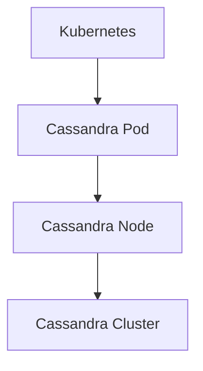

## 介绍

Apache Cassandra 是一个高度可扩展的分布式 NoSQL 数据库，以其卓越的性能、高可用性和无单点故障的特性而闻名。随着技术的不断发展，Cassandra 也在不断进化，以满足现代应用程序的需求。本文将探讨 Cassandra 的未来发展方向，帮助初学者了解其新特性、技术趋势以及在实际应用中的潜力。

## Cassandra 的新特性

### 1. **改进的存储引擎**

Cassandra 正在不断优化其存储引擎，以提高性能和可扩展性。例如，Cassandra 4.0 引入了更高效的存储格式，减少了磁盘 I/O 操作，从而提高了查询性能。

```sql
-- 示例：创建表
CREATE TABLE users (
    user_id UUID PRIMARY KEY,
    username TEXT,
    email TEXT
);
```

### 2. **增强的查询语言**

Cassandra 的查询语言（CQL）也在不断改进，以支持更复杂的查询操作。例如，Cassandra 4.0 引入了对 `GROUP BY` 和 `JOIN` 的支持，使得数据分析更加方便。

```sql
-- 示例：使用 GROUP BY 查询
SELECT username, COUNT(*) FROM users GROUP BY username;
```

### 3. **更好的监控和管理工具**

Cassandra 正在开发更强大的监控和管理工具，以帮助管理员更轻松地管理和维护集群。例如，Cassandra 4.0 引入了新的监控 API，可以实时监控集群的健康状况。

```bash
# 示例：使用 nodetool 监控集群
nodetool status
```

## Cassandra 的技术趋势

### 1. **云原生支持**

随着云计算的普及，Cassandra 正在加强其云原生支持。例如，Cassandra 正在与 Kubernetes 集成，以支持在容器化环境中部署和管理 Cassandra 集群。



### 2. **多模型数据库**

Cassandra 正在向多模型数据库方向发展，以支持更多的数据模型和查询方式。例如，Cassandra 正在开发对图数据库和文档数据库的支持，以满足不同应用场景的需求。

```sql
-- 示例：使用图数据库查询
MATCH (u:User)-[:FRIEND]->(f:User) WHERE u.username = 'alice' RETURN f.username;
```

### 3. **AI 和机器学习集成**

Cassandra 正在探索与 AI 和机器学习的集成，以支持更智能的数据分析和处理。例如，Cassandra 正在开发对 TensorFlow 和 PyTorch 的支持，以便在数据库内部直接进行机器学习模型的训练和推理。

```python
# 示例：使用 TensorFlow 进行机器学习
import tensorflow as tf
model = tf.keras.Sequential([
    tf.keras.layers.Dense(128, activation='relu'),
    tf.keras.layers.Dense(10, activation='softmax')
])
model.compile(optimizer='adam', loss='sparse_categorical_crossentropy', metrics=['accuracy'])
```

## 实际应用案例

### 1. **电商平台**

在电商平台中，Cassandra 可以用于存储用户数据、订单数据和商品数据。通过 Cassandra 的高可用性和可扩展性，电商平台可以轻松应对高并发访问和海量数据存储的需求。

```sql
-- 示例：存储订单数据
CREATE TABLE orders (
    order_id UUID PRIMARY KEY,
    user_id UUID,
    product_id UUID,
    quantity INT,
    price DECIMAL
);
```

### 2. **物联网（IoT）**

在物联网应用中，Cassandra 可以用于存储传感器数据和设备状态。通过 Cassandra 的分布式架构，物联网系统可以轻松处理来自数百万个设备的数据流。

```sql
-- 示例：存储传感器数据
CREATE TABLE sensor_data (
    sensor_id UUID PRIMARY KEY,
    timestamp TIMESTAMP,
    value DECIMAL
);
```

## 总结

Cassandra 作为一个强大的分布式数据库，正在不断进化以满足现代应用程序的需求。通过改进的存储引擎、增强的查询语言、更好的监控和管理工具，Cassandra 正在为未来的数据管理奠定坚实的基础。同时，Cassandra 也在积极探索云原生支持、多模型数据库和 AI 集成等新技术趋势，以应对不断变化的技术环境。

## 附加资源

- [Cassandra 官方文档](https://cassandra.apache.org/doc/latest/)
- [Cassandra 4.0 新特性](https://cassandra.apache.org/doc/latest/new_features.html)
- [Cassandra 与 Kubernetes 集成指南](https://cassandra.apache.org/doc/latest/operating/kubernetes.html)

## 练习

1. 创建一个 Cassandra 表，用于存储用户评论数据。
2. 使用 CQL 查询语句，统计每个用户的评论数量。
3. 尝试在 Kubernetes 上部署一个 Cassandra 集群，并监控其运行状态。

:::tip
在完成练习时，可以参考 Cassandra 官方文档和社区资源，以获取更多帮助和指导。
:::