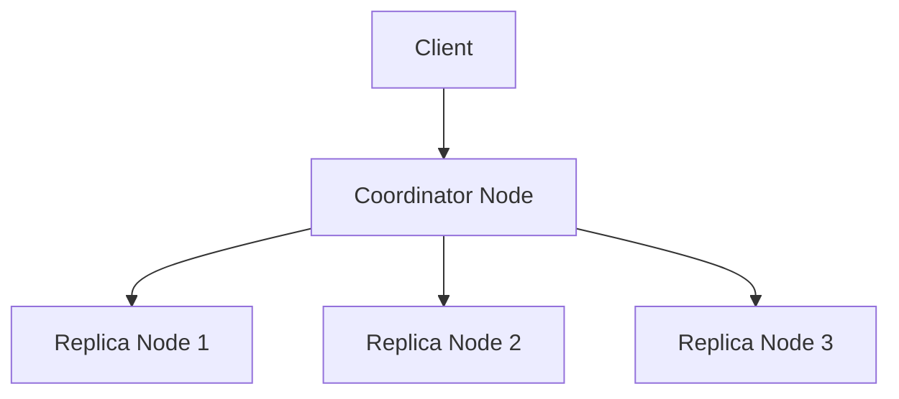

# Cassandra 性能提升发展

Cassandra是一个高度可扩展的分布式NoSQL数据库，广泛应用于需要处理大规模数据的场景。随着数据量的增长和业务需求的复杂化，Cassandra在性能优化方面不断演进。本文将带您了解Cassandra在性能提升方面的最新进展，并探讨其未来发展方向。

## 1. 介绍

Cassandra的性能优化主要集中在以下几个方面：
- **查询性能**：通过优化查询执行计划和索引机制，提升查询速度。
- **存储效率**：改进数据存储格式和压缩算法，减少磁盘和内存占用。
- **分布式架构**：优化分布式一致性协议和节点通信机制，提高系统整体吞吐量。
- **资源管理**：引入更智能的资源调度和负载均衡策略，确保系统在高负载下仍能稳定运行。

接下来，我们将逐步讲解这些优化策略，并通过实际案例展示其应用。

## 2. 查询性能优化

### 2.1 查询执行计划优化

Cassandra通过优化查询执行计划来提升查询性能。例如，Cassandra 4.0引入了更智能的查询优化器，能够根据数据分布和查询条件自动选择最优的执行路径。

```sql
-- 示例查询
SELECT * FROM users WHERE user_id = '12345';
```

在这个查询中，Cassandra会自动选择最合适的节点进行数据检索，从而减少查询延迟。

### 2.2 索引机制改进

Cassandra支持多种索引类型，包括二级索引和SASI（SSTable Attached Secondary Index）。SASI索引在Cassandra 3.0中引入，能够显著提升范围查询的性能。

```sql
-- 创建SASI索引
CREATE CUSTOM INDEX ON users (email) USING 'org.apache.cassandra.index.sasi.SASIIndex';
```

通过使用SASI索引，Cassandra可以在大规模数据集上快速执行范围查询。

## 3. 存储效率提升

### 3.1 数据压缩算法

Cassandra支持多种数据压缩算法，如LZ4、Snappy和Zstandard。这些算法在压缩率和解压速度之间提供了良好的平衡，能够有效减少磁盘和内存占用。

```sql
-- 配置压缩算法
ALTER TABLE users WITH compression = {'sstable_compression': 'LZ4Compressor'};
```

通过选择合适的压缩算法，Cassandra可以在不显著增加CPU负载的情况下，显著减少存储空间。

### 3.2 存储格式改进

Cassandra 4.0引入了新的存储格式，如`Bigtable`格式，能够更高效地存储和检索数据。这种格式通过减少元数据开销和优化数据布局，提升了存储效率。

## 4. 分布式架构优化

### 4.1 一致性协议改进

Cassandra使用`Gossip`协议进行节点间通信，并通过`Paxos`协议实现分布式一致性。Cassandra 4.0对`Paxos`协议进行了优化，减少了协调开销，提高了系统吞吐量。



通过优化一致性协议，Cassandra能够在高并发场景下保持高性能。

### 4.2 节点通信优化

Cassandra 4.0引入了`Zero Copy Streaming`技术，减少了节点间数据复制时的内存拷贝次数，从而提升了数据迁移和恢复的速度。

## 5. 资源管理优化

### 5.1 智能负载均衡

Cassandra 4.0引入了更智能的负载均衡策略，能够根据节点负载和网络状况动态调整数据分布，确保系统在高负载下仍能稳定运行。

```sql
-- 查看节点负载
nodetool status
```

通过智能负载均衡，Cassandra能够有效避免热点节点问题，提升系统整体性能。

### 5.2 资源调度优化

Cassandra 4.0引入了基于优先级的资源调度机制，能够根据任务类型和优先级合理分配系统资源，确保关键任务优先执行。

## 6. 实际案例

### 6.1 电商平台

某电商平台使用Cassandra存储用户订单数据。通过引入SASI索引和LZ4压缩算法，该平台成功将查询延迟降低了30%，存储空间减少了40%。

### 6.2 社交网络

某社交网络平台使用Cassandra存储用户动态数据。通过优化一致性协议和引入智能负载均衡策略，该平台在高并发场景下的系统吞吐量提升了50%。

## 7. 总结

Cassandra在性能优化方面取得了显著进展，特别是在查询性能、存储效率、分布式架构和资源管理方面。这些优化策略不仅提升了系统性能，还为Cassandra的未来发展奠定了坚实基础。

## 8. 附加资源与练习

- **官方文档**：[Cassandra Documentation](https://cassandra.apache.org/doc/latest/)
- **练习**：尝试在本地环境中配置Cassandra，并使用SASI索引和LZ4压缩算法优化查询性能和存储效率。

:::tip
建议初学者通过实际操作和实验来深入理解Cassandra的性能优化策略。
:::