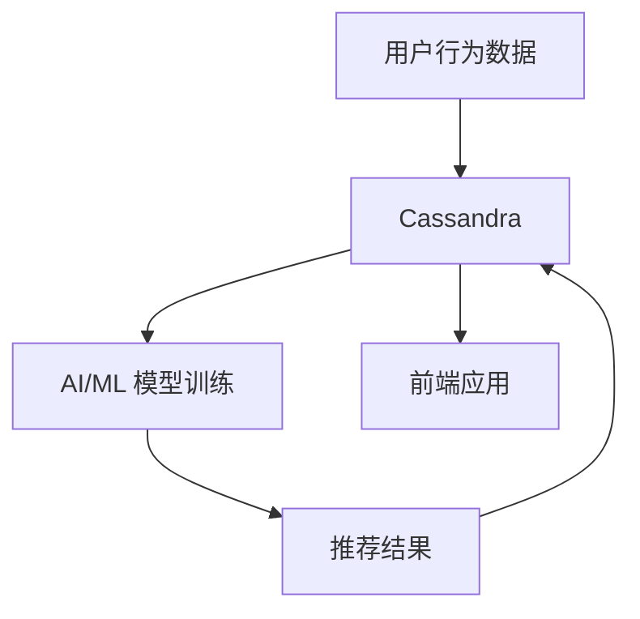

# Cassandra 与AI/ML集成

## 介绍

Apache Cassandra 是一个高度可扩展的分布式 NoSQL 数据库，广泛用于处理大规模数据。随着人工智能（AI）和机器学习（ML）技术的快速发展，许多企业开始将 Cassandra 与 AI/ML 集成，以构建更智能的数据驱动应用。这种集成不仅能够提升数据处理效率，还能为实时分析和预测提供强大的支持。

在本篇文章中，我们将探讨 Cassandra 如何与 AI/ML 集成，并通过实际案例展示其应用场景。

---

## Cassandra 与 AI/ML 集成的基础

### 1. 数据存储与访问
Cassandra 的主要优势在于其分布式架构和高可用性，这使得它非常适合存储大规模数据集。AI/ML 模型通常需要大量的训练数据，而这些数据可以高效地存储在 Cassandra 中。

例如，假设我们有一个用户行为数据集，用于训练推荐系统模型。我们可以将数据存储在 Cassandra 中，并通过 CQL（Cassandra Query Language）进行查询：

```sql
CREATE TABLE user_behavior (
    user_id UUID,
    timestamp TIMESTAMP,
    action TEXT,
    PRIMARY KEY (user_id, timestamp)
);
```

### 2. 数据预处理
在 AI/ML 工作流中，数据预处理是一个关键步骤。Cassandra 可以通过其强大的查询功能支持数据清洗和转换。例如，我们可以使用 CQL 过滤出特定时间段内的用户行为数据：

```sql
SELECT * FROM user_behavior
WHERE timestamp >= '2023-01-01' AND timestamp < '2023-02-01';
```

### 3. 模型训练与推理
Cassandra 可以与 AI/ML 框架（如 TensorFlow 或 PyTorch）集成，直接从中读取数据用于模型训练。此外，训练好的模型可以部署到生产环境中，并通过 Cassandra 存储的实时数据进行推理。

---

## 实际案例：实时推荐系统

### 场景描述
假设我们正在构建一个电商平台的实时推荐系统。该系统需要根据用户的实时行为（如浏览、点击、购买）生成个性化推荐。

### 数据流
1. 用户行为数据实时写入 Cassandra。
2. AI/ML 模型从 Cassandra 中读取数据并进行训练。
3. 训练好的模型生成推荐结果，并存储回 Cassandra。
4. 前端应用从 Cassandra 中读取推荐结果并展示给用户。



### 代码示例
以下是一个简单的 Python 示例，展示如何从 Cassandra 中读取数据并用于模型训练：

```python
from cassandra.cluster import Cluster
import pandas as pd
from sklearn.model_selection import train_test_split
from sklearn.ensemble import RandomForestClassifier

# 连接 Cassandra
cluster = Cluster(['127.0.0.1'])
session = cluster.connect('my_keyspace')

# 查询数据
query = "SELECT user_id, action, timestamp FROM user_behavior"
rows = session.execute(query)

# 转换为 Pandas DataFrame
data = pd.DataFrame(list(rows))

# 数据预处理
data['action'] = data['action'].astype('category').cat.codes

# 划分训练集和测试集
X = data[['user_id', 'timestamp']]
y = data['action']
X_train, X_test, y_train, y_test = train_test_split(X, y, test_size=0.2)

# 训练模型
model = RandomForestClassifier()
model.fit(X_train, y_train)

# 评估模型
accuracy = model.score(X_test, y_test)
print(f"模型准确率: {accuracy:.2f}")
```

---

## 总结

Cassandra 与 AI/ML 的集成为现代数据驱动应用提供了强大的支持。通过高效的数据存储、预处理和实时推理能力，Cassandra 能够显著提升 AI/ML 工作流的效率。无论是构建实时推荐系统、欺诈检测系统，还是其他智能应用，Cassandra 都是一个理想的选择。

---

## 附加资源与练习

### 资源
- [Apache Cassandra 官方文档](https://cassandra.apache.org/doc/latest/)
- [TensorFlow 与 Cassandra 集成指南](https://www.tensorflow.org/io/tutorials/cassandra)
- [PyTorch 数据加载器与 Cassandra 集成](https://pytorch.org/docs/stable/data.html)

### 练习
1. 尝试将 Cassandra 与 TensorFlow 集成，并使用真实数据集训练一个简单的分类模型。
2. 设计一个实时推荐系统的数据流图，并实现从数据写入到模型推理的完整流程。
3. 探索 Cassandra 的其他特性（如二级索引和物化视图），并思考它们如何优化 AI/ML 工作流。

:::tip
如果你在集成过程中遇到问题，可以参考 Cassandra 和 AI/ML 框架的官方文档，或者加入相关的社区论坛寻求帮助。
:::