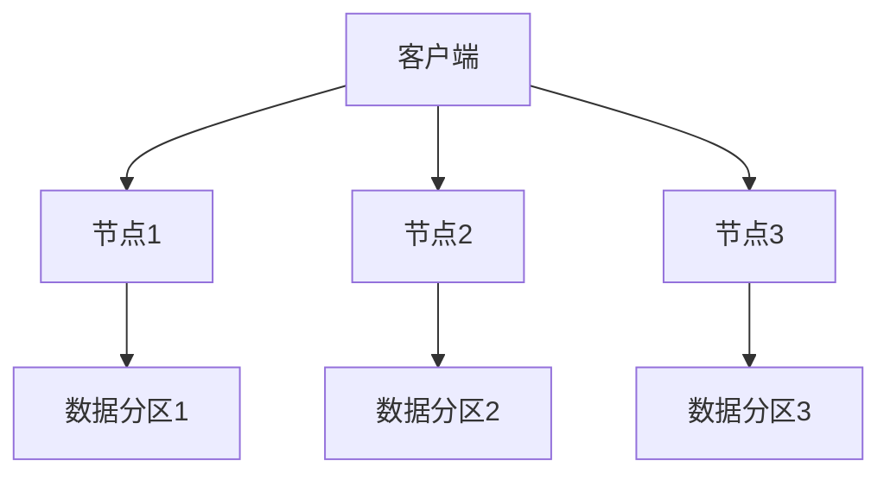

## 介绍

Apache Cassandra 是一个高度可扩展的分布式 NoSQL 数据库，最初由 Facebook 开发，用于处理大规模数据存储需求。自 2008 年开源以来，Cassandra 的架构经历了多次重大演进，以适应不断变化的技术需求和业务场景。本文将带您了解 Cassandra 的架构演进历程，并探讨其未来的发展方向。

## 初始架构：分布式与去中心化

Cassandra 最初的设计目标是解决 Facebook 的收件箱搜索问题。其核心思想是构建一个**去中心化**的分布式数据库，能够在多个节点之间均匀分布数据，同时提供高可用性和无单点故障。

### 关键特性
- **分布式架构**：数据分布在多个节点上，每个节点都是对等的。
- **无单点故障**：没有主从节点之分，所有节点地位平等。
- **最终一致性**：通过 Gossip 协议和反熵机制实现数据的最终一致性。



:::note
**Gossip 协议**：Cassandra 使用 Gossip 协议在节点之间传播状态信息，确保每个节点都知道集群中其他节点的状态。
:::

## 架构演进：性能优化与新特性

随着 Cassandra 的广泛应用，其架构也在不断演进，以支持更高的性能、更强的可扩展性和更丰富的功能。

### 1. 数据存储引擎的改进
Cassandra 最初使用 Thrift 作为其存储引擎，但在 2014 年引入了 **CQL（Cassandra Query Language）**，提供了更直观的 SQL-like 查询接口。同时，存储引擎从 Thrift 迁移到了更高效的 **SSTable** 格式。

```sql
-- 使用 CQL 创建表
CREATE TABLE users (
    user_id UUID PRIMARY KEY,
    name TEXT,
    email TEXT
);
```

### 2. 数据分区与复制策略
Cassandra 使用 **一致性哈希** 来分配数据分区，并通过 **复制策略** 确保数据的冗余存储。常见的复制策略包括：
- **SimpleStrategy**：适用于单数据中心。
- **NetworkTopologyStrategy**：适用于多数据中心，支持更灵活的复制配置。

```sql
-- 创建键空间并指定复制策略
CREATE KEYSPACE my_keyspace
WITH replication = {
    'class': 'NetworkTopologyStrategy',
    'datacenter1': 3,
    'datacenter2': 2
};
```

### 3. 轻量级事务（LWT）
为了支持更强的数据一致性，Cassandra 引入了 **轻量级事务（Lightweight Transactions, LWT）**，基于 Paxos 协议实现。

```sql
-- 使用 LWT 插入数据
INSERT INTO users (user_id, name, email)
VALUES (uuid(), 'Alice', 'alice@example.com')
IF NOT EXISTS;
```

:::tip
**LWT 适用场景**：适用于需要强一致性的场景，但会带来一定的性能开销，因此应谨慎使用。
:::

### 4. 物化视图
Cassandra 4.0 引入了 **物化视图（Materialized Views）**，允许用户基于现有表创建预计算的视图，从而优化查询性能。

```sql
-- 创建物化视图
CREATE MATERIALIZED VIEW user_emails AS
SELECT user_id, email
FROM users
WHERE email IS NOT NULL
PRIMARY KEY (email, user_id);
```

## 实际案例：Cassandra 在 Netflix 的应用

Netflix 是 Cassandra 的典型用户之一，其使用 Cassandra 存储用户观看历史、推荐数据等。Netflix 的案例展示了 Cassandra 如何在高并发、大规模数据场景下提供稳定的服务。

:::caution
**挑战**：在高负载下，Cassandra 的调优和运维需要深入理解其架构和配置。
:::

## 未来方向：持续创新

Cassandra 的未来发展方向包括：
- **性能优化**：通过改进存储引擎和查询优化器，进一步提升性能。
- **云原生支持**：更好地支持 Kubernetes 和云原生架构。
- **AI/ML 集成**：探索与机器学习和人工智能技术的深度集成。

## 总结

Cassandra 的架构演进展示了其如何从一个简单的分布式数据库发展为一个功能丰富、性能卓越的 NoSQL 解决方案。通过不断引入新特性和优化，Cassandra 能够满足现代应用对高可用性、高性能和灵活性的需求。

## 附加资源与练习

- **官方文档**：[Cassandra Documentation](https://cassandra.apache.org/doc/)
- **练习**：尝试在本地部署一个 Cassandra 集群，并使用 CQL 创建表和插入数据。
- **深入学习**：研究 Cassandra 的一致性哈希算法和 Gossip 协议的实现细节。